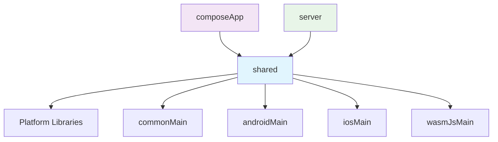

# Layer Dependencies & Implementation Order

Kotlin Multiplatformプロジェクトでのレイヤー間依存関係と実装順序の指針です。並行実装可能性の判定とworktree戦略に活用されます。

## 🏗️ レイヤー依存関係

### 基本依存構造


### 依存関係詳細

**✅ 許可されている依存:**
```yaml
composeApp:
  depends_on: [shared]
  reason: "UI層は共通ビジネスロジック・エンティティを使用"
  
server:  
  depends_on: [shared]
  reason: "API層は共通DTOとビジネスルールを使用"
  
shared:
  depends_on: [platform_libraries]
  reason: "プラットフォーム固有実装のみ依存"
```

**❌ 禁止されている依存:**
```yaml
shared:
  cannot_depend_on: [composeApp, server]
  reason: "共通層は上位レイヤーに依存してはならない"
  
composeApp:
  cannot_depend_on: [server]
  reason: "UI層はサーバー層に直接依存しない"
  
server:
  cannot_depend_on: [composeApp]
  reason: "サーバー層はUI層に依存しない"
```

## ⚡ 並行実装可能性マトリックス

### Phase分割戦略

**Phase 1: Foundation Layer**
```yaml
shared_layer:
  parallel: false
  prerequisites: []
  estimated_time: "30-60分"
  deliverables:
    - "commonMain entities"
    - "Repository interfaces" 
    - "Use cases"
    - "expect/actual declarations"
```

**Phase 2: Application Layers**  
```yaml
compose_layer:
  parallel: true
  prerequisites: [shared_layer_completed]
  parallel_with: [server_layer]
  estimated_time: "45-90分"
  deliverables:
    - "Screen Composables"
    - "ViewModels/State management"
    - "Navigation"
    - "Platform-specific UI"

server_layer:
  parallel: true  
  prerequisites: [shared_layer_completed]
  parallel_with: [compose_layer]
  estimated_time: "30-75分"
  deliverables:
    - "API endpoints"
    - "Request/Response handling"
    - "Business logic integration"
    - "Database integration"
```

**Phase 3: Integration**
```yaml
integration_layer:
  parallel: false
  prerequisites: [compose_layer_completed, server_layer_completed]
  estimated_time: "15-30分"
  deliverables:
    - "End-to-end tests"
    - "API integration tests"
    - "Build verification"
```

## 🌳 Git Worktree戦略

### Worktree分割パターン

**Pattern 1: 完全並行 (理想的)**
```bash
# メインワークスペース: shared層
git checkout -b feature/issue-123-implementation

# 並行worktree: compose層
git worktree add ../CollabStream-compose feature/issue-123-implementation
  
# 並行worktree: server層  
git worktree add ../CollabStream-server feature/issue-123-implementation
```

**Pattern 2: 段階的並行 (一般的)**
```bash
# Phase 1: shared層のみ
git checkout -b feature/issue-123-implementation
# shared実装完了 → commit

# Phase 2: compose・server並行
git worktree add ../CollabStream-compose feature/issue-123-implementation
git worktree add ../CollabStream-server feature/issue-123-implementation
```

**Pattern 3: 順次実装 (複雑な依存関係)**
```bash
# 単一worktreeで順次実装
git checkout -b feature/issue-123-implementation
# shared → compose → server → integration
```

### Worktree選択アルゴリズム

```yaml
worktree_decision_matrix:
  
  simple_feature:
    condition: "single_layer || minimal_dependencies"
    strategy: "sequential_single_worktree" 
    reason: "オーバーヘッドを避ける"
    
  medium_feature:
    condition: "multiple_layers && clear_boundaries"  
    strategy: "staged_parallel_worktree"
    reason: "段階的並行で効率化"
    
  complex_feature:
    condition: "all_layers && heavy_interactions"
    strategy: "full_parallel_worktree"  
    reason: "最大効率化、ただし複雑性増加"
```

## 🔄 実装順序パターン

### 1. Data-First Pattern

**適用場面**: Entity・Repository中心の機能
```yaml
implementation_order:
  1: "shared/entities" 
  2: "shared/repositories"
  3: "shared/usecases"
  4: "server/api_endpoints"  
  5: "compose/screens"
  6: "integration_tests"
```

**例**: ユーザー管理機能
```
User entity → UserRepository → GetUserUseCase → 
/api/users endpoint → UserScreen → E2E test
```

### 2. UI-First Pattern  

**適用場面**: UI中心・プロトタイプ機能
```yaml
implementation_order:
  1: "shared/entities_minimal"
  2: "compose/screens_mockdata"
  3: "shared/repositories_interface" 
  4: "shared/usecases"
  5: "server/api_implementation"
  6: "integration"
```

**例**: 新しい画面・ワークフロー
```
User entity (minimal) → UserScreen (mock) → 
UserRepository interface → Real implementation
```

### 3. API-First Pattern

**適用場面**: 外部API統合・Backend重視
```yaml
implementation_order:
  1: "shared/dtos"
  2: "server/api_endpoints"
  3: "shared/repositories"
  4: "shared/usecases"  
  5: "compose/screens"
  6: "end_to_end_flow"
```

## 📊 依存関係分析アルゴリズム

### 自動判定ロジック

```typescript
interface LayerDependency {
  layer: 'shared' | 'compose' | 'server';
  dependencies: string[];
  provides: string[];
  parallel_safe: boolean;
}

function analyzeDependencies(issueRequirements: IssueRequirements): LayerDependency[] {
  const layers: LayerDependency[] = [];
  
  // Shared layer analysis
  if (issueRequirements.needsEntities || issueRequirements.needsBusinessLogic) {
    layers.push({
      layer: 'shared',
      dependencies: [],
      provides: ['entities', 'repositories', 'usecases'],
      parallel_safe: false // Foundation layer
    });
  }
  
  // Compose layer analysis  
  if (issueRequirements.needsUI) {
    layers.push({
      layer: 'compose',
      dependencies: layers.includes('shared') ? ['shared'] : [],
      provides: ['screens', 'navigation', 'ui_components'],
      parallel_safe: !layers.some(l => l.layer === 'shared') // True if no shared dependency
    });
  }
  
  // Server layer analysis
  if (issueRequirements.needsAPI) {
    layers.push({
      layer: 'server', 
      dependencies: layers.includes('shared') ? ['shared'] : [],
      provides: ['api_endpoints', 'business_logic', 'data_access'],
      parallel_safe: !layers.some(l => l.layer === 'shared') // True if no shared dependency
    });
  }
  
  return layers;
}

function determineParallelStrategy(layers: LayerDependency[]): ParallelStrategy {
  const parallelLayers = layers.filter(l => l.parallel_safe);
  const sequentialLayers = layers.filter(l => !l.parallel_safe);
  
  if (parallelLayers.length >= 2) {
    return {
      type: 'staged_parallel',
      phase1: sequentialLayers,
      phase2: parallelLayers
    };
  } else {
    return {
      type: 'sequential',
      order: ['shared', 'compose', 'server'].filter(layer => 
        layers.some(l => l.layer === layer)
      )
    };
  }
}
```

## 🧪 テスト依存関係

### Layer別テスト戦略

**shared層テスト:**
```yaml
test_dependencies: [mockito, coroutines-test]
test_scope: "unit_tests_only"
mock_external: "all_platform_dependencies"
parallel_safe: true
```

**compose層テスト:**  
```yaml
test_dependencies: [compose-ui-test, shared-test-fixtures]
test_scope: "ui_integration_tests" 
mock_external: "repository_layer"
parallel_safe: true # shared層モック使用
```

**server層テスト:**
```yaml
test_dependencies: [ktor-server-test, testcontainers]
test_scope: "api_integration_tests"
mock_external: "database_external_api" 
parallel_safe: true # shared層モック使用
```

### テスト実行順序
```yaml
test_execution_order:
  phase1_parallel:
    - "shared_unit_tests"
    - "compose_ui_tests" 
    - "server_api_tests"
    
  phase2_sequential:
    - "integration_tests"
    - "e2e_tests"
```

## ⚠️ 制約・考慮事項

### 並行実装時の注意点

**1. Git競合回避:**
```yaml
file_separation:
  shared: "shared/src/**/*"
  compose: "composeApp/src/**/*" 
  server: "server/src/**/*"
  
conflict_prone_files:
  - "build.gradle.kts" (dependency changes)
  - "settings.gradle.kts" (module changes)
  - "shared/src/commonMain/kotlin/**/*" (entity changes)
```

**2. ビルド依存:**
```yaml
build_order_constraints:
  - "shared must build before compose"
  - "shared must build before server"
  - "full integration test requires all layers"
  
gradle_considerations:
  - "parallel build: --parallel"
  - "incremental compilation: enabled"
  - "configuration cache: enabled"
```

**3. Agent間通信:**
```yaml
handoff_requirements:
  shared_to_compose:
    - "entity definitions"
    - "repository interfaces"  
    - "usecase signatures"
    
  shared_to_server:
    - "dto definitions"
    - "api contracts"
    - "business rule implementations"
```

---

**実装時参考**: この依存関係情報はtask-breakdown-specialistが並行実装可能性を判定する際に使用されます。