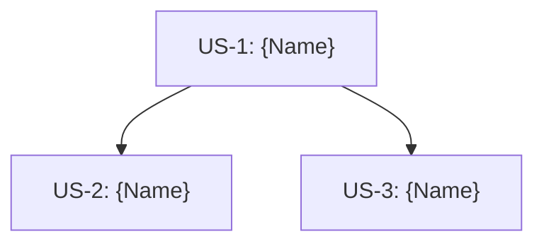

# Phase 0: Epic定義 & 共通基盤の切り出し

Phase 0では、大規模機能（Epic）を複数のUser Storyに分割し、並行実装時の重複を避けるための最小限の共通ドメインを定義します。

## 🔄 Plan Modeでの実行を推奨

Phase 0はEpic・Story分割の設計フェーズです。**Plan Mode**での実行を推奨します。

Plan Modeで実行することで：
- 事前にEpic構成を確認・調整できる
- Story分割の妥当性をレビューしてから作成
- 共通ドメインの設計を事前に議論

**推奨**: `/phase0`実行前にPlan Modeに入る

## 🎯 実行方法

```bash
/phase0
```

**注意**: Phase 0は大規模機能（3 Story以上）の場合のみ使用します。小規模機能（1-2 Story）は `/phase1` から直接開始してください。

## Context

### GitHub Issue確認
- Existing Epic Issues: !`gh issue list --label "epic" --limit 5 2>/dev/null || echo "Epic Issueなし"`
- Existing Story Issues: !`gh issue list --label "story" --limit 10 2>/dev/null || echo "Story Issueなし"`
- Labels: !`gh label list 2>/dev/null | head -10 || echo "ラベル取得失敗"`

### Domain Models確認
- Domain models: !`find shared/src/commonMain/kotlin -type f -path "*/domain/model/*.kt" | head -10`
- Repositories: !`find shared/src/commonMain/kotlin -type f -path "*/domain/repository/*.kt" | head -10`

### Git状態
- Current branch: !`git branch --show-current`
- Git status: !`git status --porcelain | head -10 || echo "Clean"`

---

## Overview

**Phase 0の目的**: 並行開発時の設計不整合を防ぐ

- Epic = 複数User Story（3+）のグループ → **GitHub Issue [Epic]**
- Story = 1-3日の実装単位 → **GitHub Issue [Story]**
- 共通ドメイン = 並行実装時の重複を避けるための最小限の定義 → `shared/domain/`
- **進捗管理** = GitHub Issueのラベルとチェックボックスで管理（SSOT）
- 詳細な実装 = Phase 1で各Storyごとに

**SSOT（Single Source of Truth）**: すべての情報はGitHub Issueで管理。`docs/design-doc/epic-*.md`は作成しない。

---

## When to Use Phase 0

### ✅ Phase 0を使用すべき場合

- **3 Story以上の大規模機能**
- **複数モジュールにまたがる機能**
- **共通ドメインモデルが必要な場合**

### ❌ Phase 0をスキップすべき場合

- **1-2 Storyの小規模機能** → `/phase1` から直接開始

---

## Phase 0 Process

### Step 0: ラベル作成（初回のみ）

#### 0.1 必要なラベルを作成

```bash
# Epic用ラベル
gh label create "epic" --color "7057ff" --description "Epic: 大規模機能のグループ" 2>/dev/null || echo "epic label already exists"

# Story用ラベル
gh label create "story" --color "0e8a16" --description "Story: ユーザーストーリー" 2>/dev/null || echo "story label already exists"

# Phase進捗ラベル
gh label create "phase-0" --color "d4c5f9" --description "Phase 0: Epic定義" 2>/dev/null || echo "phase-0 label already exists"
gh label create "phase-1" --color "c5def5" --description "Phase 1: 仕様定義" 2>/dev/null || echo "phase-1 label already exists"
gh label create "phase-2" --color "bfdadc" --description "Phase 2: 実装" 2>/dev/null || echo "phase-2 label already exists"
gh label create "phase-3" --color "fef2c0" --description "Phase 3: レビュー" 2>/dev/null || echo "phase-3 label already exists"
```

---

### Step 1: Epic Definition（GitHub Issue作成）

#### 1.1 Epic Issue作成

**Epic Issue作成コマンド**:
```bash
gh issue create \
  --title "[Epic] {Epic Name}" \
  --body "$(cat <<'EOF'
## メタデータ
- **Epic ID**: EPIC-XXX
- **作成日**: YYYY-MM-DD

---

## 1. Epic概要

### ビジョン
{このEpicで実現したい大きなゴール（1-2段落）}

### 背景・課題
{なぜこのEpicが必要か}

### ユーザー価値
- {価値1: ユーザーが得られる具体的なメリット}
- {価値2: ビジネスへの貢献}

---

## 2. 共通ドメイン

### Entity
- `{EntityName}` - `shared/src/commonMain/kotlin/org/example/project/domain/model/`

### Repository Interface
- `{RepositoryName}` - `shared/src/commonMain/kotlin/org/example/project/domain/repository/`

---

## 3. Story一覧

Story Issueは個別に作成し、このEpicにリンクします。

| Story | Issue | 依存 |
|-------|-------|------|
| US-1: {Name} | #{number} | - |
| US-2: {Name} | #{number} | US-1 |
| US-3: {Name} | #{number} | US-1 |

---

## 4. 依存関係図



**並行開発可能**: US-2とUS-3は並行して開発可能（US-1完了後）

---

🤖 Generated with [Claude Code](https://claude.ai/code)
EOF
)" \
  --label "epic"
```

**作成後**: Epic Issue番号を記録（例: #30）

---

### Step 2: User Story Breakdown（Story Issue作成）

#### 2.1 Story Splitting Strategy

**1 Story = 1-3日の実装規模**

#### 2.2 各StoryをGitHub Issueとして作成

**Story Issue作成コマンド（各Storyごとに実行）**:

```bash
# Story 1
gh issue create \
  --title "[Story] US-1: {Story 1 Name}" \
  --body "$(cat <<'EOF'
## User Story
As a {user}, I want to {action}, so that {benefit}

---

## Goal
{1文でのゴール}

---

## 依存
- なし（最初のStory）

---

## Epic
- #{Epic Issue番号} [Epic] {Epic Name}

---

## 成果物
- `composeApp/src/commonMain/kotlin/org/example/project/feature/{feature_name}/REQUIREMENTS.md`

---

## Phase進捗
- [ ] Phase 1: 仕様定義
- [ ] Phase 2: 実装
- [ ] Phase 3: レビュー

---

## 次のアクション
`/phase1` を実行してREQUIREMENTS.mdを作成

---

🤖 Generated with [Claude Code](https://claude.ai/code)
EOF
)" \
  --label "story"

# Story 2（依存ありの例）
gh issue create \
  --title "[Story] US-2: {Story 2 Name}" \
  --body "$(cat <<'EOF'
## User Story
As a {user}, I want to {action}, so that {benefit}

---

## Goal
{1文でのゴール}

---

## 依存
- #{US-1 Issue番号} [Story] US-1: {Story 1 Name}

---

## Epic
- #{Epic Issue番号} [Epic] {Epic Name}

---

## 成果物
- `composeApp/src/commonMain/kotlin/org/example/project/feature/{feature_name}/REQUIREMENTS.md`

---

## Phase進捗
- [ ] Phase 1: 仕様定義
- [ ] Phase 2: 実装
- [ ] Phase 3: レビュー

---

## 次のアクション
US-1完了後、`/phase1` を実行

---

🤖 Generated with [Claude Code](https://claude.ai/code)
EOF
)" \
  --label "story"
```

#### 2.3 Epic Issue本文を更新（Story Issueリンク追加）

**全Story Issue作成後、Epic Issueを更新**:

```bash
# Epic Issue本文を取得して更新
gh issue edit {EPIC_ISSUE_NUMBER} --body "$(gh issue view {EPIC_ISSUE_NUMBER} --json body -q '.body' | sed 's/#{number}/#{実際のIssue番号}/g')"
```

**または手動でEpic Issue本文のStory一覧テーブルを更新**

---

### Step 3: Shared Domain Definition（最小限）

**重要**: Phase 0では並行実装時の重複を避けるための最小限のドメイン定義のみ。詳細はPhase 1で各Storyごとに。

#### 3.1 Entity定義

**配置**: `shared/src/commonMain/kotlin/org/example/project/domain/model/`

```kotlin
// shared/domain/model/{Entity}.kt

package org.example.project.domain.model

/**
 * {Entity説明}
 * Epic: #{Epic Issue番号}
 * Shared across: US-1, US-2, US-3
 */
data class {Entity}(
    val id: String,
    // Shared fields across stories
)
```

#### 3.2 Repository Interface定義

**配置**: `shared/src/commonMain/kotlin/org/example/project/domain/repository/`

```kotlin
// shared/domain/repository/{Repository}.kt

package org.example.project.domain.repository

import org.example.project.domain.model.{Entity}

/**
 * {Repository説明}
 * Epic: #{Epic Issue番号}
 */
interface {Repository} {
    // Shared methods（骨格のみ、実装はPhase 1で）
    suspend fun get{Entity}ById(id: String): Result<{Entity}>
}
```

**作成ガイドライン**:
- immutableなdata class
- プラットフォーム非依存
- KDocでEpic Issue番号を参照

#### 3.3 What NOT to Implement

**❌ Phase 0では作成しない**:
- UseCase → Phase 1で各Storyごとに定義
- Repository Implementation → Phase 1で実装
- ViewModel → Phase 1で各Storyごとに定義
- UI Components → Phase 1で各Storyごとに定義

---

### Step 4: PR & Merge（共通ドメインコードのみ）

#### 4.1 Git Commit

```bash
git add shared/src/commonMain/kotlin/org/example/project/domain/

git commit -m "$(cat <<'EOF'
feat: Epic #{Epic Issue番号} - Phase 0 共通ドメイン定義

Epic: #{Epic Issue番号} [Epic] {Epic Name}

Shared Domain:
- Entity: {EntityName}
- Repository Interface: {RepositoryName}

Story Issues:
- #{US-1番号}: US-1
- #{US-2番号}: US-2
- #{US-3番号}: US-3

各StoryはPhase 1から開始可能。

🤖 Generated with [Claude Code](https://claude.ai/code)

Co-Authored-By: Claude <noreply@anthropic.com>
EOF
)"
```

#### 4.2 PR Creation

```bash
gh pr create \
  --title "feat: Epic #{Epic Issue番号} - Phase 0 共通ドメイン定義" \
  --body "$(cat <<'EOF'
## Epic
- #{Epic Issue番号} [Epic] {Epic Name}

## Phase 0成果物

### GitHub Issues
- [x] Epic Issue作成済み: #{Epic Issue番号}
- [x] Story Issue作成済み: #{US-1}, #{US-2}, #{US-3}

### 共通Domain
- [x] Entity: `{EntityName}`
- [x] Repository Interface: `{RepositoryName}`

## Next Steps
各StoryのPhase 1（`/phase1`）を順次開始

| Story | Issue | 次のアクション |
|-------|-------|--------------|
| US-1 | #{番号} | `/phase1` 実行可能 |
| US-2 | #{番号} | US-1完了待ち |
| US-3 | #{番号} | US-1完了待ち |

---

🤖 Generated with [Claude Code](https://claude.ai/code)
EOF
)"
```

---

## Success Criteria

Phase 0完了の条件：

- [ ] **ラベル作成完了**
  - [ ] `epic` ラベル存在
  - [ ] `story` ラベル存在
  - [ ] `phase-0`〜`phase-3` ラベル存在

- [ ] **Epic Issue作成完了**
  - [ ] [Epic] Issue作成済み
  - [ ] ビジョン・背景・ユーザー価値記載
  - [ ] 共通ドメイン情報記載

- [ ] **Story Issue作成完了**
  - [ ] 全Story Issue作成済み（3+ stories）
  - [ ] 各StoryにEpic Issueリンク記載
  - [ ] 依存関係明記
  - [ ] Phase進捗チェックボックス追加

- [ ] **Epic Issue更新完了**
  - [ ] Story一覧テーブルにIssue番号追記
  - [ ] 依存関係図（Mermaid）追記

- [ ] **Shared Domain実装完了**（最小限）
  - [ ] Entity定義（KDocにEpic Issue番号）
  - [ ] Repository Interface定義

- [ ] **What NOT to Implement確認**
  - [ ] UseCaseは含まれていない
  - [ ] Repository実装は含まれていない
  - [ ] ViewModelは含まれていない

- [ ] **PR作成完了**
  - [ ] shared/のコードのみコミット
  - [ ] Epic Issueを参照

---

## Next Steps

Phase 0完了後：

1. **Story Issue確認** → GitHub上でStory Issueを確認
2. **Story 1のPhase 1開始** → Story Issue #{US-1番号} を参照し、`/phase1` 実行
3. **並行Story開始** → 依存関係を確認して並行開発
4. **進捗管理** → Story IssueのPhase進捗チェックボックスを更新

**各StoryはPhase 1 → Phase 2 → Phase 3のサイクルで実装**します。

---

## Notes

### ラベル運用ルール

| Issue種別 | 必須ラベル | Phase進捗ラベル |
|----------|-----------|----------------|
| Epic Issue | `epic` | - |
| Story Issue | `story` | `phase-1` → `phase-2` → `phase-3` |

**Phase進捗ラベルの更新タイミング**:
- Phase 1開始時: `phase-1`を付与
- Phase 2開始時: `phase-1`を削除、`phase-2`を付与
- Phase 3開始時: `phase-2`を削除、`phase-3`を付与
- 完了時: `phase-3`を削除、Issueをクローズ

### よくある質問

**Q1: 共通ドメインはどこまで定義すべき？**
A: 並行実装時の重複を避けるための最小限のみ。全てを網羅する必要はありません。

**Q2: docs/design-doc/epic-*.md は作成する？**
A: **作成しません**。GitHub Issue [Epic] がSSOT（Single Source of Truth）です。

**Q3: Repository Interfaceのメソッドは？**
A: 各Storyで使用するメソッドの骨格のみ。実装はPhase 1で。

**Q4: Story分割の粒度は？**
A: 1 Story = 1-3日。大きすぎる場合は分割。

---

**Phase 0完了後、各Storyの `/phase1` から開始してください！**
