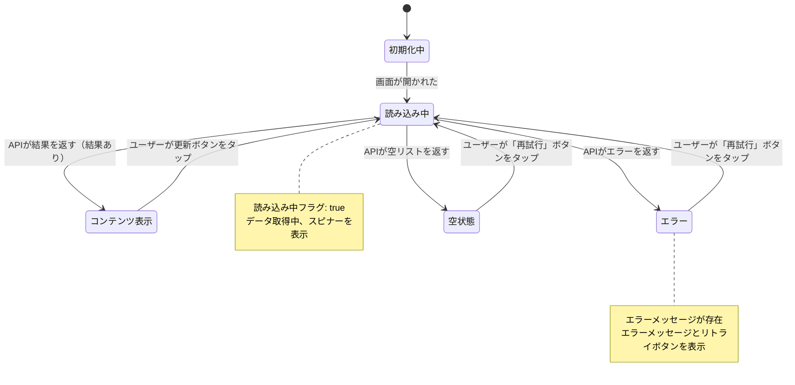

# Phase 1: 仕様・インターフェース定義（合意レビュー）

Phase 1では、「何を作るか」を明確にし、AIと人間が共に参照できる詳細仕様を作成します。

**前提**: Story Issueは既に作成済み（Phase 0で作成、または小規模機能の場合は直接Phase 1から）

## 🎯 実行方法

```bash
/phase1
```

## Context

### Story Issue確認
- Story Issue: !`gh issue list --label "story" --limit 10 2>/dev/null || echo "Story Issueなし"`

### Epic確認（該当する場合）
- Epic Issue: !`gh issue list --label "epic" --limit 5 2>/dev/null || echo "Epicなし"`
- 共通ドメイン: !`find shared/src/commonMain/kotlin -type f -name "*.kt" | grep -E "(domain/model|domain/repository)" | head -10`

### 既存パターン参照
- SPECIFICATION examples: !`find composeApp/src/commonMain/kotlin -name "SPECIFICATION.md" -o -name "REQUIREMENTS.md" | head -5`
- ViewModel examples: !`find composeApp/src/commonMain/kotlin -name "*ViewModel.kt" | head -5`

### Git状態
- Current branch: !`git branch --show-current`
- Git status: !`git status --porcelain | head -10 || echo "Clean"`

---

## Overview

**Phase 1の目的**: 「何を作るか」の合意

実装前に以下を明確にします：
- **ナビゲーション設計**: 呼び出し元・呼び出し方法・遷移先の明確化
- **ユーザーストーリー**: ユーザー操作と期待する動作
- **ビジネスルール**: 機能要件と制約条件
- **画面状態遷移**: Mermaid図で視覚化
- **テスト仕様**: ViewModelTestで振る舞いを定義

**重要な原則**:
- 実装の詳細は書かない（Phase 2でAIが推論）
- 「何を作るか」に集中
- テストで仕様を表現（実行可能な仕様書）
- **進捗管理はStory Issueで**（SSOT）

---

## Phase 1 Process

### Step -1: 環境準備（main最新化 & Worktree作成）

#### -1.1 最新のmainを取得

```bash
# mainブランチに切り替えて最新化
git checkout main
git pull origin main
```

#### -1.2 Worktree作成

Phase 1用のworktreeを作成します:

```bash
/create-worktree {feature_name}-phase1
```

**例**: `video-sync` 機能の場合
```bash
/create-worktree video-sync-phase1
```

これにより以下が作成されます:
- Worktree: `.worktrees/{feature_name}-phase1/`
- ブランチ: `feature/{feature_name}-phase1`

#### -1.3 Worktreeで作業開始

```bash
cd .worktrees/{feature_name}-phase1
```

---

### Step 0: Story Issue確認 & 進捗更新

#### 0.1 Story Issue確認

```bash
# 対象のStory Issue詳細を取得
gh issue view {STORY_ISSUE_NUMBER}

# または一覧から選択
gh issue list --label "story"
```

#### 0.2 Phase 1開始をマーク

```bash
# Story Issueに phase-1 ラベルを付与
gh issue edit {STORY_ISSUE_NUMBER} --add-label "phase-1"

# Story Issue本文のチェックボックスを更新（コメントで通知）
gh issue comment {STORY_ISSUE_NUMBER} --body "## Phase 1 開始

仕様定義（SPECIFICATION.md作成）を開始します。

- [x] Phase 1: 仕様定義（進行中）"
```

---

### Step 0.5: ナビゲーション設計

新機能がアプリ全体のどこにどのように組み込まれるかを設計します。

#### 0.5.1 現状の画面構成を確認

```bash
# Level 1: アプリ全体の画面構成を確認
cat docs/screen-navigation.md

# Level 2: 関連モジュールの画面遷移を確認
ls docs/navigation/
cat docs/navigation/{module}-module.md
```

#### 0.5.2 動線設計の検討

以下を明確にします：

1. **呼び出し元**: どの画面からこの機能に遷移するか
   - 例: ホーム画面のFABから、メニューから、既存画面のボタンから
2. **呼び出し方法**: どのようなUI要素で呼び出すか
   - 例: BottomNavigation、FAB、メニュー項目、ボタン、モーダル
3. **遷移先**: この機能からどの画面に遷移するか
   - 例: 詳細画面、外部アプリ、元の画面に戻る

#### 0.5.3 Level 1/2ドキュメント更新

更新判断基準:

| 追加内容 | Level 1更新 | Level 2更新 |
|---------|-------------|-------------|
| 新しいメイン画面（BottomNav等から直接アクセス） | ✅ 必須 | ✅ 必須（新規作成も） |
| 既存モジュールへの新画面追加 | ⚪ 場合による | ✅ 必須 |
| 既存画面への機能追加（モーダル等） | ❌ 不要 | ⚪ 場合による |
| 画面内の小機能追加 | ❌ 不要 | ❌ 不要 |

**Level 1更新が必要な場合**:
```bash
# docs/screen-navigation.md を編集
# 1. Mermaid図に機能ノードを追加
# 2. Feature List Tableに行を追加
# 3. 色分けを適用（機能領域に応じて）
```

**Level 2更新が必要な場合**:
```bash
# 新規モジュールの場合
cp docs/design-doc/template/module-navigation-template.md \
   docs/navigation/{module}-module.md

# 既存モジュールへの追加の場合
# docs/navigation/{module}-module.md を編集
```

---

### Step 1: SPECIFICATION.md作成

#### 1.1 既存ファイル検索と配置判断

まず、既存の仕様ファイルを検索します:

```bash
# 機能ディレクトリで仕様ファイルを検索
find composeApp/src/commonMain/kotlin/org/example/project/feature/{feature_name} \
  -name "SPECIFICATION.md" -o -name "REQUIREMENTS.md" 2>/dev/null
```

**配置方法の判断基準**:

| ケース | 方法 |
|--------|------|
| 新規画面の追加 | 新規 SPECIFICATION.md 作成 |
| 既存画面への機能追加 | 既存 SPECIFICATION.md の各セクションを修正 |
| 別UIコンポーネント（モーダル等） | サブディレクトリに新規作成 |

**既存画面への機能追加の場合**:
- 既存の3セクション構造は維持
- Section 1: 新機能のユーザーストーリーを**追加**
- Section 2: 新機能のビジネスルールを**追加**
- Section 3: 状態図に新しい状態・遷移を**追加**（図は常に1つ）
- **具体的なコード（疑似コード含む）は禁止** - 自然言語で説明

**禁止事項**:
- 「## Story N: {機能名}」のような独立セクションの作成
- 複数の状態図を作成
- 疑似コードや実装例の記載

**実装方法**:
- **既存ファイルあり** → Edit toolで各セクションに内容を追加
- **既存ファイルなし** → 新規作成（テンプレートからコピー）

#### 1.2 配置場所
```
composeApp/src/commonMain/kotlin/org/example/project/feature/{feature_name}/SPECIFICATION.md
```

#### 1.3 Section 1: ユーザーストーリー

**箇条書きで記述**:

```markdown
## 1. ユーザーストーリー

- ユーザーが画面を開くと、自動的にデータ一覧を読み込む
- 読み込み中はローディングインジケータを表示する
- データ取得に成功した場合、リスト形式で表示する
- データ取得に失敗した場合、エラーメッセージと「再試行」ボタンを表示する
- 「再試行」ボタンを押すと、再度データ取得を試みる
```

**ポイント**:
- ユーザーの操作から記述
- 期待する動作を明確に
- エラーケースも含める

#### 1.4 Section 2: ビジネスルール

**カテゴリ別に整理**:

```markdown
## 2. ビジネスルール

- **データソート**: 更新日時の新しい順
- **取得件数**: 一度の取得は20件まで
- **キャッシュ**: 取得したデータは5分間キャッシュ
- **エラーハンドリング**:
  - ネットワークエラー: 「再試行」ボタン付きエラー画面
  - 認証エラー: ログイン画面へ遷移
  - サーバーエラー: エラーメッセージ表示
```

**ポイント**:
- 数値は具体的に
- エラーハンドリングの詳細
- 制約条件を明記

#### 1.5 Section 3: 画面内の状態遷移

**Mermaid状態遷移図を直接SPECIFICATION.md内に記述します**:

```markdown
## 3. 画面内の状態遷移

画面の状態（Loading, Content, Error等）とユーザーアクションによる遷移を定義します。

### 状態遷移図



### 関連ドキュメント

- **App Navigation**: [/docs/screen-navigation.md](/docs/screen-navigation.md) - アプリ全体の画面遷移（Level 1）
- **Module Navigation**: [/docs/navigation/{module}-module.md](/docs/navigation/{module}-module.md) - モジュール単位の画面遷移（Level 2、該当する場合）
```

**ポイント**:
- Mermaid図を直接SPECIFICATION.md内に記述
- Section 2のビジネスルールから状態を抽出
- ユーザー操作とシステムイベントを明記
- 必要に応じてネスト状態を追加
- 別ファイルへの参照は削除（全て1ファイルに集約）

**新機能の場合のみ、App Navigationを更新**:
```bash
# docs/screen-navigation.md を編集
# 1. Mermaid図に機能ノードを追加
# 2. Feature List Tableに行を追加
# 3. 色分けを適用（feature areaに応じて）
```

---

### Step 2: ViewModelTest作成（必須）

#### 2.1 配置場所
```
composeApp/src/commonTest/kotlin/org/example/project/feature/{feature_name}/{Feature}ViewModelTest.kt
```

#### 2.2 テスト構造（簡潔版）

**テンプレート**:
```kotlin
package org.example.project.feature.{feature_name}

import kotlin.test.Test
import kotlin.test.DisplayName

/**
 * {機能名}画面の振る舞い仕様
 * Specification: feature/{feature_name}/SPECIFICATION.md
 * Story Issue: #{STORY_ISSUE_NUMBER}
 */
@DisplayName("{機能名}画面の振る舞い仕様")
class {Feature}ViewModelTest {

    @Nested
    @DisplayName("画面を開いた時")
    inner class OnInitialize {

        @Test
        @DisplayName("まずはローディング状態になること")
        fun startsWithLoading() {
            // TODO: Phase 2でAI実装
        }

        @Nested
        @DisplayName("データ取得に成功した場合")
        inner class OnSuccess {
            @Test
            @DisplayName("コンテンツが表示されること")
            fun showContent() {
                // TODO: Phase 2でAI実装
            }
        }

        @Nested
        @DisplayName("データ取得に失敗した場合")
        inner class OnFailure {
            @Test
            @DisplayName("エラー状態になること")
            fun showsError() {
                // TODO: Phase 2でAI実装
            }
        }
    }

    @Nested
    @DisplayName("再試行ボタンを押した時")
    inner class OnRetry {
        @Test
        @DisplayName("再度データ取得を試みること")
        fun retriesDataFetch() {
            // TODO: Phase 2でAI実装
        }
    }
}
```

**テスト構造の設計ポイント**:
- @DisplayName: 日本語で仕様を記述
- @Nested: 階層的に整理
- TODOコメント: Phase 2でAIが実装
- SPECIFICATION.mdの状態遷移と対応
- **KDocにStory Issue番号を記載**

---

### Step 3: UseCaseTest作成（任意）

**作成する条件**:
- 複雑なビジネスルールがある場合
- ドメインロジックのテストが必要な場合

#### 3.1 配置場所
```
shared/src/commonTest/kotlin/org/example/project/domain/usecase/{UseCase}Test.kt
```

#### 3.2 テンプレート（簡潔版）

```kotlin
package org.example.project.domain.usecase

import kotlin.test.Test
import kotlin.test.DisplayName

/**
 * Story Issue: #{STORY_ISSUE_NUMBER}
 */
@DisplayName("{機能名}のビジネスルール")
class {UseCase}Test {

    @Test
    @DisplayName("{ビジネスルール説明}")
    fun testBusinessRule() {
        // TODO: Phase 2でAI実装
    }
}
```

---

### Step 4: Interface Skeleton（オプション）

**作成する判断基準**:
- ✅ 複雑な状態管理が必要
- ✅ 複数のIntent（ユーザー操作）がある
- ❌ シンプルな画面（Loading → Content → Error のみ）→ Phase 2でAI生成

#### 作成する場合のファイルリスト

```
composeApp/src/commonMain/kotlin/org/example/project/feature/{feature_name}/
├── {Feature}ViewModel.kt          # ViewModel骨格
├── {Feature}UiState.kt            # State定義
└── {Feature}Intent.kt             # Intent定義
```

**Phase 2でAIが自動生成できる場合はスキップ推奨**

---

### Step 5: Directory Structure

#### 5.1 基本構造

```
composeApp/src/commonMain/kotlin/.../feature/{feature_name}/
  ├── SPECIFICATION.md               # ✅ Phase 1で作成
  └── ui/                            # UI Components（Phase 2で作成）

composeApp/src/commonTest/kotlin/.../feature/{feature_name}/
  └── {Feature}ViewModelTest.kt     # ✅ Phase 1で作成（空のテスト）

shared/src/commonTest/kotlin/.../domain/usecase/
  └── {UseCase}Test.kt               # ⚪ Phase 1で作成（任意）
```

#### 5.2 ディレクトリ作成

```bash
mkdir -p composeApp/src/commonMain/kotlin/org/example/project/feature/{feature_name}/ui
mkdir -p composeApp/src/commonTest/kotlin/org/example/project/feature/{feature_name}
```

---

### Step 6: Phase 1 Review & PR

#### 6.1 レビュー観点

**「何を作るか」の合意**:
- [ ] **ナビゲーション設計完了**
  - [ ] 呼び出し元・呼び出し方法・遷移先が明確か
  - [ ] Level 1（screen-navigation.md）更新完了（該当する場合）
  - [ ] Level 2（module-navigation.md）更新完了（該当する場合）
- [ ] SPECIFICATION.mdが明確か（3セクション）
- [ ] Section 1: ユーザーストーリーが記述されているか
- [ ] Section 2: ビジネスルールが明確か
- [ ] Section 3: Mermaid状態遷移図がSPECIFICATION.md内に記述され、振る舞いを正しく表現しているか
- [ ] ViewModelTestで仕様が表現されているか
- [ ] エラーケースが含まれているか

**Note**: 画面遷移図は別ファイルではなく、SPECIFICATION.md内に統合されています。

#### 6.2 PR作成

**ブランチ**:
```bash
# Step -1でworktreeを作成済みのため、既に feature/{feature_name}-phase1 ブランチで作業中
# ブランチ切り替えは不要
```

**PR Title**: `feat: {機能名} - Phase 1 仕様定義`

**PR Body**:
```markdown
## Phase 1: 仕様・インターフェース定義

### Story Issue
- #{STORY_ISSUE_NUMBER}

### 成果物
- [x] SPECIFICATION.md（3セクション統合仕様書）
- [x] ViewModelTest.kt（空のテスト骨格）

### 次のステップ
承認後、Phase 2（`/phase2`）でAI実装開始
```

**PR作成コマンド**:
```bash
git add composeApp/src/commonMain/kotlin/org/example/project/feature/{feature_name}/
git add composeApp/src/commonTest/kotlin/org/example/project/feature/{feature_name}/

git commit -m "$(cat <<'EOF'
feat: {機能名} - Phase 1 仕様定義

Story Issue: #{STORY_ISSUE_NUMBER}

- SPECIFICATION.md作成（3セクション統合仕様書）
  - Section 1: ユーザーストーリー
  - Section 2: ビジネスルール
  - Section 3: 画面内の状態遷移（Mermaid図）
- ViewModelTest.kt作成（空のテスト骨格）

🤖 Generated with [Claude Code](https://claude.ai/code)

Co-Authored-By: Claude <noreply@anthropic.com>
EOF
)"

gh pr create --title "feat: {機能名} - Phase 1 仕様定義" --body "（上記内容）"
```

---

### Step 7: Story Issue更新

#### 7.1 Phase 1完了をマーク

```bash
# Story Issueにコメントを追加
gh issue comment {STORY_ISSUE_NUMBER} --body "## Phase 1 完了 ✅

### 成果物
- SPECIFICATION.md: \`feature/{feature_name}/SPECIFICATION.md\`
- ViewModelTest: \`feature/{feature_name}/{Feature}ViewModelTest.kt\`
- Phase 1 PR: #{PR_NUMBER}

### 次のアクション
Phase 2 (\`/phase2\`) で実装開始"
```

#### 7.2 ラベル更新（Phase 2準備完了）

```bash
# phase-1 ラベルは Phase 2 開始時に削除される
# この時点ではそのまま維持
```

---

## Success Criteria

Phase 1完了の条件：

- [ ] **Story Issue進捗更新**
  - [ ] `phase-1` ラベル付与
  - [ ] Phase 1開始コメント追加

- [ ] **ナビゲーション設計完了**
  - [ ] 呼び出し元の画面を特定
  - [ ] 呼び出し方法（UI要素）を決定
  - [ ] 遷移先の画面を特定
  - [ ] Level 1更新完了（該当する場合）
  - [ ] Level 2更新完了（該当する場合）

- [ ] **SPECIFICATION.md作成完了**（3セクション統合仕様書）
  - [ ] Section 1: ユーザーストーリー
  - [ ] Section 2: ビジネスルール
  - [ ] Section 3: 画面内の状態遷移（Mermaid図を直接記述）

- [ ] **ViewModelTest.kt作成完了**（必須）
  - [ ] @DisplayName + @Nested 構造
  - [ ] 空のテストメソッド（TODOコメント付き）
  - [ ] SPECIFICATION.mdと整合性あり
  - [ ] KDocにStory Issue番号記載

- [ ] **UseCaseTest.kt作成完了**（該当する場合）
  - [ ] ビジネスルールをテストで表現

- [ ] **レビュー完了**
  - [ ] Phase 1 PR作成
  - [ ] レビュー承認

- [ ] **Story Issue更新完了**
  - [ ] Phase 1完了コメント追加
  - [ ] PR番号を記載

---

## Next Steps

Phase 1完了後：

1. **PR承認待ち** → Phase 1ブランチをマージまたは保持
2. **Phase 2実装** → `/phase2` コマンド実行
3. **進捗管理** → Story Issueで管理（`phase-1` → `phase-2` ラベル切り替え）

**Phase 2で実現すること**:
- Shared Layer実装（Domain/Data）
- ComposeApp Layer実装（ViewModel/UI）
- テスト実装（空のテストを完全実装）
- DI設定（Koin）

---

## Notes

### よくある質問

**Q1: Interface骨格は必ず作成すべき？**
A: いいえ。シンプルな画面の場合、Phase 2でAIが推論できます。

**Q2: SPECIFICATION.mdにコード例を含めるべき？**
A: いいえ。「何を作るか」に集中し、実装の詳細は書きません。

**Q3: ViewModelTestはどこまで詳細に書くべき？**
A: Phase 1では空のテストメソッド（TODOコメント付き）のみです。

**Q4: 進捗管理はどこで行う？**
A: **Story Issue**で管理します（SSOT）。SPECIFICATION.md内には進捗セクションを作成しません。

**Q5: 従来のREQUIREMENTS.mdとscreen-transition.mdは？**
A: SPECIFICATION.mdに統合されました。既存ファイルは移行ガイド（docs/guides/migrate-to-specification.md）を参照してください。

---

**Phase 1完了後、次は `/phase2` コマンドでAI実装を開始してください。**