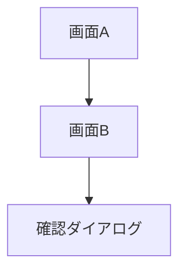

# 言語ルール

## 出力言語

**すべての応答、説明、コメント、ドキュメントは日本語で出力すること。**

### 対象
- テキスト応答
- コードコメント
- ドキュメント作成
- Git コミットメッセージ
- PR 説明文

### 例外
- コード（変数名、関数名等）は英語
- 技術用語はそのまま使用可（例: Repository, ViewModel）
- ライブラリ名、フレームワーク名

### Mermaid 図

Mermaid 図のラベルも日本語で記述すること。

