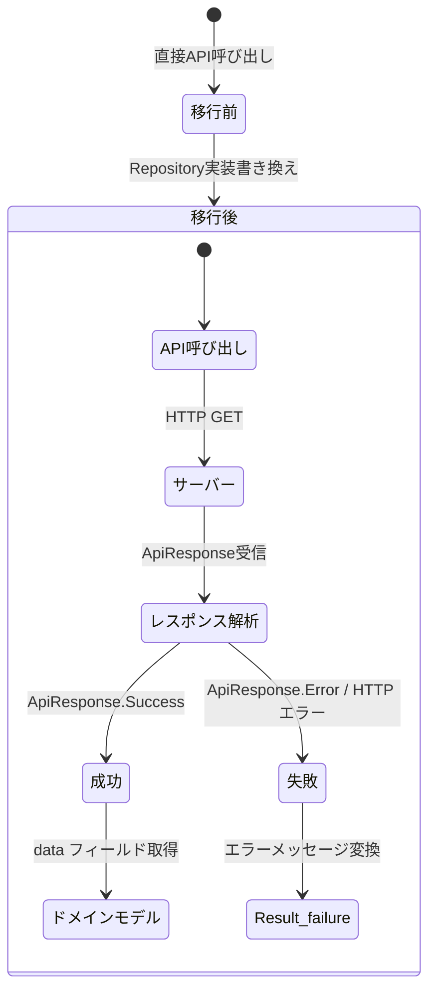

# 機能仕様: クライアント側Repository移行

> 作成日: 2026-02-16

---

## 1. ユーザーストーリー

- 開発者がクライアントのRepository実装を直接API呼び出しからサーバーAPI経由に移行する
- 移行後もユーザーから見た動作は変わらない（動画取得、検索、チャンネル動画一覧すべて同様に動作する）
- BuildKonfigからYouTube / Twitch APIキー定義が除去され、APIキーがクライアントに含まれなくなる
- 開発環境（localhost:8080）と本番環境（Cloud Run）でサーバーURLを切り替えられる
- APIエラー時は既存と同等のエラーハンドリングが機能する

---

## 2. ビジネスルール

| ドメイン | ルール | 条件/値 | 備考 |
|----------|--------|---------|------|
| APIプロキシ | 通信先 | サーバーAPI経由（直接API呼び出し禁止） | ADR-005 Phase 2 |
| APIキー | クライアント保持 | 禁止（BuildKonfigから除去） | セキュリティ要件 |
| サーバーURL | 開発環境 | `http://10.0.2.2:8080`（Android）/ `http://localhost:8080`（その他） | エミュレータ考慮 |
| サーバーURL | 本番環境 | 環境変数 or BuildKonfig で設定 | 将来のCloud Run対応 |
| レスポンス形式 | 共通 | `ApiResponse<T>` ラッパー（Success/Error） | サーバー既存仕様 |
| エラーハンドリング | HTTP 4xx/5xx | `Result.failure()` に変換 | 既存UI動作維持 |
| 移行対象 | Repository | VideoSyncRepository, TimelineSyncRepository, VideoSearchRepository | 3 Repository |
| 移行対象 | DataSource | YouTubeSearchDataSource, TwitchSearchDataSource | 2 DataSource |
| 移行不要 | Repository | ChannelFollowRepository, SyncHistoryRepository, UserRepository | ローカルDB操作のみ |

### 移行対象エンドポイント対応表

| クライアント機能 | サーバーエンドポイント | メソッド |
|-----------------|---------------------|---------|
| 動画詳細取得 | `GET /api/videos/{id}?service=youtube\|twitch` | `getVideoDetails()` |
| チャンネル動画一覧 | `GET /api/channels/{id}/videos?service=...&startDate=...&endDate=...` | `getChannelVideos()` |
| 動画検索 | `GET /api/search/videos?q=...&service=...` | `searchVideos()` |
| チャンネル検索 | `GET /api/search/channels?q=...&service=...` | `searchChannels()` |

---

## 3. 状態遷移

この US は内部実装の移行であり、ユーザー向けの状態遷移に変更はない。
既存の各画面（動画再生、タイムライン同期、検索）の状態遷移を維持する。

