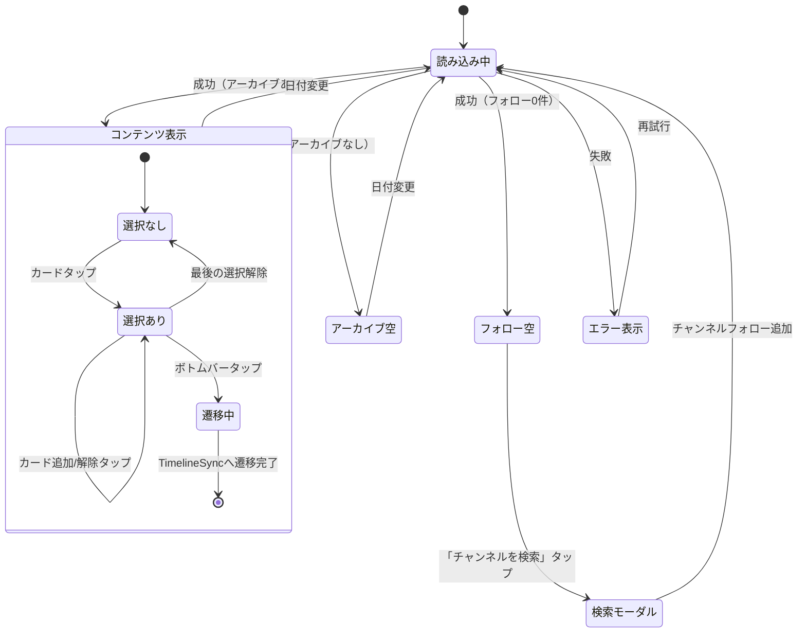

# 機能仕様: アーカイブHome画面

> 作成日: 2026-02-11
> US: US-3, US-4（チャンネルフォロー & アーカイブHome Epic）

---

## 1. ユーザーストーリー

### 画面表示
- ユーザーがアプリを起動すると、ArchiveHome画面が表示される
- 上部に横並び日付セレクター（`WeekCalendar`再利用）が表示される
- デフォルトでは今日の日付が選択されている
- 下部にフォロー中チャンネルの選択日アーカイブカードが縦リストで表示される

### 日付選択
- ユーザーが日付をタップすると、その日のアーカイブに切り替わる
- カレンダーは左右にスワイプして前後の週に移動できる

### アーカイブカード
- 各カードにはチャンネルアイコン、チャンネル名、動画タイトル、サムネイル、配信時間が表示される
- カードタップで選択トグル（チェックマーク表示）
- 1つ以上選択時にボトムバー「タイムラインで開く (N)」が出現

### 空状態（フォロー0件）
- アイコン + 「チャンネルをフォローしてアーカイブを表示しよう」メッセージ
- 「チャンネルを検索」ボタン → 検索モーダルへ

### 空状態（アーカイブ0件）
- 「この日のアーカイブはありません」メッセージ表示

### 同期画面遷移
- ボトムアクションバーをタップすると、選択チャンネル+日付がプリセットされた状態でTimelineSyncに遷移する

---

## 2. ビジネスルール

| ドメイン | ルール | 条件/値 | 備考 |
|----------|--------|---------|------|
| カレンダー | 表示範囲 | 過去7日〜当日 | WeekCalendar再利用 |
| カレンダー | デフォルト選択 | 今日 | - |
| アーカイブ取得 | データソース | `TimelineSyncRepository.getChannelVideos()` | 既存API再利用 |
| アーカイブ取得 | 日付範囲 | 選択日の1日分 | dateRange = selectedDate..selectedDate |
| アーカイブ取得 | 対象 | フォロー中チャンネルのみ | ChannelFollowRepository参照 |
| カード選択 | 選択方式 | タップでトグル | チェックマーク表示 |
| カード選択 | 最大選択数 | 10 | SyncChannelの最大数と同じ |
| ボトムバー | 表示条件 | 1つ以上選択時 | 0件で非表示 |
| ボトムバー | テキスト | 「タイムラインで開く ({N})」 | Nは選択数 |
| 遷移 | プリセット | 選択チャンネル + 選択日付 | TimelineSyncRouteにパラメータ追加 |
| 空状態 | フォロー0件 | 検索誘導UI | チャンネル検索モーダルへ遷移 |
| 空状態 | アーカイブ0件 | メッセージ表示 | 「この日のアーカイブはありません」 |
| エラー | ネットワークエラー | 再試行ボタン表示 | - |
| スタート画面 | 変更 | TimelineSyncRoute → ArchiveHomeRoute | NavGraph変更 |

---

## 3. 状態遷移

