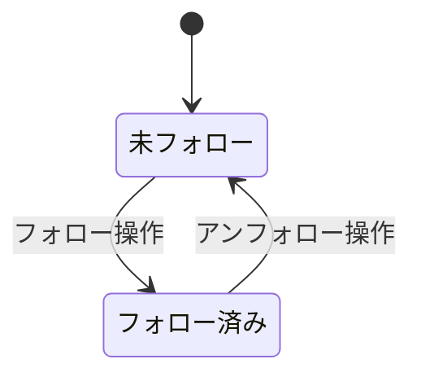

# 機能仕様: チャンネルフォロー データ層

> 作成日: 2026-02-11
> US: US-1（チャンネルフォロー & アーカイブHome Epic）

---

## 1. ユーザーストーリー

- ユーザーがチャンネルをフォローすると、ローカルDBに永続化される
- ユーザーがフォロー済みチャンネルをアンフォローすると、DBから削除される
- フォロー済みチャンネル一覧をFlowで監視でき、変更がリアルタイムに反映される
- フォロー状態をchannelIdで照会でき、UIでフォロー済みかどうかを判定できる

---

## 2. ビジネスルール

| ドメイン | ルール | 条件/値 | 備考 |
|----------|--------|---------|------|
| フォロー | 一意性 | channelId + serviceType で一意 | 同一チャンネルの重複フォロー不可 |
| フォロー | 保存項目 | channelId, channelName, channelIconUrl, serviceType, followedAt | - |
| フォロー | 並び順 | followedAt 降順（新しい順） | デフォルトソート |
| フォロー | 上限 | なし（Phase 1） | 将来的に上限追加の可能性 |
| アンフォロー | 削除方式 | 物理削除 | 論理削除は不要 |
| 監視 | 変更通知 | Flow<List<FollowedChannel>> | フォロー追加・削除時に自動発行 |

---

## 3. 状態遷移

