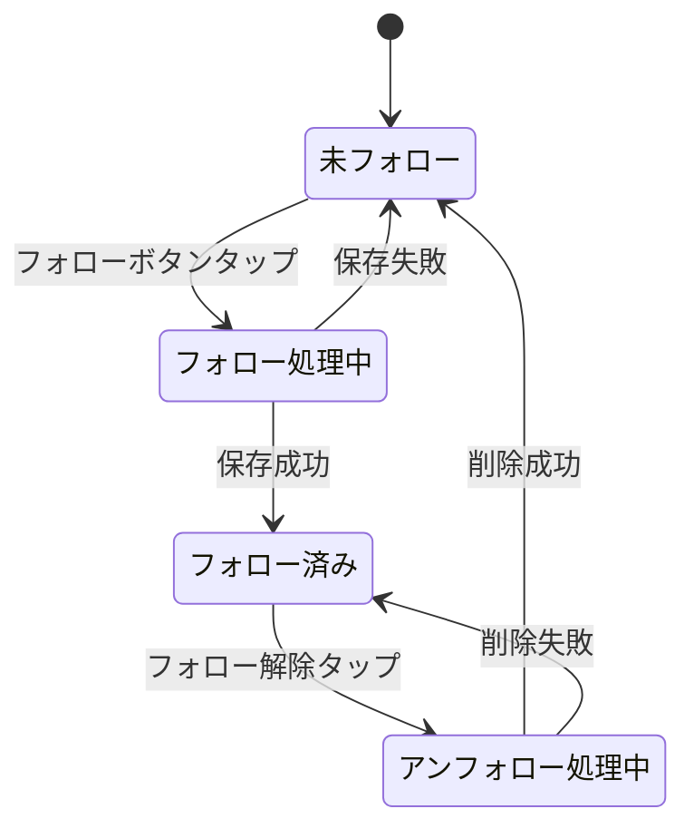

# 機能仕様: チャンネルフォロー

> 作成日: 2026-02-15
> US: US-1（データ層）, US-2（フォロー/アンフォロー UI）

---

## 1. ユーザーストーリー

### フォロー操作
- ユーザーがチャンネル検索結果からフォローボタンをタップすると、チャンネルがフォローリストに保存される
- フォロー済みチャンネルのフォローボタンをタップすると、フォローが解除される
- フォロー/アンフォローは冪等（同じ操作を繰り返しても副作用なし）

### フォロー一覧
- フォロー済みチャンネル一覧はフォロー日時の降順で表示される
- フォロー追加・解除時にリアルタイムでリストが更新される（Flow監視）

### データ永続化
- フォロー情報はRoom KMPでローカルに永続化される
- アプリ再起動後もフォロー情報は保持される

---

## 2. ビジネスルール

| ドメイン | ルール | 条件/値 | 備考 |
|----------|--------|---------|------|
| フォロー | 一意性 | channelId + serviceType | 複合キーで重複防止 |
| フォロー | 冪等性 | 既存データはUPSERT | ONConflict.REPLACE |
| アンフォロー | 冪等性 | 存在しなくても正常終了 | エラーにしない |
| 一覧取得 | ソート順 | followedAt降順 | 新しいフォローが先頭 |
| フォロー情報 | 必須フィールド | channelId, channelName, channelIconUrl, serviceType, followedAt | FollowedChannel参照 |
| serviceType | 対応種別 | YOUTUBE, TWITCH | VideoServiceType enum |

---

## 3. 状態遷移

