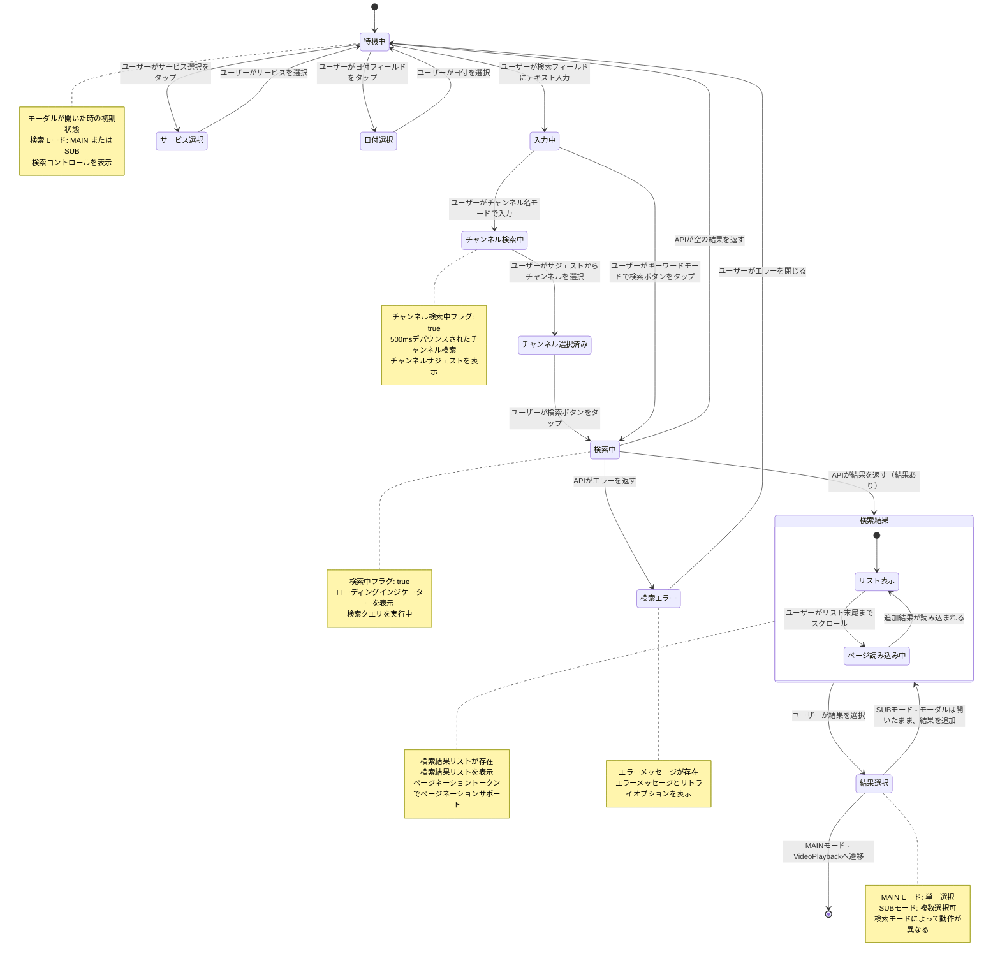

# 画面遷移図: StreamerSearch

> **配置場所**: `composeApp/src/commonMain/kotlin/org/example/project/feature/streamer_search/screen-transition.md`
> **目的**: 画面の状態ライフサイクル、ユーザーアクション、振る舞い遷移の視覚的表現
> **レベル**: 画面内部の振る舞い（Level 3）

---

## 目的

この図は、StreamerSearch画面の**詳細な振る舞い**を可視化し、以下を示します：
- 画面の状態（待機中、検索中、検索結果表示中、エラー表示中等）
- 状態変更をトリガーするユーザーアクション
- 状態遷移を決定する条件
- 複雑な検索動作のためのネスト状態（MAINモード vs SUBモード）

これにより、実装時に機能の振る舞い要件を正確に理解できます。

---

## 状態図

---

## 状態説明

### 待機中
**画面の状態**:
- 検索モード: MAINまたはSUB
- 入力テキスト: 空または以前のテキスト
- 選択サービス: YouTubeまたはTwitch
- 選択日付: デフォルトで昨日

**可能なユーザーアクション**:
- テキスト入力
- サービス選択
- 日付ピッカーを開く

### 入力中
**画面の状態**:
- 入力テキスト: ユーザーの入力内容

**可能なユーザーアクション**:
- チャンネル名を入力（500msデバウンス）
- 検索ボタンをタップ

### チャンネル検索中
**画面の状態**:
- チャンネル検索中フラグ: true
- チャンネルサジェスト: APIから読み込み中

**遷移条件**:
- チャンネルを選択すると、チャンネル選択済み状態へ

### チャンネル選択済み
**画面の状態**:
- 選択チャンネル: 選択されたチャンネル情報
- 入力テキスト: チャンネル名に更新

**可能なユーザーアクション**:
- 検索ボタンをタップ

### 検索中
**画面の状態**:
- 検索中フラグ: true

**遷移条件**:
- 結果ありで成功 → 検索結果状態
- エラー → 検索エラー状態
- 空の結果 → 待機中状態

### 検索結果
**画面の状態**:
- 検索結果リスト: 検索結果のリスト
- ページネーショントークン: ページネーション用

**ネスト状態**:
- **リスト表示**: 結果を表示中
- **ページ読み込み中**: 追加結果を読み込み中

**可能なユーザーアクション**:
- MAINモード: 単一選択
- SUBモード: 複数選択
- 末尾までスクロール（追加読み込み）

### 結果選択
**モード別動作**:
- **MAINモード**:
  - 単一選択のみ
  - VideoPlaybackへ遷移
  - バックスタックでHomeを置き換え

- **SUBモード**:
  - 複数選択可能
  - SavedStateHandleに結果を書き込み
  - モーダルは開いたまま次の選択が可能
  - ユーザーが手動でモーダルを閉じる

**画面の状態**:
- MAIN: 選択結果は単一
- SUB: 選択結果は複数可
- SUB: 既に追加済みのストリームを除外

### 検索エラー
**画面の状態**:
- エラーメッセージ: エラー内容

**可能なユーザーアクション**:
- エラーを閉じる → 待機中状態へ

### 日付選択
**画面の状態**:
- 日付ピッカー表示フラグ: true

**可能なユーザーアクション**:
- 日付を選択
- ピッカーを閉じる

### サービス選択
**画面の状態**:
- 選択サービス: YouTubeまたはTwitch

**可能なユーザーアクション**:
- サービスを選択

---

## 特殊な振る舞い

### デバウンスされたチャンネル検索
- ユーザーがチャンネル名モードで入力すると、チャンネル検索が実行される
- 過剰なAPI呼び出しを避けるため500msデバウンス
- 入力中にチャンネルサジェストを表示

### SUBモードでの複数選択
- ユーザーは複数の検索結果を選択可能
- 各選択は即座にSavedStateHandleに書き込まれる
- モーダルは開いたまま次の選択が可能
- ユーザーがTopAppBarの閉じるボタンで手動でモーダルを閉じる

### 既存ストリームの除外
SUBモードでは：
- 既に追加済みのサブストリームのIDを保持
- 現在のメインストリームのIDを保持
- 検索結果はこれらのIDを除外して重複を防ぐ

### ページネーション
- ユーザーが末尾までスクロールすると、追加読み込みが開始される
- ページネーショントークンを使用して次のページを取得
- 結果は検索結果リストに追加される

---

## 関連ドキュメント

- **親**: [video-module.md](../../../../docs/navigation/video-module.md) - モジュールレベル画面遷移（Level 2）
- **兄弟**: REQUIREMENTS.md - 機能仕様（存在する場合）

---

**最終更新**: 2025-12-30
