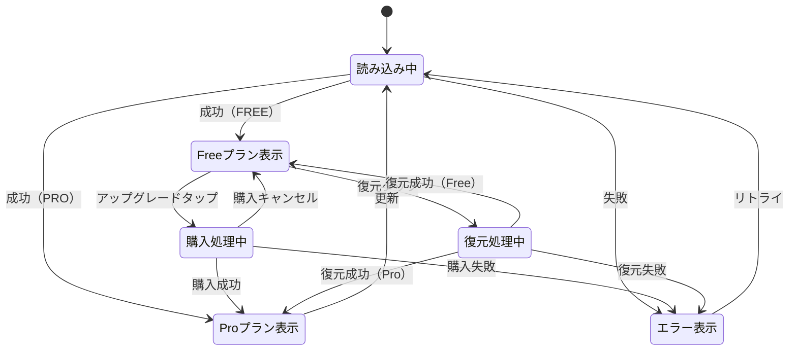

# 機能仕様: サブスクリプション管理

> 作成日: 2026-02-15

---

## 1. ユーザーストーリー

- ユーザーが設定画面から「サブスクリプション」をタップすると、サブスクリプション管理画面が表示される
- 画面を開くと、現在のサブスクリプション状態（Free/Pro）が自動的に読み込まれる
- 読み込み中はローディングインジケーターを表示する
- Freeプランのユーザーには「Proにアップグレード」ボタンを表示する
- 「Proにアップグレード」をタップすると、ストアの購入フローが起動する
- 購入成功後、画面がProプラン表示に更新される
- 「購入を復元」をタップすると、過去の購入が復元される
- Proプランのユーザーには有効期限と自動更新状態を表示する
- エラー発生時はエラーメッセージとリトライボタンを表示する

---

## 2. ビジネスルール

| ドメイン | ルール | 条件/値 | 備考 |
|----------|--------|---------|------|
| プラン | 種別 | FREE / PRO の2段階 | 将来的な段階追加に対応可能な設計 |
| プラン | デフォルト | FREE | 未購入ユーザーはFree |
| 購入 | 対応ストア | Google Play / App Store | RevenueCat KMP SDKで一元管理 |
| 購入 | 復元 | 同一デバイスIDで復元可能 | 機種変更時はデバイスID再設定が必要 |
| Feature Gate | 判定ロジック | Feature.requiredTier <= currentTier | FREEは全PRO機能にアクセス不可 |
| 認証 | ユーザー識別 | デバイスID（UUID v4） | アカウント作成不要 |
| 有効期限 | 表示形式 | 「YYYY年MM月DD日まで」 | null（Freeプラン）の場合は非表示 |
| 自動更新 | 表示 | 有効/無効 | willRenewフラグに基づく |

---

## 3. 状態遷移

