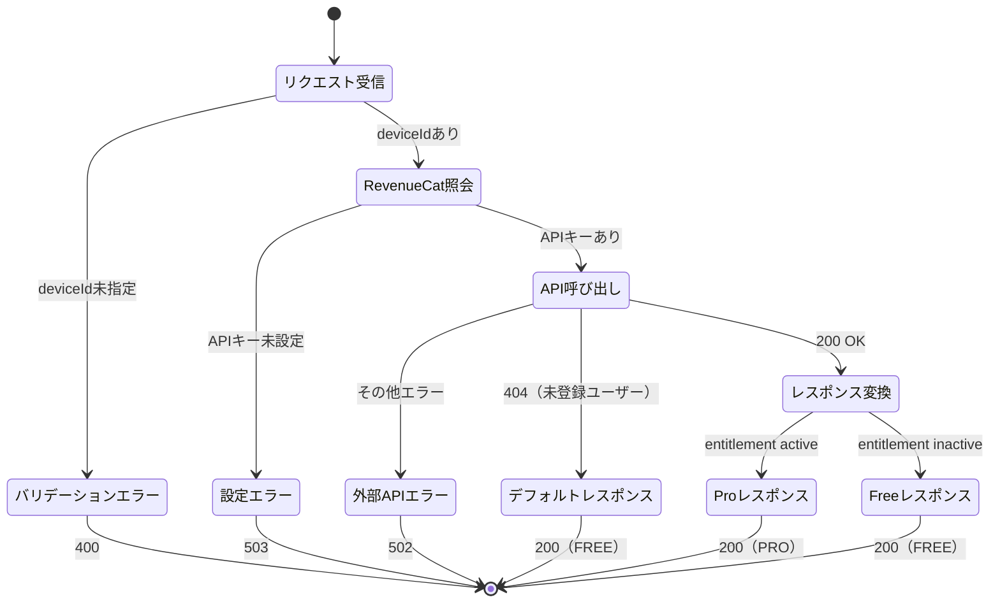

# 機能仕様: サーバーサイドサブスクリプション検証API

> 作成日: 2026-02-21

---

## 1. ユーザーストーリー

- サーバーが `GET /api/subscription/status?deviceId={deviceId}` リクエストを受信すると、RevenueCat REST API v1でサブスクリプション状態を照会する
- RevenueCatにサブスクリプション情報が存在する場合、entitlementの `is_active` / `will_renew` / `expires_date` をSubscriptionStatusに変換して返す
- RevenueCatに該当ユーザーが未登録の場合、FREEプラン（isActive=false）のデフォルトレスポンスを返す
- deviceIdパラメータが未指定の場合、400 Bad Requestを返す
- RevenueCat APIキーが未設定の場合、503 Service Unavailableを返す
- RevenueCat API呼び出しが失敗した場合、502 Bad Gatewayを返す

---

## 2. ビジネスルール

| ドメイン | ルール | 条件/値 | 備考 |
|----------|--------|---------|------|
| エンドポイント | パス | `GET /api/subscription/status` | クエリパラメータでdeviceId指定 |
| エンドポイント | 認証 | 不要（deviceIdで識別） | クライアント側で匿名認証済み |
| RevenueCat | API版 | REST API v1 | `GET /v1/subscribers/{appUserId}` |
| RevenueCat | 認証 | Bearer token（Secret API Key） | 環境変数 `REVENUECAT_API_KEY` |
| RevenueCat | appUserId | deviceId をそのまま使用 | UUID v4形式 |
| マッピング | tier判定 | entitlement "pro" が `is_active=true` → PRO | それ以外はFREE |
| マッピング | isActive | entitlement の `is_active` フラグ | FREEの場合はfalse |
| マッピング | expiresAtMillis | entitlement の `expires_date` をエポックミリ秒に変換 | nullの場合はnull |
| マッピング | willRenew | entitlement の `will_renew` フラグ | FREEの場合はfalse |
| エラー | deviceId未指定 | 400 Bad Request | エラーメッセージ付き |
| エラー | APIキー未設定 | 503 Service Unavailable | サーバー設定エラー |
| エラー | RevenueCat障害 | 502 Bad Gateway | 外部API障害 |
| エラー | 未登録ユーザー | 200 OK（FREEプラン） | エラーではなく正常レスポンス |

---

## 3. 状態遷移

