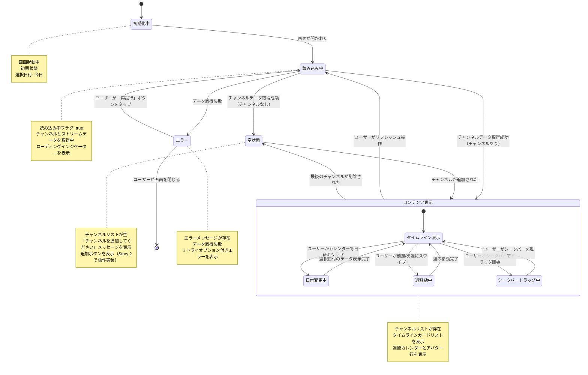

# 機能仕様: Timeline Sync

> **配置場所**: `composeApp/src/commonMain/kotlin/org/example/project/feature/timeline_sync/SPECIFICATION.md`
> **目的**: AI実装のためのSSoT（Single Source of Truth）
> **Story**: Story 1, 3 of EPIC-002 (Timeline Sync)
> **関連Issue**: #32（Story 1）, #53（Story 3）
> **バージョン**: 5.0（統合仕様書形式 - Story 3統合）

---

## 1. ユーザーストーリー

### 画面表示
- ユーザーがタイムライン画面を開くと、ヘッダーに「Timeline Sync」と「{N} CHANNELS ACTIVE」が表示される
- 画面上部に週間カレンダーが横スクロール可能な形式で表示される
- カレンダーの下にチャンネルアバター行が横スクロール可能な形式で表示される
- 中央にSYNC TIME表示（HH:MM:SS形式）が表示される
- メインエリアにタイムラインカードリストが縦スクロール可能な形式で表示される
- 画面下部にボトムナビゲーション（Home / Timeline / Channels / Settings）が表示される

### 日付選択
- デフォルトでは今日の日付が選択されている（青背景でハイライト）
- ユーザーがカレンダーの日付をタップすると、その日のタイムラインに切り替わる
- カレンダーは左右にスワイプして前後の週に移動できる
- 日付は「MON 17」「TUE 18」の形式で表示される

### チャンネル表示
- 各チャンネルはアバター行とタイムラインカードの2箇所で表示される
- **アバター行**:
  - 丸型アバター画像
  - プラットフォームバッジ（YouTube=赤、Twitch=紫）
  - 下部にチャンネル名
  - 右端に「+ Add」ボタン（Story 2で実装、Story 1では非活性）
- **タイムラインカード**:
  - 左側: プラットフォームアイコン + チャンネル名 + 時間範囲（HH:MM - HH:MM）
  - 右側: Open/Waitボタン（Story 4で実装、Story 1では表示のみ）
  - 背景: タイムラインバー（YouTube=赤、Twitch=紫）

### タイムラインバー表示
- ストリームの開始〜終了時刻がバーの位置と幅で視覚的に表現される
- 選択された日付の0:00-24:00を基準にバー位置を計算
- 未開始のストリームは「Starts HH:MM」「{N}M TO START」と表示される

### 同期時刻インジケーター
- タイムライン全体を貫通する縦の青い線で同期時刻を視覚的に表示
- シークバーのドラッグ中は、インジケーターもリアルタイムで移動する
- 初期表示時は、一番上に表示されているアーカイブ動画の開始時刻が設定される
- チャンネルが登録されていない場合は非表示

### 同期時刻選択
- ユーザーがタイムライン上で同期時刻を選択できる
- タイムライン上にドラッグ可能なシークバーが表示される
- シークバーをドラッグすると、SYNC TIME表示がリアルタイムで更新される（HH:MM:SS形式）
- シークバーを離すと、選択した時刻が確定される
- 同期時刻がストリーム開始前の場合、該当チャンネルは「WAITING」状態として表示される
- 同期時刻がストリーム範囲内の場合、該当チャンネルは「READY」状態として表示される

### 空状態
- チャンネルが登録されていない場合、空状態UIを表示
- 「チャンネルを追加してください」のメッセージを表示
- チャンネル追加ボタンを表示（Story 2で動作実装）

---

## 2. ビジネスルール

### カレンダー
- **表示範囲**: 過去7日〜当日（将来拡張で未来も可能に）
- **デフォルト選択**: 今日の日付
- **形式**: 曜日（3文字英語大文字）+ 日付（数字）
- **週移動**: 左スワイプで次週、右スワイプで前週

### タイムラインバー
- **時間軸**: 選択日の0:00から24:00まで（ローカル時間）
- **バー位置計算**:
  - startTimeが選択日より前の場合 → 0:00から開始
  - endTimeが選択日より後の場合 → 24:00まで表示
  - endTimeがnull（ライブ配信中）の場合 → 現在時刻まで表示
- **バーの色**:
  - YouTube: 赤 (#FF0000)
  - Twitch: 紫 (#9146FF)
- **未開始ストリーム**:
  - 破線/グレーでバーを表示
  - 「Starts HH:MM」でストリーム開始時刻を表示
  - 「{N}M TO START」で残り時間を表示

### チャンネルデータ
- **使用モデル**: Phase 0で定義した`SyncChannel`
- **最大チャンネル数**: 10（将来拡張時の制限）
- **ストリーム**: 各チャンネルには0または1つの`SelectedStreamInfo`

### アクティブチャンネル数
- ストリームが選択されているチャンネルの数をカウント
- ヘッダーに「{N} CHANNELS ACTIVE」として表示
- 緑のドットアイコンを併せて表示

### Open/Waitボタン
- **READY状態**: 「Open」ボタン（外部リンクアイコン付き）を表示
- **WAITING状態**: 「Wait」ボタン（ロックアイコン付き、非活性）を表示
- **Story 1スコープ**: ボタンは表示のみ、タップ動作はStory 4で実装

### 同期時刻インジケーター
- **表示**: 縦の青い線（#0288D1）
- **位置**: SYNC TIMEの時刻に対応する位置
- **初期状態**: 一番上に表示されているアーカイブ動画の開始時刻
- **ドラッグ時**: リアルタイムで移動

### 同期時刻（Story 3）
- **プロジェクト制約**: このプロジェクトは**アーカイブ動画のみ対応**（ライブ配信中の動画は扱わない）
- **初期同期時刻**: 画面表示時の初期syncTimeは一番上に表示されているアーカイブ動画の開始時刻
- **同期時刻範囲**: 全チャンネルの中で最も早いストリーム開始時刻〜最も遅いストリーム終了時刻
- **同期位置計算**: 各チャンネルごとに、同期時刻における再生位置を秒単位で計算（同期時刻 - ストリーム開始時刻）
- **SyncStatus判定**:
  - **WAITING**: 同期時刻がストリーム開始前の場合（アーカイブ開始前）
  - **READY**: 同期時刻がストリーム範囲内の場合（Open可能）
- **SYNC TIME表示形式**: HH:MM:SS（24時間表記）、例: 14:30:45
- **更新タイミング**:
  - シークバーのドラッグ中: リアルタイム更新
  - シークバーを離した時: 最終確定値

### エラー処理
- **ネットワークエラー**: 「再試行」ボタン付きエラー画面を表示
- **データなし**: 空状態UIを表示

---

## 3. 画面内状態遷移

### 目的

この図は、Timeline Sync画面の**詳細な振る舞い**を可視化し、以下を示します：
- 画面の状態（初期化中、読み込み中、コンテンツ表示、空状態、エラー）
- 状態変更をトリガーするユーザーアクション
- 状態遷移を決定する条件
- 日付選択と週移動のためのネスト状態

これにより、実装時に機能の振る舞い要件を正確に理解できます。

### 状態図

### 状態説明

#### 初期化中
**画面の状態**:
- 画面が最初に読み込まれた時の初期状態
- チャンネルリスト: 空
- 選択日付: 今日（デフォルト）
- 同期時刻: null

**遷移条件**:
- 画面が開かれる → 読み込み中状態へ

#### 読み込み中
**画面の状態**:
- 読み込み中フラグ: true
- チャンネルデータを取得中
- 選択された日付のストリームデータを取得中
- ローディングインジケーターを表示

**遷移条件**:
- チャンネルあり → コンテンツ表示状態
- チャンネルなし → 空状態
- 失敗 → エラー状態

#### コンテンツ表示
**画面の状態**:
- チャンネルリスト: 1つ以上のチャンネルが存在
- 週間カレンダー: 表示中（選択日付がハイライト）
- チャンネルアバター行: 表示中
- SYNC TIME: 表示中（初期はnull）
- タイムラインカードリスト: 表示中
- 同期時刻インジケーター: 同期時刻が設定されていれば表示

**可能なユーザーアクション**:
- 日付をタップして変更 → 日付変更中
- 前週/次週にスワイプ → 週移動中
- リフレッシュ操作 → 読み込み中
- チャンネル追加ボタンをタップ（Story 2でハンドル）
- Open/Waitボタンをタップ（Story 4でハンドル）

#### 日付変更中（ネスト状態）
**画面の状態**:
- 選択日付が更新中
- タイムラインバーを再計算中

**遷移条件**:
- 新しい日付のデータ表示完了 → タイムライン表示へ

#### 週移動中（ネスト状態）
**画面の状態**:
- カレンダーの表示週が変更中
- 選択日付は変更しない

**遷移条件**:
- 週の移動完了 → タイムライン表示へ

#### シークバードラッグ中（ネスト状態）
**画面の状態**:
- isDragging: true
- syncTime: リアルタイム更新中
- SYNC TIME表示: リアルタイム更新
- 同期時刻インジケーター: リアルタイム移動
- 各チャンネルのSyncStatus: リアルタイム再計算
- 各チャンネルのtargetSeekPosition: リアルタイム再計算

**遷移条件**:
- シークバーを離す → タイムライン表示へ

#### 空状態
**画面の状態**:
- チャンネルリスト: 空
- 「チャンネルを追加してください」メッセージ表示
- 追加ボタン表示

**可能なユーザーアクション**:
- 追加ボタンをタップ（Story 2でハンドル）

#### エラー
**画面の状態**:
- エラーメッセージ: エラー内容
- データ取得失敗

**可能なユーザーアクション**:
- リトライ → 読み込み中状態へ
- 画面を離れる → 画面を終了

### 特殊な振る舞い

#### 日付変更時の振る舞い
1. ユーザーがカレンダーで日付をタップ
2. 選択日付を更新
3. 選択日付に基づいてタイムラインバー位置を再計算
4. タイムラインカードリストを再描画

#### 週移動時の振る舞い
1. ユーザーが左右にスワイプ
2. 表示する週を変更（前週 or 次週）
3. カレンダーUIを更新
4. 選択日付は変更しない（週が変わっても選択日はそのまま）

#### タイムラインバー表示ルール
- ストリームの`startTime`〜`endTime`をバーの位置と幅で表現
- 選択日の0:00-24:00の範囲で表示
- 複数日にまたがるストリームは選択日の範囲でクリップ
- `endTime`がnull（ライブ配信中）の場合は現在時刻まで表示

#### 同期時刻インジケーター
- SYNC TIMEの時刻に対応する位置に縦の青い線を表示
- 全てのタイムラインカードを貫通する形で描画
- Story 1では表示のみ（選択・変更はStory 3で実装）

#### アクティブチャンネルカウント
- `selectedStream`がnullでないチャンネルの数をカウント
- ヘッダーに「{N} CHANNELS ACTIVE」として表示

#### 未開始ストリームの表示
- `startTime`が現在時刻より後の場合
- 「Starts HH:MM」で開始時刻を表示
- 「{N}M TO START」で残り時間を表示
- バーは破線/グレーで表示
- 「Wait」ボタン（ロックアイコン付き）を表示

#### シークバードラッグ時の処理フロー
1. ユーザーがシークバーをタッチ
2. isDraggingがtrueになる
3. ユーザーがシークバーを移動
4. syncTimeがリアルタイムで更新される
5. SYNC TIME表示が更新される
6. 各チャンネルのtargetSeekPosition（同期時刻 - ストリーム開始時刻）が再計算される
7. 各チャンネルのSyncStatus（WAITING/READY）が再判定される
8. 同期時刻インジケーターが移動する
9. ユーザーがシークバーを離す
10. isDraggingがfalseになる
11. 最終的なsyncTimeが確定

#### 同期位置計算の詳細
各チャンネルごとに以下のロジックで計算：
- 同期時刻がストリーム開始前の場合:
  - SyncStatus = WAITING
  - targetSeekPosition = 0
- 同期時刻がストリーム範囲内の場合:
  - SyncStatus = READY
  - targetSeekPosition = (同期時刻 - ストリーム開始時刻) の秒数

#### チャンネル追加・削除時の振る舞い
- **チャンネル追加時**: 同期時刻範囲を再計算、現在のsyncTimeが範囲内に収まるか確認
- **チャンネル削除時**: 同期時刻範囲を再計算、現在のsyncTimeが範囲外になった場合は調整
- **最後のチャンネル削除時**: syncTime = null、同期時刻インジケーター非表示

---

## 補足

### 使用するドメインモデル（Phase 0で定義済み）
- `SyncChannel` - チャンネル + 選択ストリーム + 同期状態 + targetSeekPosition
- `SelectedStreamInfo` - ストリーム情報（id, title, startTime, endTime, duration）
- `SyncStatus` - 同期状態（NOT_SYNCED, WAITING, READY, OPENED）
- `TimelineSyncRepository` - getChannelVideos()
- `VideoServiceType` - YOUTUBE / TWITCH

### 既存実装の活用（Story 3）
- `TimelineSyncIntent.UpdateSyncTime` - 既存
- `TimelineSyncIntent.StartDragging` - 既存
- `TimelineSyncIntent.StopDragging` - 既存
- `TimelineSyncUiState.syncTime` - 既存
- `TimelineSyncUiState.isDragging` - 既存
- `TimelineSyncUiState.syncTimeRange` - 既存

### スコープ外（将来のStory）
- チャンネル追加・削除（Story 2）
- 外部アプリ連携（Story 4）

### UIデザイン参照
- GitHub Issue #32 コメント: UIモックアップ画像

### アプリ全体のナビゲーション（Level 1-2）
- **App Navigation**: [/docs/screen-navigation.md](/docs/screen-navigation.md)
- **Module Navigation**: [/docs/navigation/timeline-module.md](/docs/navigation/timeline-module.md)

### 参照
- **類似機能**: `feature/video_playback/`（MVIパターンの参考）
- **参照ADR**:
  - ADR-002（MVIパターン）
  - ADR-003（4層コンポーネント構造）

---

**作成者**: Claude Code
**作成日**: 2026-01-12
**最終更新**: 2026-01-18（Story 3統合、統合仕様書形式への完全移行）
**関連Issue**: #32（Story 1）, #53（Story 3）
**Epic**: Timeline Sync (EPIC-002)

