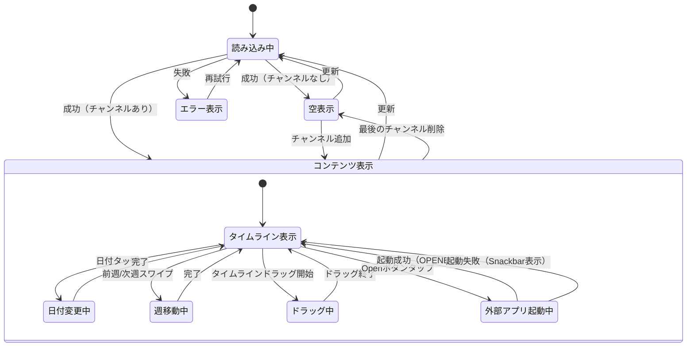

# 機能仕様: Timeline Sync

> Story: 1, 3, 4 of EPIC-002 | Issue: #32, #53, #54

---

## 1. ユーザーストーリー

### 画面表示
- ユーザーがタイムライン画面を開くと、ヘッダーに「Timeline Sync」と「{N} CHANNELS ACTIVE」が表示される
- 画面上部に週間カレンダーが横スクロール可能な形式で表示される
- カレンダーの下にチャンネルアバター行が横スクロール可能な形式で表示される
- 中央にSYNC TIME表示（HH:MM:SS形式）が表示される
- メインエリアにタイムラインカードリストが縦スクロール可能な形式で表示される
- 画面下部にボトムナビゲーション（Home / Timeline / Channels / Settings）が表示される

### 日付選択
- デフォルトでは今日の日付が選択されている（青背景でハイライト）
- ユーザーがカレンダーの日付をタップすると、その日のタイムラインに切り替わる
- カレンダーは左右にスワイプして前後の週に移動できる

### チャンネル表示
- 各チャンネルはアバター行とタイムラインカードの2箇所で表示される
- アバター行: 丸型アバター画像、プラットフォームバッジ、チャンネル名、「+ Add」ボタン
- タイムラインカード: プラットフォームアイコン、チャンネル名、時間範囲、Open/Waitボタン

### 同期時刻選択
- ユーザーがタイムライン全体を左右にドラッグして同期時刻を選択できる
- タイムラインをドラッグすると、SYNC TIME表示がリアルタイムで更新される
- 同期時刻がストリーム開始前の場合は「WAITING」、範囲内の場合は「READY」状態になる

### 空状態
- チャンネルが登録されていない場合、「チャンネルを追加してください」メッセージと追加ボタンを表示

### 外部アプリ連携（Story 4）
- ユーザーがタイムラインカードの「Open」ボタンをタップすると、該当チャンネルの外部アプリが起動する
- 外部アプリは計算された再生位置（targetSeekPosition）から再生を開始する
- 「Open」ボタンは同期時刻がストリーム範囲内（READY状態）の場合のみ有効
- 「Wait」ボタン（WAITING状態）はタップできない（非活性）
- 外部アプリが未インストールの場合、Webブラウザで該当URLを開く
- 外部アプリを開いた後、該当チャンネルのSyncStatusがOPENEDに変わる

---

## 2. ビジネスルール

| ドメイン | ルール | 条件/値 | US |
|----------|--------|---------|-----|
| カレンダー | 表示範囲 | 過去7日〜当日 | 1 |
| カレンダー | デフォルト選択 | 今日 | 1 |
| カレンダー | 日付形式 | 曜日（3文字英語大文字）+ 日付 | 1 |
| カレンダー | 週移動 | 左スワイプで次週、右スワイプで前週 | 1 |
| タイムラインバー | 時間軸 | 選択日の0:00〜24:00（ローカル時間） | 1 |
| タイムラインバー | 開始位置 | startTimeが選択日より前なら0:00から | 1 |
| タイムラインバー | 終了位置 | endTimeが選択日より後なら24:00まで、nullなら現在時刻 | 1 |
| タイムラインバー | 未開始表示 | 「Starts HH:MM」「{N}M TO START」 | 1 |
| チャンネル | 最大数 | 10 | 1 |
| チャンネル | アクティブ判定 | selectedStreamがnullでないチャンネルをカウント | 1 |
| 同期インジケーター | 位置 | 画面中央に固定表示 | 1 |
| 同期インジケーター | 初期値 | 一番上のアーカイブ動画の開始時刻 | 3 |
| 同期時刻 | 対象 | アーカイブ動画のみ（ライブ配信は対象外） | 3 |
| 同期時刻 | 範囲 | 最早ストリーム開始時刻〜最遅ストリーム終了時刻 | 3 |
| 同期時刻 | 表示形式 | HH:MM:SS（24時間表記） | 3 |
| 同期時刻 | 更新タイミング | ドラッグ中はリアルタイム、離すと確定 | 3 |
| 同期位置 | 計算 | 同期時刻 − ストリーム開始時刻（秒、0以上） | 3 |
| SyncStatus | WAITING判定 | 同期時刻がストリーム開始前 | 3 |
| SyncStatus | READY判定 | 同期時刻がストリーム範囲内 | 3 |
| SyncStatus | OPENED判定 | Openボタンタップ後、外部アプリ起動成功 | 4 |
| Open/Waitボタン | READY時 | 「Open」ボタン（外部リンクアイコン）、タップで外部アプリ起動 | 1,4 |
| Open/Waitボタン | WAITING時 | 「Wait」ボタン（ロックアイコン、非活性） | 1 |
| Open/Waitボタン | OPENED時 | 「Open」ボタンに「✓」マーク、再タップ可能 | 4 |
| 外部アプリ | YouTube DeepLink | youtube://watch?v={VIDEO_ID}&t={SECONDS} | 4 |
| 外部アプリ | YouTube フォールバック | https://www.youtube.com/watch?v={VIDEO_ID}&t={SECONDS}s | 4 |
| 外部アプリ | Twitch DeepLink | twitch://video/{VIDEO_ID}?t={SECONDS}s | 4 |
| 外部アプリ | Twitch フォールバック | https://www.twitch.tv/videos/{VIDEO_ID}?t={SECONDS}s | 4 |
| 外部アプリ | 再生位置 | targetSeekPosition.toInt().coerceAtLeast(0) | 4 |
| 外部アプリ | エラー時 | DeepLink・フォールバック両方失敗でSnackbar表示 | 4 |
| エラー処理 | ネットワークエラー | 「再試行」ボタン付きエラー画面 | 1 |
| エラー処理 | データなし | 空状態UI表示 | 1 |

---

## 3. 状態遷移

