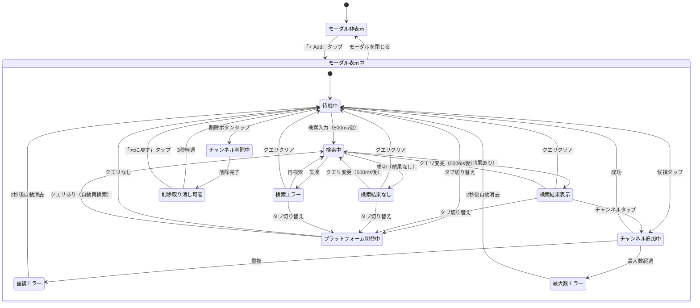

# 機能仕様: Timeline Sync - チャンネル追加・管理

> Story: 2, 5 of EPIC-002 | Issue: #46, #69
> Story: US-2 of チャンネルフォロー & アーカイブHome Epic（フォロー/アンフォロー UI）

---

## 1. ユーザーストーリー

### チャンネル追加
- ユーザーがタイムライン画面で「+ Add」ボタンをタップすると、チャンネル追加モーダル（ボトムシート）が表示される
- モーダルには検索フィールドと追加済みチャンネルリストが表示される
- ユーザーが検索フィールドに入力すると、500msデバウンス後にチャンネル検索が実行される
- 検索結果はチャンネル候補としてリスト表示される（最大5件）
- ユーザーがチャンネル候補をタップすると、そのチャンネルがタイムラインに追加される
- 追加完了後、モーダルは閉じずに継続して追加可能
- ユーザーがモーダルを閉じると、タイムライン画面に戻り追加されたチャンネルが表示される

### チャンネル削除
- チャンネル追加モーダル内で、追加済みチャンネルの横に削除ボタン（×）が表示される
- ユーザーが削除ボタンをタップすると、チャンネルが即時削除される
- 削除後、「元に戻す」ボタン付きスナックバーが3秒間表示される
- ユーザーが「元に戻す」をタップすると、削除が取り消される

### タイムライン画面のAddボタン
- Story 1で非活性だったAddボタンが活性化される
- チャンネル数が最大（10）に達している場合はボタンが非活性になる

### チャンネルフォロー（フォローEpic US-2）
- 検索結果の各チャンネルにフォローアイコンが表示される
- フォロー済みチャンネルは塗りつぶしアイコンで表示される
- 未フォローチャンネルはアウトラインアイコンで表示される
- ユーザーがフォローアイコンをタップすると、フォロー状態が切り替わる
- フォロー/アンフォロー操作後にSnackbarでフィードバックが表示される

### プラットフォーム選択（US-5）
- ユーザーがチャンネル追加モーダルを開くと、検索フィールドの上にプラットフォーム選択タブが表示される
- タブには「Twitch」「YouTube」の2つのオプションがある
- デフォルトでは「Twitch」タブが選択されている
- ユーザーがタブを切り替えると、検索結果がクリアされ、選択したプラットフォームで検索可能になる
- 検索結果には各チャンネルのプラットフォームアイコンが表示される
- 追加されたチャンネルは選択時のプラットフォーム情報（serviceType）を保持する

---

## 2. ビジネスルール

| ドメイン | ルール | 条件/値 | US |
|----------|--------|---------|-----|
| 検索 | デバウンス | 500ms | 2 |
| 検索 | 最大結果数 | 5件 | 2 |
| 検索 | 対象サービス | 選択中プラットフォーム（Twitch/YouTube） | 2, 5 |
| 検索 | 空クエリ | 検索候補をクリア | 2 |
| 検索 | 結果フィルタリング | 追加済みチャンネルは除外 | 2 |
| プラットフォーム | 選択肢 | Twitch, YouTube | 5 |
| プラットフォーム | デフォルト | Twitch | 5 |
| プラットフォーム | 切り替え時 | 検索クエリ保持、検索結果クリア、再検索実行 | 5 |
| プラットフォーム | アイコン表示 | 検索結果・追加済みリストにプラットフォームアイコン表示 | 5 |
| チャンネル追加 | 最大数 | 10 | 2 |
| チャンネル追加 | 重複チェック | channelIdで判定 | 2 |
| チャンネル追加 | 変換 | ChannelInfo → SyncChannel（selectedStream=null, syncStatus=NOT_SYNCED, serviceType=選択中プラットフォーム） | 2, 5 |
| チャンネル削除 | 確認ダイアログ | 不要（即時削除） | 2 |
| チャンネル削除 | 元に戻す | 3秒間表示 | 2 |
| チャンネル削除 | 最小数 | 0（全削除可能） | 2 |
| モーダル | 表示形式 | ボトムシート | 2 |
| モーダル | 閉じる方法 | 背景タップ、スワイプダウン、完了ボタン | 2 |
| モーダル | 閉じる時 | 検索クエリと検索候補をクリア | 2 |
| エラー | 検索エラー | モーダル内にエラーメッセージ表示 | 2 |
| エラー | 重複追加 | スナックバー「既に追加済みです」（2秒後消去） | 2 |
| エラー | 最大数超過 | スナックバー「最大10チャンネルまで追加可能です」 | 2 |
| フォローアイコン | 未フォロー時 | アウトラインアイコン、タップでフォロー | フォローUS-2 |
| フォローアイコン | フォロー済み時 | 塗りつぶしアイコン、タップでアンフォロー | フォローUS-2 |
| フォローアイコン | 配置 | 検索結果カードの右端（チャンネル追加ボタンと共存） | フォローUS-2 |
| フォロー操作 | フォロー成功 | Snackbar「{チャンネル名}をフォローしました」 | フォローUS-2 |
| フォロー操作 | アンフォロー成功 | Snackbar「{チャンネル名}のフォローを解除しました」 | フォローUS-2 |
| フォロー操作 | タップ対象 | フォローアイコンのみ（カード全体のタップは既存動作を維持） | フォローUS-2 |

---

## 3. 状態遷移

