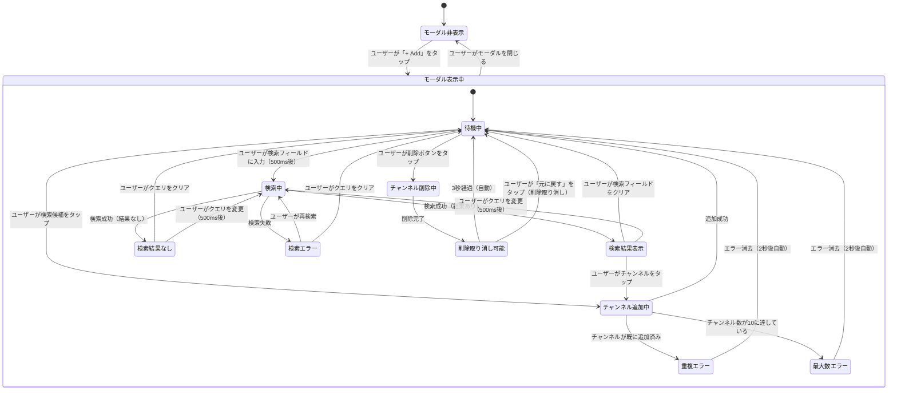

# 機能仕様: Timeline Sync - チャンネル追加・管理

> **配置場所**: `composeApp/src/commonMain/kotlin/org/example/project/feature/timeline_sync/channel_add/SPECIFICATION.md`
> **目的**: AI実装のためのSSoT（Single Source of Truth）
> **Story**: Story 2 of EPIC-002 (Timeline Sync)
> **Issue**: #46
> **バージョン**: 4.0（統合仕様書形式）

---

## 1. ユーザーストーリー

### チャンネル追加
- ユーザーがタイムライン画面で「+ Add」ボタンをタップすると、チャンネル追加モーダル（ボトムシート）が表示される
- モーダルには検索フィールドと追加済みチャンネルリストが表示される
- ユーザーが検索フィールドに入力すると、500msデバウンス後にチャンネル検索が実行される
- 検索結果はチャンネル候補としてリスト表示される（最大5件）
- ユーザーがチャンネル候補をタップすると、そのチャンネルがタイムラインに追加される
- 追加完了後、モーダルは閉じずに継続して追加可能（複数チャンネル追加対応）
- ユーザーがモーダルを閉じると、タイムライン画面に戻り追加されたチャンネルが表示される

### チャンネル削除
- チャンネル追加モーダル内で、追加済みチャンネルの横に削除ボタン（×）が表示される
- ユーザーが削除ボタンをタップすると、チャンネルが削除される
- 削除後、「元に戻す」ボタン付きスナックバーが表示される（3秒間）
- ユーザーが「元に戻す」をタップすると、削除が取り消される
- 削除後、タイムラインからそのチャンネルのカードも即時削除される

### タイムライン画面のAddボタン
- Story 1で非活性だったAddボタンが活性化される
- ボタンをタップするとチャンネル追加モーダルが開く
- チャンネル数が最大（10）に達している場合はボタンが非活性になる

---

## 2. ビジネスルール

### チャンネル検索
- **使用UseCase**: 既存の`ChannelSearchUseCase.searchTwitchChannels()`
- **デバウンス**: 500ms（StreamerSearchViewModelと同じパターン）
- **最大結果数**: 5件
- **対象サービス**: Twitch（YouTubeは将来拡張）
- **空クエリ**: 検索候補をクリア
- **結果フィルタリング**: 既に追加済みのチャンネルは検索結果から除外する

### チャンネル追加
- **最大チャンネル数**: 10（タイムライン表示の制限）
- **重複チェック**: channelIdで重複を防止（既に追加済みの場合はエラー表示）
- **変換**: `ChannelInfo` → `SyncChannel`
  - selectedStream: null
  - syncStatus: NOT_SYNCED
  - serviceType: TWITCH

### チャンネル削除
- **確認ダイアログ**: 不要（即時削除 + 「元に戻す」スナックバー）
- **元に戻す**: 削除後3秒間「元に戻す」ボタンを表示、タップで削除取り消し
- **最小チャンネル数**: 0（全削除可能 → 空状態表示）

### モーダル状態
- **表示**: ボトムシート形式
- **閉じる方法**: 背景タップ、スワイプダウン、完了ボタン
- **閉じる時の動作**: 検索状態をリセット（検索クエリ、検索候補をクリア）

### エラー処理
- **検索エラー**: モーダル内にエラーメッセージを表示
- **重複追加**: スナックバーで「既に追加済みです」を表示（2秒後に自動消去）
- **最大数超過**: スナックバーで「最大10チャンネルまで追加可能です」を表示

---

## 3. 画面内状態遷移

### 目的

この図は、チャンネル追加モーダルの**詳細な振る舞い**を可視化し、以下を示します：
- モーダルの状態（非表示、待機中、検索中、検索結果表示等）
- 状態変更をトリガーするユーザーアクション
- 状態遷移を決定する条件
- チャンネル追加・削除のネスト状態

これにより、実装時に機能の振る舞い要件を正確に理解できます。

### 状態図

### 状態説明

#### モーダル非表示
**画面の状態**:
- ボトムシートが閉じている
- タイムライン画面が通常表示

**遷移条件**:
- 「+ Add」ボタンタップ → モーダル表示中へ

#### モーダル表示中

##### 待機中
**画面の状態**:
- 検索フィールドが空または入力済み
- 検索候補リストなし
- 追加済みチャンネルリスト表示

**可能なユーザーアクション**:
- 検索フィールドに入力
- 既存チャンネルの削除ボタンタップ
- モーダルを閉じる

##### 検索中
**画面の状態**:
- ローディングインジケーター表示
- 前回の検索候補は一時的にクリア

**遷移条件**:
- API成功（結果あり） → 検索結果表示
- API成功（結果なし） → 検索結果なし
- API失敗 → 検索エラー

##### 検索結果表示
**画面の状態**:
- チャンネル候補リストを表示（最大5件）
- 各候補をタップして追加可能

**表示項目**:
- チャンネル名（displayName）
- 配信ゲーム名（gameName、オプション）
- サムネイル画像（thumbnailUrl）

##### 検索結果なし
**画面の状態**:
- 「検索結果が見つかりませんでした」メッセージ表示

##### 検索エラー
**画面の状態**:
- エラーメッセージ表示
- 再検索可能な状態

##### チャンネル追加中
**画面の状態**:
- 選択されたチャンネルをSyncChannelに変換中
- 重複チェック、最大数チェック実行中

**遷移条件**:
- 成功 → 待機中（チャンネルリストに追加、候補リストから削除）
- 重複 → 重複エラー
- 最大数超過 → 最大数エラー

##### 重複エラー
**画面の状態**:
- スナックバーで「既に追加済みです」表示
- 2秒後に自動消去

##### 最大数エラー
**画面の状態**:
- スナックバーで「最大10チャンネルまで追加可能です」表示
- 2秒後に自動消去

##### チャンネル削除中
**画面の状態**:
- 選択されたチャンネルをリストから削除中
- 即時完了（確認ダイアログなし）

**遷移条件**:
- 削除完了 → 削除取り消し可能

##### 削除取り消し可能
**画面の状態**:
- 「元に戻す」ボタン付きスナックバーを表示
- 削除されたチャンネル情報を一時保持

**遷移条件**:
- 3秒経過 → 待機中（削除確定）
- 「元に戻す」タップ → 待機中（チャンネル復元）

### 特殊な振る舞い

#### デバウンス検索
- ユーザーが検索フィールドに入力すると、500ms後に検索が実行される
- 500ms以内に追加入力があった場合、タイマーがリセットされる
- 最後の入力から500ms経過後に検索APIが呼び出される

#### モーダルを閉じた時
- 検索クエリをクリア
- 検索候補をクリア
- エラーメッセージをクリア
- 追加済みチャンネルはそのまま保持

#### チャンネル追加成功時
- チャンネルリストに新しいSyncChannelを追加
- タイムライン画面に即座に反映
- モーダルは閉じない（継続して追加可能）
- 検索候補から追加したチャンネルを除外表示

#### 検索結果のフィルタリング
- 検索結果には既に追加済みのチャンネルは表示されない
- チャンネルIDで重複をチェック
- ユーザーの混乱を防ぎ、操作効率を向上

#### チャンネル削除時の「元に戻す」
- 削除ボタンタップ後、即座にリストから削除
- 同時に「元に戻す」ボタン付きスナックバーを表示（3秒間）
- 「元に戻す」タップで削除を取り消し、チャンネルを復元
- 3秒経過で削除確定、スナックバー消去

---

## 補足

### 使用するドメインモデル
- `ChannelInfo` - 検索結果チャンネル情報
- `SyncChannel` - タイムライン表示用チャンネル（Story 1で定義済み）
- `ChannelSearchUseCase` - Twitchチャンネル検索
- `VideoServiceType` - YOUTUBE / TWITCH

### Story 2スコープ外
- YouTubeチャンネル検索（将来のStoryまたはバックログ）
- ストリーム選択（Story 3）
- 外部アプリ連携（Story 4）

### アプリ全体のナビゲーション（Level 1-2）
- **App Navigation**: [/docs/screen-navigation.md](/docs/screen-navigation.md)
- **Module Navigation**: [/docs/navigation/timeline-module.md](/docs/navigation/timeline-module.md)
- **Story 1画面遷移**: [../SPECIFICATION.md](../SPECIFICATION.md)

### 参照
- **類似機能**: `feature/streamer_search/`（検索デバウンスパターン）
- **参照ADR**:
  - ADR-002（MVIパターン）
  - ADR-003（4層コンポーネント構造）

---

**作成者**: Claude Code
**作成日**: 2026-01-14
**最終更新**: 2026-01-18（統合仕様書形式への移行）
**関連Issue**: #46
**Epic**: Timeline Sync (EPIC-002)
