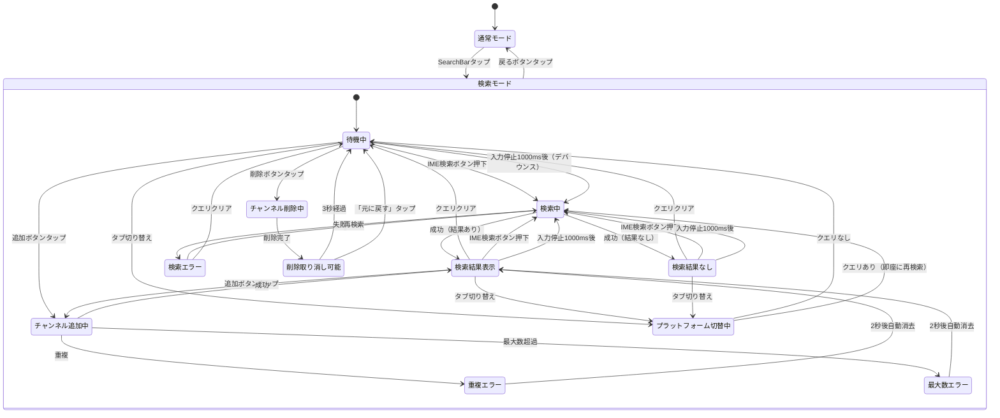

# 機能仕様: Timeline Sync - チャンネル検索・追加

> Epic: アーカイブ画面 検索UX改善 | US-1, US-2, US-3
> 旧仕様: BottomSheet方式 → 検索モード方式に移行
> 作成日: 2026-02-21

---

## 1. ユーザーストーリー

### 検索バー（常時表示）
- タイムライン画面の上部（ヘッダー直下）に検索バーが常時表示されている
- 検索バーにはプレースホルダー「チャンネルを検索」が表示される
- 検索バーをタップすると、画面が検索モードに切り替わる

### 検索モード
- 検索モードに入ると、タイムラインコンテンツ（カレンダー、アバター行、タイムラインカード）が非表示になる
- 検索バーがアクティブになり、キーボードが表示される
- 検索バーの下にプラットフォーム選択タブ（Twitch / YouTube）が表示される
- プラットフォーム選択タブの下に検索結果リストが表示される
- 検索結果リストの下に追加済みチャンネルセクションが表示される
- 検索バーの左に戻るボタンが表示され、タップで通常モードに戻る

### チャンネル検索
- ユーザーがIMEの検索ボタンを押すと、即座に検索が実行される
- 入力停止後1000msでも自動検索が実行される（デバウンス）
- 検索中はSearchBarのtrailingIconにCircularProgressIndicatorが表示される
- 検索結果はチャンネル候補としてリスト表示される（最大5件）
- 既に追加済みのチャンネルは検索結果から除外される
- 検索フィールドをクリアすると検索結果が即座にクリアされる

### プラットフォーム選択
- デフォルトは「Twitch」が選択されている
- タブを切り替えると、検索結果がクリアされ、クエリが空でない場合は即座に再検索される
- 検索結果には各チャンネルのプラットフォームアイコンが表示される

### チャンネル追加
- 検索結果の各チャンネルに追加ボタン（+）が表示される
- タップするとチャンネルがタイムラインに追加される
- 追加後、検索モードは維持される（継続追加可能）
- 最大10チャンネルまで追加可能

### チャンネル削除
- 追加済みチャンネルセクションの各チャンネルに削除ボタン（×）が表示される
- タップすると即時削除され、「元に戻す」Snackbarが3秒間表示される

### チャンネルフォロー
- 検索結果の各チャンネルにフォローアイコンが表示される
- フォロー済みは塗りつぶしアイコン、未フォローはアウトラインアイコン
- タップでフォロー状態を切り替え、Snackbarでフィードバック表示

### フォーカス管理
- 検索モード進入時にSearchBarに自動フォーカス
- 検索結果が更新されてもフォーカスは維持される
- 戻るボタンでフォーカスが解除され、キーボードが閉じる

---

## 2. ビジネスルール

| ドメイン | ルール | 条件/値 | US |
|----------|--------|---------|-----|
| 検索バー | 表示位置 | ヘッダー直下、常時表示 | 1 |
| 検索バー | プレースホルダー | 「チャンネルを検索」 | 1 |
| 検索モード | 切替トリガー | SearchBarタップで進入、戻るボタンで復帰 | 1 |
| 検索モード | コンテンツ | 通常コンテンツを非表示、検索UIに差し替え | 1 |
| 検索 | IME検索ボタン | 即座に検索実行 | 3 |
| 検索 | デバウンス | 1000ms（入力停止後に自動検索） | 3 |
| 検索 | 最大結果数 | 5件 | 2 |
| 検索 | 対象サービス | 選択中プラットフォーム（Twitch/YouTube） | 2 |
| 検索 | 空クエリ | 検索候補を即座にクリア | 2, 3 |
| 検索 | 結果フィルタリング | 追加済みチャンネルは除外 | 2 |
| フォーカス | 検索モード進入時 | SearchBarに自動フォーカス | 3 |
| フォーカス | 検索結果更新時 | フォーカス維持（FocusRequester使用） | 3 |
| フォーカス | 検索モード離脱時 | フォーカス解除、キーボード非表示 | 3 |
| プラットフォーム | 選択肢 | Twitch, YouTube | 2 |
| プラットフォーム | デフォルト | Twitch | 2 |
| プラットフォーム | 切り替え時 | 検索クエリ保持、検索結果クリア、即座に再検索 | 2 |
| チャンネル追加 | 最大数 | 10 | 2 |
| チャンネル追加 | 重複チェック | channelIdで判定 | 2 |
| チャンネル追加 | 追加後 | 検索モード維持（継続追加可能） | 2 |
| チャンネル削除 | 確認ダイアログ | 不要（即時削除） | 2 |
| チャンネル削除 | 元に戻す | 3秒間表示 | 2 |
| エラー | 検索エラー | 検索結果エリアにエラーメッセージ表示 | 2 |
| エラー | 重複追加 | Snackbar「既に追加済みです」（2秒後消去） | 2 |
| エラー | 最大数超過 | Snackbar「最大10チャンネルまで追加可能です」 | 2 |
| フォローアイコン | 未フォロー時 | アウトラインアイコン、タップでフォロー | 2 |
| フォローアイコン | フォロー済み時 | 塗りつぶしアイコン、タップでアンフォロー | 2 |

---

## 3. 状態遷移

