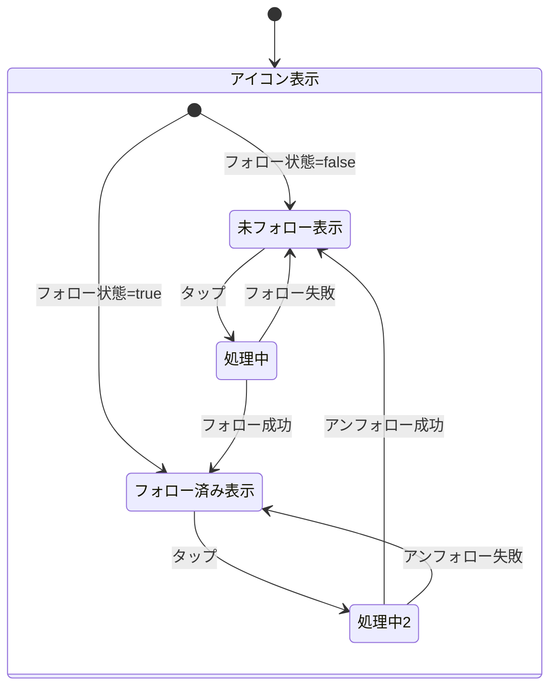

# 機能仕様: フォロー/アンフォロー UI

> 作成日: 2026-02-11
> US: US-2（チャンネルフォロー & アーカイブHome Epic）

---

## 1. ユーザーストーリー

- ユーザーがChannelAddBottomSheetでチャンネル検索すると、各結果にフォローアイコンが表示される
- フォロー済みチャンネルは塗りつぶしアイコン（ハートまたはスター）で表示される
- 未フォローチャンネルはアウトラインアイコンで表示される
- ユーザーがフォローアイコンをタップすると、フォロー状態が切り替わる
- フォロー/アンフォロー操作後にSnackbarでフィードバックが表示される

---

## 2. ビジネスルール

| ドメイン | ルール | 条件/値 | 備考 |
|----------|--------|---------|------|
| フォローアイコン | 未フォロー時 | アウトラインアイコン | タップでフォロー |
| フォローアイコン | フォロー済み時 | 塗りつぶしアイコン | タップでアンフォロー |
| フォローアイコン | 配置 | 検索結果カードの右端 | チャンネル追加ボタンと共存 |
| フィードバック | フォロー成功 | 「{チャンネル名}をフォローしました」Snackbar | - |
| フィードバック | アンフォロー成功 | 「{チャンネル名}のフォローを解除しました」Snackbar | - |
| 操作 | タップ対象 | フォローアイコンのみ | チャンネルカード全体のタップは既存動作を維持 |

---

## 3. 状態遷移

