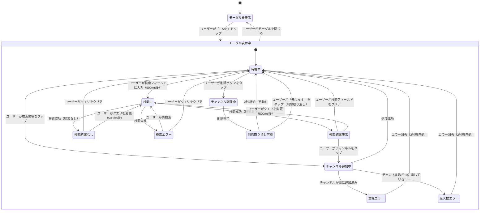

# 画面遷移図: チャンネル追加モーダル

> **配置場所**: `composeApp/src/commonMain/kotlin/org/example/project/feature/timeline_sync/channel_add/screen-transition.md`
> **目的**: チャンネル追加モーダルの状態遷移を可視化
> **レベル**: 画面内部の振る舞い（Level 3）
> **Issue**: #46

---

## 状態図

---

## 状態説明

### モーダル非表示
**画面の状態**:
- ボトムシートが閉じている
- タイムライン画面が通常表示
- `isChannelAddModalVisible: false`

**遷移条件**:
- 「+ Add」ボタンタップ → モーダル表示中へ

---

### モーダル表示中

#### 待機中
**画面の状態**:
- 検索フィールドが空または入力済み
- 検索候補リストなし
- 追加済みチャンネルリスト表示
- `channelSearchQuery: ""`
- `channelSuggestions: []`
- `isSearchingChannels: false`

**可能なユーザーアクション**:
- 検索フィールドに入力
- 既存チャンネルの削除ボタンタップ
- モーダルを閉じる

---

#### 検索中
**画面の状態**:
- ローディングインジケーター表示
- 前回の検索候補は一時的にクリア
- `isSearchingChannels: true`

**遷移条件**:
- API成功（結果あり） → 検索結果表示
- API成功（結果なし） → 検索結果なし
- API失敗 → 検索エラー

---

#### 検索結果表示
**画面の状態**:
- チャンネル候補リストを表示（最大5件）
- 各候補をタップして追加可能
- `channelSuggestions: [ChannelInfo, ...]`
- `isSearchingChannels: false`

**表示項目**:
- チャンネル名（displayName）
- 配信ゲーム名（gameName、オプション）
- サムネイル画像（thumbnailUrl）

---

#### 検索結果なし
**画面の状態**:
- 「検索結果が見つかりませんでした」メッセージ表示
- `channelSuggestions: []`
- `isSearchingChannels: false`

---

#### 検索エラー
**画面の状態**:
- エラーメッセージ表示
- 再検索可能な状態
- `channelAddError: "検索に失敗しました"`

---

#### チャンネル追加中
**画面の状態**:
- 選択されたチャンネルをSyncChannelに変換中
- 重複チェック、最大数チェック実行中

**遷移条件**:
- 成功 → 待機中（チャンネルリストに追加、候補リストから削除）
- 重複 → 重複エラー
- 最大数超過 → 最大数エラー

---

#### 重複エラー
**画面の状態**:
- スナックバーで「既に追加済みです」表示
- 2秒後に自動消去
- `channelAddError: "既に追加済みです"`

---

#### 最大数エラー
**画面の状態**:
- スナックバーで「最大10チャンネルまで追加可能です」表示
- 2秒後に自動消去
- `channelAddError: "最大10チャンネルまで追加可能です"`

---

#### チャンネル削除中
**画面の状態**:
- 選択されたチャンネルをリストから削除中
- 即時完了（確認ダイアログなし）

**遷移条件**:
- 削除完了 → 削除取り消し可能

---

#### 削除取り消し可能
**画面の状態**:
- 「元に戻す」ボタン付きスナックバーを表示
- 削除されたチャンネル情報を一時保持
- `recentlyDeletedChannel: SyncChannel`

**遷移条件**:
- 3秒経過 → 待機中（削除確定）
- 「元に戻す」タップ → 待機中（チャンネル復元）

---

## 特殊な振る舞い

### デバウンス検索
- ユーザーが検索フィールドに入力すると、500ms後に検索が実行される
- 500ms以内に追加入力があった場合、タイマーがリセットされる
- 最後の入力から500ms経過後に検索APIが呼び出される

### モーダルを閉じた時
- 検索クエリをクリア（`channelSearchQuery: ""`）
- 検索候補をクリア（`channelSuggestions: []`）
- エラーメッセージをクリア（`channelAddError: null`）
- 追加済みチャンネルはそのまま保持

### チャンネル追加成功時
- チャンネルリスト（`channels`）に新しいSyncChannelを追加
- タイムライン画面に即座に反映
- モーダルは閉じない（継続して追加可能）
- 検索候補から追加したチャンネルを除外表示

### 検索結果のフィルタリング
- 検索結果には既に追加済みのチャンネルは表示されない
- channelIdで重複をチェック
- ユーザーの混乱を防ぎ、操作効率を向上

### チャンネル削除時の「元に戻す」
- 削除ボタンタップ後、即座にリストから削除
- 同時に「元に戻す」ボタン付きスナックバーを表示（3秒間）
- 「元に戻す」タップで削除を取り消し、チャンネルを復元
- 3秒経過で削除確定、スナックバー消去

---

## UiStateプロパティ対応表

| 状態 | isChannelAddModalVisible | channelSearchQuery | channelSuggestions | isSearchingChannels | channelAddError |
|------|--------------------------|--------------------|--------------------|---------------------|-----------------|
| モーダル非表示 | false | "" | [] | false | null |
| 待機中 | true | "" or "..." | [] | false | null |
| 検索中 | true | "..." | [] | true | null |
| 検索結果表示 | true | "..." | [ChannelInfo, ...] | false | null |
| 検索結果なし | true | "..." | [] | false | null |
| 検索エラー | true | "..." | [] | false | "検索に失敗しました" |
| 重複エラー | true | "..." | [...] | false | "既に追加済みです" |
| 最大数エラー | true | "..." | [...] | false | "最大10チャンネルまで..." |

---

## 関連ドキュメント

- **親**: [/docs/navigation/timeline-module.md](/docs/navigation/timeline-module.md)
- **兄弟**: [REQUIREMENTS.md](./REQUIREMENTS.md)
- **Story 1画面遷移**: [../screen-transition.md](../screen-transition.md)

---

**作成者**: Claude Code
**作成日**: 2026-01-14
**関連Issue**: #46
