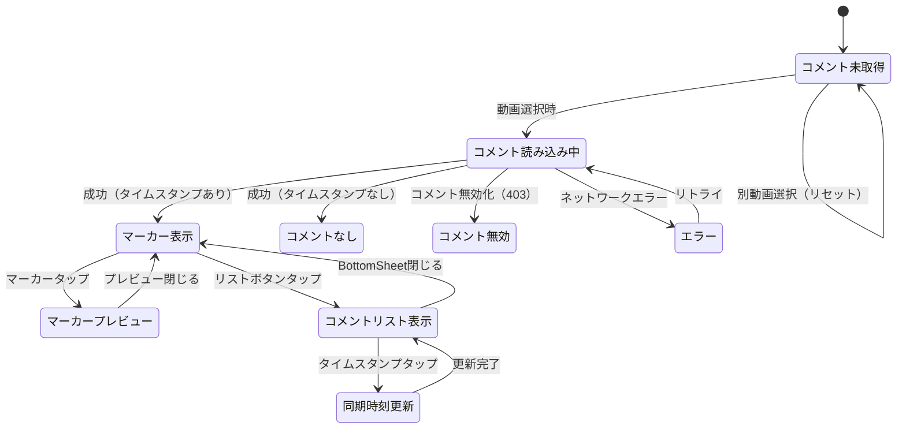

# 機能仕様: コメントタイムスタンプ同期

> 作成日: 2026-02-15

---

## 1. ユーザーストーリー

- ユーザーがタイムライン画面を表示すると、選択中の動画のコメントからタイムスタンプが自動抽出される
- タイムスタンプがタイムラインバー上にマーカードットとして表示される
- ユーザーがマーカーをタップすると、該当コメントのプレビュー（著者名・テキスト・いいね数）がTooltipで表示される
- ユーザーがコメントリストボタンをタップすると、タイムスタンプ付きコメントのBottomSheetが表示される
- BottomSheet内のタイムスタンプをタップすると、同期時刻がその時刻に更新される
- コメントリストはいいね数順と時間順でソートを切り替えられる
- コメントが無効化された動画ではエラーメッセージが表示される
- コメント読み込み中はローディングインジケーターが表示される

---

## 2. ビジネスルール

### タイムスタンプ抽出

| ドメイン | ルール | 条件/値 | 備考 |
|----------|--------|---------|------|
| タイムスタンプ | 対応フォーマット | `M:SS`, `MM:SS`, `H:MM:SS`, `HH:MM:SS` | 秒は必ず2桁 |
| タイムスタンプ | 秒の範囲 | 00-59 | 60以上は除外 |
| タイムスタンプ | 分の範囲 | 00-59（`H:MM:SS`形式のとき） | 60以上は除外 |
| タイムスタンプ | 除外パターン | `M:S`（秒1桁） | 日付等の誤検出防止 |
| タイムスタンプ | 動画duration超過 | 除外 | 動画の長さを超えるタイムスタンプは無効 |
| タイムスタンプ | 1コメント複数タイムスタンプ | 各タイムスタンプに対してマーカーを生成 | - |

### マーカー表示

| ドメイン | ルール | 条件/値 | 備考 |
|----------|--------|---------|------|
| マーカー | 表示位置 | タイムラインバー上の対応する時間位置 | - |
| マーカー | 表示形状 | ドット（小円） | 既存のタイムラインバーに重畳 |
| マーカー | タップ領域 | ドットより大きなタップ領域を確保 | 操作性向上 |
| マーカー | 密集時 | 近接マーカーは1つに集約表示 | 視認性確保 |
| マーカー | プレビュー表示 | タップでTooltip/Popup | 著者名・テキスト・いいね数 |

### コメントリスト

| ドメイン | ルール | 条件/値 | 備考 |
|----------|--------|---------|------|
| リスト | 表示形式 | BottomSheet | - |
| リスト | 表示対象 | タイムスタンプ付きコメントのみ | タイムスタンプなしは非表示 |
| リスト | デフォルトソート | いいね数順（降順） | - |
| リスト | ソート切替 | いいね数順 / 時間順 | トグルボタン |
| リスト | ページネーション | スクロール末尾で追加読み込み | 100件/リクエスト |
| リスト | 項目表示 | アイコン・著者名・テキスト・いいね数・投稿日時 | - |
| リスト | タイムスタンプ | タップ可能なリンクとして表示 | タップで同期時刻更新 |

### 同期連携

| ドメイン | ルール | 条件/値 | 備考 |
|----------|--------|---------|------|
| 同期 | タイムスタンプタップ | 同期時刻をタイムスタンプの時刻に更新 | 既存の同期ロジックを利用 |
| 同期 | 更新対象 | 選択中の動画の再生位置 | - |

### エラーハンドリング

| ドメイン | ルール | 条件/値 | 備考 |
|----------|--------|---------|------|
| エラー | コメント無効化 | 「この動画ではコメントが無効です」を表示 | 403 commentsDisabled |
| エラー | ネットワークエラー | リトライボタン付きエラー表示 | - |
| エラー | コメント0件 | 「タイムスタンプ付きコメントはありません」を表示 | - |

---

## 3. 状態遷移

