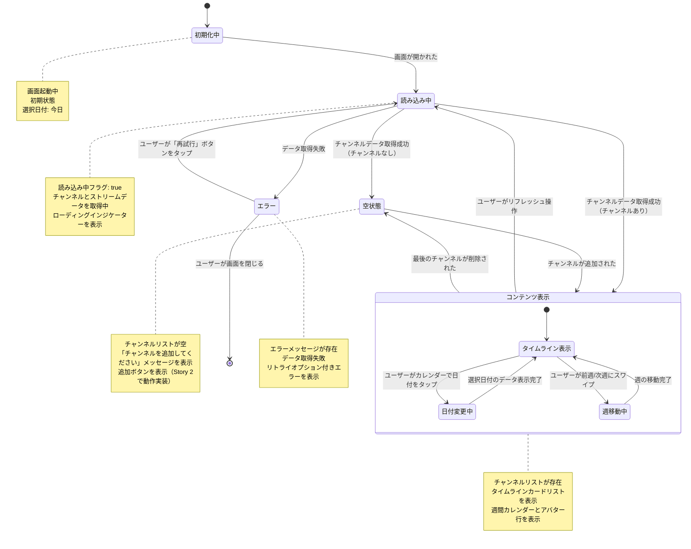

# 画面遷移図: Timeline Sync

> **配置場所**: `composeApp/src/commonMain/kotlin/org/example/project/feature/timeline_sync/screen-transition.md`
> **目的**: 画面状態ライフサイクル、ユーザーアクション、振る舞い遷移の視覚的表現
> **レベル**: 画面内部の振る舞い（Level 3）

---

## 目的

この図は、Timeline Sync画面の**詳細な振る舞い**を可視化し、以下を示します：
- 画面の状態（初期化中、読み込み中、コンテンツ表示、空状態、エラー）
- 状態変更をトリガーするユーザーアクション
- 状態遷移を決定する条件
- 日付選択と週移動のためのネスト状態

これにより、実装時に機能の振る舞い要件を正確に理解できます。

---

## 状態図

---

## 状態説明

### 初期化中
**画面の状態**:
- 画面が最初に読み込まれた時の初期状態
- チャンネルリスト: 空
- 選択日付: 今日（デフォルト）
- 同期時刻: null

**遷移条件**:
- 画面が開かれる → 読み込み中状態へ

### 読み込み中
**画面の状態**:
- 読み込み中フラグ: true
- チャンネルデータを取得中
- 選択された日付のストリームデータを取得中
- ローディングインジケーターを表示

**遷移条件**:
- チャンネルあり → コンテンツ表示状態
- チャンネルなし → 空状態
- 失敗 → エラー状態

### コンテンツ表示
**画面の状態**:
- チャンネルリスト: 1つ以上のチャンネルが存在
- 週間カレンダー: 表示中（選択日付がハイライト）
- チャンネルアバター行: 表示中
- SYNC TIME: 表示中（初期はnull）
- タイムラインカードリスト: 表示中
- 同期時刻インジケーター: 同期時刻が設定されていれば表示

**可能なユーザーアクション**:
- 日付をタップして変更 → 日付変更中
- 前週/次週にスワイプ → 週移動中
- リフレッシュ操作 → 読み込み中
- チャンネル追加ボタンをタップ（Story 2でハンドル）
- Open/Waitボタンをタップ（Story 4でハンドル）

### 日付変更中（ネスト状態）
**画面の状態**:
- 選択日付が更新中
- タイムラインバーを再計算中

**遷移条件**:
- 新しい日付のデータ表示完了 → タイムライン表示へ

### 週移動中（ネスト状態）
**画面の状態**:
- カレンダーの表示週が変更中
- 選択日付は変更しない

**遷移条件**:
- 週の移動完了 → タイムライン表示へ

### 空状態
**画面の状態**:
- チャンネルリスト: 空
- 「チャンネルを追加してください」メッセージ表示
- 追加ボタン表示

**可能なユーザーアクション**:
- 追加ボタンをタップ（Story 2でハンドル）

### エラー
**画面の状態**:
- エラーメッセージ: エラー内容
- データ取得失敗

**可能なユーザーアクション**:
- リトライ → 読み込み中状態へ
- 画面を離れる → 画面を終了

---

## 特殊な振る舞い

### 日付変更時の振る舞い
1. ユーザーがカレンダーで日付をタップ
2. 選択日付を更新
3. 選択日付に基づいてタイムラインバー位置を再計算
4. タイムラインカードリストを再描画

### 週移動時の振る舞い
1. ユーザーが左右にスワイプ
2. 表示する週を変更（前週 or 次週）
3. カレンダーUIを更新
4. 選択日付は変更しない（週が変わっても選択日はそのまま）

### タイムラインバー表示ルール
- ストリームの`startTime`〜`endTime`をバーの位置と幅で表現
- 選択日の0:00-24:00の範囲で表示
- 複数日にまたがるストリームは選択日の範囲でクリップ
- `endTime`がnull（ライブ配信中）の場合は現在時刻まで表示

### 同期時刻インジケーター
- SYNC TIMEの時刻に対応する位置に縦の青い線を表示
- 全てのタイムラインカードを貫通する形で描画
- Story 1では表示のみ（選択・変更はStory 3で実装）

### アクティブチャンネルカウント
- `selectedStream`がnullでないチャンネルの数をカウント
- ヘッダーに「{N} CHANNELS ACTIVE」として表示

### 未開始ストリームの表示
- `startTime`が現在時刻より後の場合
- 「Starts HH:MM」で開始時刻を表示
- 「{N}M TO START」で残り時間を表示
- バーは破線/グレーで表示
- 「Wait」ボタン（ロックアイコン付き）を表示

---

## 関連ドキュメント

- **親**: [timeline-module.md](../../../../docs/navigation/timeline-module.md) - モジュールレベル画面遷移（Level 2）
- **兄弟**: [REQUIREMENTS.md](./REQUIREMENTS.md) - 機能仕様

---

**最終更新**: 2026-01-12
