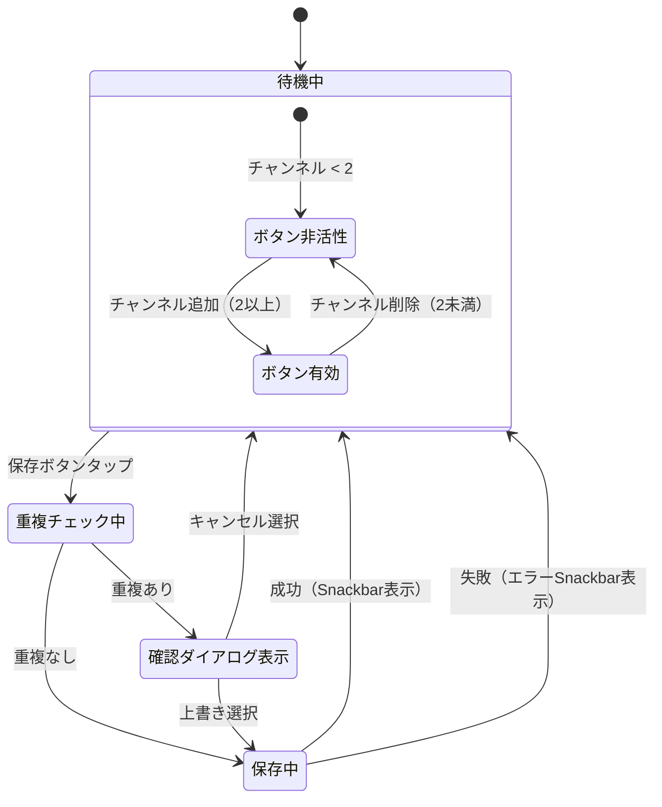

# 機能仕様: 同期履歴保存

> 作成日: 2026-02-21
> Epic: 同期チャンネル履歴保存 | US-2: 履歴保存機能

---

## 1. ユーザーストーリー

### 保存ボタン表示
- Timeline Sync画面のヘッダー領域に「保存」アイコンボタンが表示される
- チャンネルが2つ以上追加されている場合のみボタンが有効（タップ可能）
- チャンネルが1つ以下の場合はボタンが非活性（グレーアウト）

### 履歴保存フロー
- ユーザーが保存ボタンをタップすると、現在のチャンネル組み合わせが履歴として保存される
- 名前は自動生成（例: "Gaming Channel + Esports Pro"）
- 保存成功時にSnackbarで「履歴を保存しました」と表示される

### 重複検出
- 同じチャンネル組み合わせ（channelId のセットが一致）が既に保存されている場合、確認ダイアログを表示する
- ダイアログ: 「この組み合わせは既に保存されています。上書きしますか？」
- 「上書き」を選択すると既存の履歴を更新する
- 「キャンセル」を選択すると保存をキャンセルする

### エラー処理
- 保存失敗時にSnackbarで「保存に失敗しました」と表示される

---

## 2. ビジネスルール

| ドメイン | ルール | 条件/値 | 備考 |
|----------|--------|---------|------|
| 保存ボタン | 有効条件 | チャンネル数 >= 2 | US.md受け入れ条件 |
| 保存ボタン | 配置場所 | ヘッダー右側 | 既存UIに馴染む位置 |
| 自動名前生成 | 形式 | "チャンネル名1 + チャンネル名2 + ..." | SyncHistory.displayName |
| 重複判定 | 一致条件 | channelIdのセットが完全一致 | 順序は無関係 |
| 重複判定 | 動作 | 確認ダイアログを表示 | 上書き or キャンセル |
| 保存フィードバック | 成功時 | Snackbar「履歴を保存しました」 | 自動消去 |
| 保存フィードバック | 失敗時 | Snackbar「保存に失敗しました」 | 自動消去 |
| 最小チャンネル数 | 制限 | 2 | Repository側でも検証 |

---

## 3. 状態遷移

