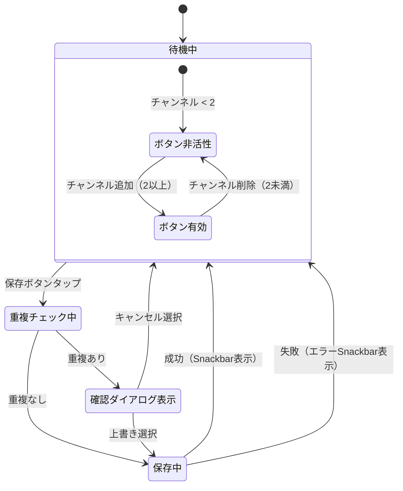
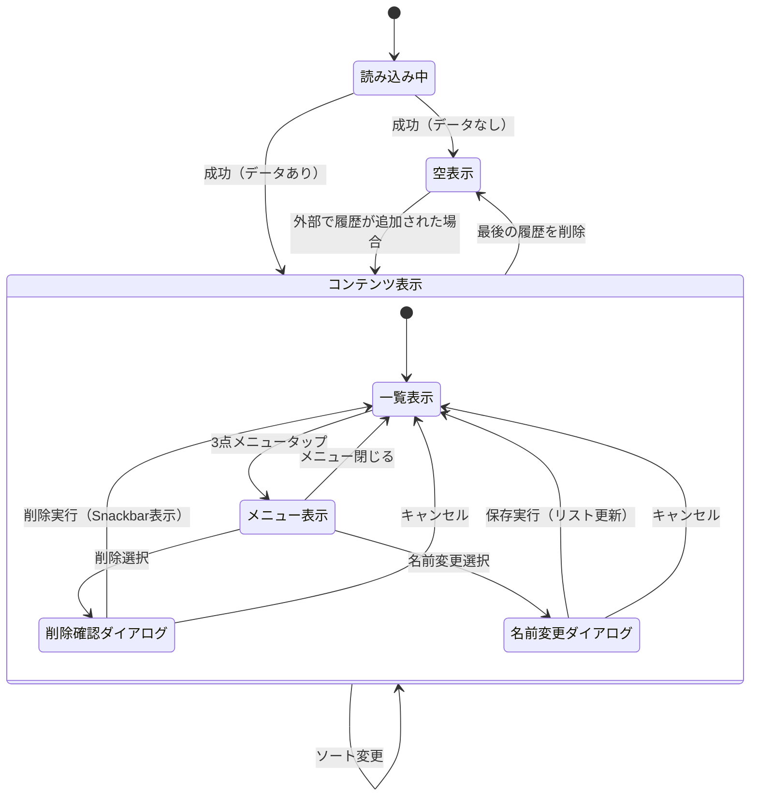
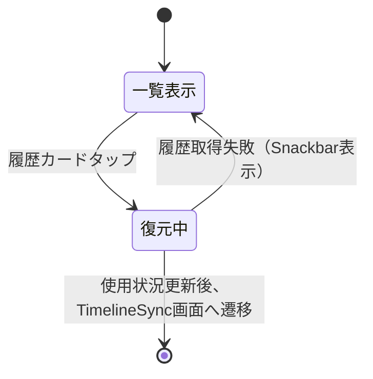

# 機能仕様: 同期履歴

> 作成日: 2026-02-21
> Epic: 同期チャンネル履歴保存 | US-2: 履歴保存機能, US-3: 履歴一覧表示UI

---

## 1. ユーザーストーリー

### 保存ボタン表示
- Timeline Sync画面のヘッダー領域に「保存」アイコンボタンが表示される
- チャンネルが2つ以上追加されている場合のみボタンが有効（タップ可能）
- チャンネルが1つ以下の場合はボタンが非活性（グレーアウト）

### 履歴保存フロー
- ユーザーが保存ボタンをタップすると、現在のチャンネル組み合わせが履歴として保存される
- 名前は自動生成（例: "Gaming Channel + Esports Pro"）
- 保存成功時にSnackbarで「履歴を保存しました」と表示される

### 重複検出
- 同じチャンネル組み合わせ（channelId のセットが一致）が既に保存されている場合、確認ダイアログを表示する
- ダイアログ: 「この組み合わせは既に保存されています。上書きしますか？」
- 「上書き」を選択すると既存の履歴を更新する
- 「キャンセル」を選択すると保存をキャンセルする

### エラー処理
- 保存失敗時にSnackbarで「保存に失敗しました」と表示される

---

## 2. ビジネスルール

| ドメイン | ルール | 条件/値 | 備考 |
|----------|--------|---------|------|
| 保存ボタン | 有効条件 | チャンネル数 >= 2 | US.md受け入れ条件 |
| 保存ボタン | 配置場所 | ヘッダー右側 | 既存UIに馴染む位置 |
| 自動名前生成 | 形式 | "チャンネル名1 + チャンネル名2 + ..." | SyncHistory.displayName |
| 重複判定 | 一致条件 | channelIdのセットが完全一致 | 順序は無関係 |
| 重複判定 | 動作 | 確認ダイアログを表示 | 上書き or キャンセル |
| 保存フィードバック | 成功時 | Snackbar「履歴を保存しました」 | 自動消去 |
| 保存フィードバック | 失敗時 | Snackbar「保存に失敗しました」 | 自動消去 |
| 最小チャンネル数 | 制限 | 2 | Repository側でも検証 |

---

## 3. 状態遷移

---
---

# US-3: 履歴一覧表示UI

---

## 1. ユーザーストーリー

### 画面アクセス
- ArchiveHome画面のTopAppBarに「履歴」アイコンボタンが表示される
- ユーザーがボタンをタップすると、同期履歴一覧画面に遷移する
- 戻るボタンで ArchiveHome に戻れる

### 履歴一覧表示
- 画面を開くと、保存済みの同期履歴がリスト表示される
- 各履歴カードには以下の情報が表示される:
  - 表示名（displayName: ユーザー設定名 or 自動生成名）
  - チャンネルアイコン（SavedChannelInfoのアイコンを横並び表示、最大3つ + 残数表示）
  - 最終使用日時（相対表示: "3日前"、"1週間前" 等）
  - 使用回数（"5回使用"）
- 読み込み中はローディング表示

### ソート機能
- TopAppBarにソートアイコンボタンを配置
- タップでドロップダウンメニューが開く
- ソート順: 最終使用日時（デフォルト）、作成日時、使用回数
- 選択したソート順でリストが即座に更新される

### 履歴の削除
- 各履歴カードの右端にメニューアイコン（3点ドット）を配置
- メニューから「削除」を選択すると確認ダイアログを表示
- ダイアログ: 「この履歴を削除しますか？」
- 「削除」→ 履歴を削除し、Snackbarで「履歴を削除しました」と表示
- 「キャンセル」→ ダイアログを閉じる

### 履歴名の変更
- メニューから「名前を変更」を選択するとダイアログを表示
- テキスト入力フィールドに現在の名前がプリセットされる
- 「保存」→ 名前を更新し、リストに反映
- 「キャンセル」→ ダイアログを閉じる
- 空文字の場合は自動生成名に戻す

### 空状態
- 履歴が0件の場合、「保存した同期履歴がありません」メッセージを表示
- 「TimelineSyncで同期を保存してみましょう」のサブテキスト

### エラー処理
- 削除失敗時にSnackbarで「削除に失敗しました」と表示
- 名前変更失敗時にSnackbarで「名前の変更に失敗しました」と表示

---

## 2. ビジネスルール

| ドメイン | ルール | 条件/値 | 備考 |
|----------|--------|---------|------|
| アクセス | 導線 | ArchiveHome TopAppBar 履歴アイコン | History icon |
| 一覧表示 | データソース | SyncHistoryRepository.observeHistories() | Flow でリアルタイム更新 |
| カード表示 | アイコン最大数 | 3 | 残りは "+N" で表示 |
| カード表示 | 日時形式 | 相対表示（"3日前" 等） | lastUsedAt 基準 |
| カード表示 | 使用回数 | "{N}回使用" | usageCount |
| ソート | デフォルト | 最終使用日時（降順） | HistorySortOrder.LAST_USED |
| ソート | 選択肢 | 最終使用日時 / 作成日時 / 使用回数 | ドロップダウン |
| 削除 | 確認 | ダイアログ表示必須 | 誤削除防止 |
| 名前変更 | 空文字処理 | 自動生成名に戻す（name = null） | displayName拡張を利用 |
| 空状態 | 表示条件 | 履歴0件 | ガイドメッセージ表示 |
| フィードバック | 削除成功 | Snackbar「履歴を削除しました」 | 自動消去 |
| フィードバック | 削除失敗 | Snackbar「削除に失敗しました」 | 自動消去 |
| フィードバック | 名前変更失敗 | Snackbar「名前の変更に失敗しました」 | 自動消去 |

---

## 3. 状態遷移

---
---

# US-4: 履歴からの再同期機能

---

## 1. ユーザーストーリー

### 履歴からの復元
- 履歴一覧画面で履歴カードをタップすると、TimelineSync画面にチャンネルが復元される
- 復元されたチャンネルは初期状態（ストリーム未選択、同期ステータス NOT_SYNCED）で追加される
- TimelineSyncの選択日は今日の日付に設定される

### 使用状況の自動更新
- 復元実行時に使用回数（usageCount）が +1 インクリメントされる
- 復元実行時に最終使用日時（lastUsedAt）が現在時刻に更新される
- 更新は履歴一覧の Flow で自動反映される（戻った際に反映済み）

### エラー処理
- 復元に失敗した場合、Snackbar で「復元に失敗しました」と表示される
- 使用状況の更新失敗はナビゲーションをブロックしない（更新失敗してもTimelineSyncへ遷移する）

---

## 2. ビジネスルール

| ドメイン | ルール | 条件/値 | 備考 |
|----------|--------|---------|------|
| 復元 | タップ対象 | 履歴カード全体（3点メニュー以外） | カードの onClick |
| 復元 | チャンネル変換 | SavedChannelInfo → PresetChannel | 既存のプリセット遷移パターンを再利用 |
| 復元 | ナビゲーション先 | TimelineSyncRoute | presetChannelsJson + presetDate |
| 復元 | 選択日 | 今日の日付 | TimelineSyncのselectedDateに設定 |
| 使用状況更新 | タイミング | ナビゲーション発行前 | recordUsage 呼び出し |
| 使用状況更新 | usageCount | +1 | SyncHistoryRepository.recordUsage |
| 使用状況更新 | lastUsedAt | 現在時刻 | SyncHistoryRepository.recordUsage |
| エラー | 復元失敗 | Snackbar「復元に失敗しました」 | 自動消去 |

---

## 3. 状態遷移

