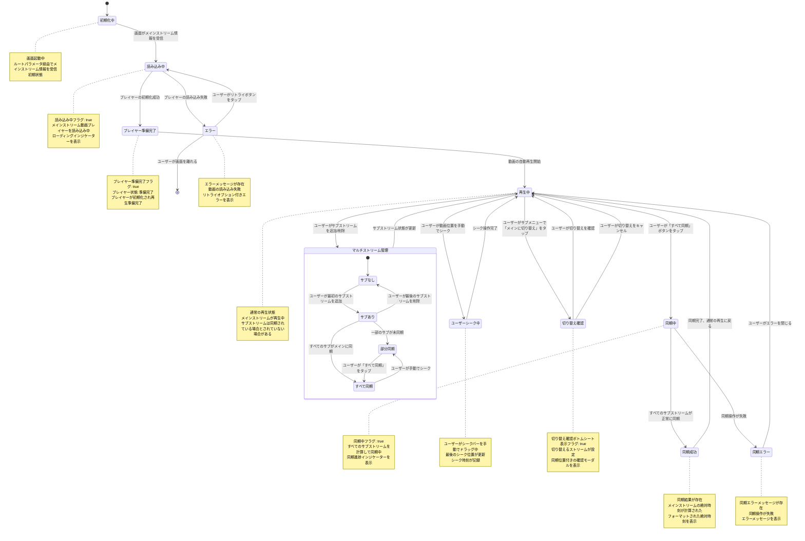

# 画面遷移図: VideoPlayback

> **配置場所**: `composeApp/src/commonMain/kotlin/org/example/project/feature/video_playback/screen-transition.md`
> **目的**: 画面の状態ライフサイクル、ユーザーアクション、振る舞い遷移の視覚的表現
> **レベル**: 画面内部の振る舞い（Level 3）

---

## 目的

この図は、VideoPlayback画面の**詳細な振る舞い**を可視化し、以下を示します：
- 画面の状態（初期化中、読み込み中、再生中、同期中等）
- 状態変更をトリガーするユーザーアクション
- 状態遷移を決定する条件
- マルチストリーム管理と同期のためのネスト状態

これにより、実装時に機能の振る舞い要件を正確に理解できます。

---

## 状態図

---

## 状態説明

### 初期化中
**画面の状態**:
- 画面が最初に読み込まれた時の初期状態
- メインストリーム: なし
- サブストリームリスト: 空

**遷移条件**:
- 画面がルートパラメータ経由でメインストリーム情報を受信
- 読み込み中状態へ遷移

### 読み込み中
**画面の状態**:
- 読み込み中フラグ: true
- メインストリーム: 情報を受信済み
- メインストリーム用の動画プレイヤーを読み込み中

**遷移条件**:
- 成功 → プレイヤー準備完了状態
- 失敗 → エラー状態

### プレイヤー準備完了
**画面の状態**:
- プレイヤー準備完了フラグ: true
- プレイヤー状態: 準備完了
- プレイヤーが正常に初期化

**遷移条件**:
- 自動的に再生中状態へ遷移

### 再生中
**画面の状態**:
- メインストリーム: 再生中
- サブストリームリスト: サブストリームのリスト（空の場合もある）
- 現在の再生位置: 現在時刻

**可能なユーザーアクション**:
- サブストリームを追加 → StreamerSearch(SUB)モーダルを開く
- サブストリームを削除
- すべて同期
- 手動シーク
- メインに切り替え

### 同期中
**画面の状態**:
- 同期中フラグ: true
- メインストリームから絶対時刻を計算中
- すべてのサブストリームをメインの絶対時刻に同期中

**遷移条件**:
- 成功 → 同期成功状態
- 失敗 → 同期エラー状態

### 同期成功
**画面の状態**:
- 同期結果: 絶対時刻情報
- メインストリームの絶対時刻: 計算済み
- フローティングバーにフォーマットされた絶対時刻を表示

**遷移条件**:
- 自動的に再生中状態へ戻る

### 同期エラー
**画面の状態**:
- 同期エラーメッセージ: エラー内容
- 同期操作が失敗

**可能なユーザーアクション**:
- エラーを閉じる → 再生中状態へ

### ユーザーシーク中
**画面の状態**:
- 最後のシーク位置: 位置値
- シーク時刻: タイムスタンプ
- ユーザーがシークバーを手動でドラッグ中

**遷移条件**:
- シーク完了 → 再生中状態
- 注意: 手動シークは同期状態を無効化

### 切り替え確認
**画面の状態**:
- 切り替え確認ボトムシート表示フラグ: true
- 切り替えるストリーム: 選択されたサブストリーム情報

**可能なユーザーアクション**:
- 確認 → メインとサブを切り替え → 再生中状態へ
- キャンセル → 再生中状態へ

### マルチストリーム管理（ネスト状態）

#### サブなし
**画面の状態**:
- サブストリームリスト: 空
- メインストリームのみ再生中

#### サブあり
**画面の状態**:
- サブストリームリスト: 少なくとも1つ存在
- 少なくとも1つのサブストリームが追加済み

#### 部分同期
**画面の状態**:
- 一部のサブストリームが未同期
- すべてのストリームが同期されていない

#### すべて同期
**画面の状態**:
- すべてのサブストリームが同期済み
- すべてのストリームがメインの絶対時刻に同期
- フローティングバーに同期状態を表示（例: "2/2 synced"）

**遷移条件**:
- ユーザーがシーク → 部分同期状態（同期が無効化される）

### エラー
**画面の状態**:
- エラーメッセージ: エラー内容
- 動画の読み込み失敗

**可能なユーザーアクション**:
- リトライ → 読み込み中状態へ
- 画面を離れる → 画面を終了

---

## 特殊な振る舞い

### サブストリーム追加の仕組み
VideoPlayback画面はサブストリーム追加のために状態を監視：
- StreamerSearch(SUB)がサブストリームデータを書き込む
- VideoPlaybackが受信してサブストリームを追加
- サブストリームがリストに追加される
- モーダルは次の選択のために開いたまま

### ストリーム切り替え
ユーザーはメインとサブストリームを切り替え可能：
1. ユーザーがサブストリームメニューで「メインに切り替え」をタップ
2. 切り替え確認状態へ遷移
3. ボトムシートがストリーム情報と計算された同期位置を表示
4. ユーザーが確認すると切り替え実行
5. メインとサブストリームの位置を入れ替え
6. 動画プレイヤーが新しいメインストリームに切り替わる

### 同期フロー
1. ユーザーがフローティングバーの「すべて同期」ボタンをタップ
2. 同期中状態へ遷移（現在位置を伴う）
3. メインストリームの絶対時刻を計算
4. すべてのサブストリームが対応する位置にシーク
5. 各サブの同期フラグがtrueに設定
6. フローティングバーが同期状態を表示（例: "3/3 synced"）

### 手動シークは同期を無効化
ユーザーが手動でシークした時：
- ユーザーシーク中状態へ遷移
- 最後のシーク位置とシーク時刻が記録
- すべてのサブストリームの同期フラグがfalseにリセット
- 同期を復元するにはユーザーが再同期する必要あり

### フローティング同期バー
ボトムフローティングカードの表示内容：
- フォーマットされた絶対時刻（同期済みの場合）
- 同期状態カウント（例: "2/3 synced"）
- ローディングインジケーター付き「すべて同期」ボタン

---

## 関連ドキュメント

- **親**: [video-module.md](../../../../docs/navigation/video-module.md) - モジュールレベル画面遷移（Level 2）
- **兄弟**: REQUIREMENTS.md - 機能仕様（存在する場合）

---

**最終更新**: 2025-12-30
