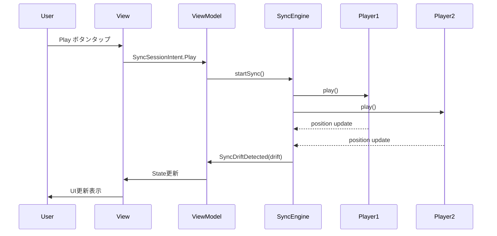

# CollabStream プレゼンテーションパターン

## 概要

動画同期サービス CollabStream における MVI (Model-View-Intent) パターンの設計戦略。

### MVI採用理由

**動画同期サービスに最適な理由**:
- **複雑な状態管理**: 2動画 × 各種状態 × 同期状態の管理
- **予測可能性**: タイムクリティカルな同期処理での状態変化追跡
- **リアクティブ対応**: リアルタイム状態変更への即座な反応
- **テスタビリティ**: 状態変化の単体テスト容易性

## MVI基本構造

```
View (UI) → Intent → ViewModel → State → View
    ↑                                      ↓
    ←── SideEffect ←── ViewModel ←─────────
```

### データフロー
1. **View**: ユーザーアクション発生
2. **Intent**: アクションをIntent に変換
3. **ViewModel**: Intent を処理しState更新
4. **State**: UI に新しい状態を通知
5. **SideEffect**: 必要に応じて副作用実行

## State設計

### 全体状態構造
```kotlin
data class SyncSessionState(
    val primaryStream: VideoStreamState,
    val secondaryStream: VideoStreamState,
    val syncEngine: SyncEngineState,
    val ui: UiState,
    val error: ErrorState? = null
)
```

### 動画ストリーム状態
```kotlin
data class VideoStreamState(
    val id: String,
    val platform: StreamPlatform,
    val metadata: StreamMetadata,
    val playback: PlaybackState,
    val loading: LoadingState
)

data class StreamMetadata(
    val title: String,
    val streamerName: String,
    val thumbnailUrl: String,
    val duration: Long,
    val url: String
)

data class PlaybackState(
    val position: Long,
    val isPlaying: Boolean,
    val isBuffering: Boolean,
    val volume: Float = 1.0f
)
```

### 同期エンジン状態
```kotlin
data class SyncEngineState(
    val status: SyncStatus,
    val drift: Long = 0L,
    val targetPosition: Long = 0L,
    val syncAccuracy: SyncAccuracy,
    val retryCount: Int = 0
)

enum class SyncStatus {
    Idle,           // 未開始
    Initializing,   // 初期化中
    Syncing,        // 同期処理中
    Synced,         // 同期完了
    OutOfSync,      // 同期ずれ
    Error           // 同期エラー
}

enum class SyncAccuracy {
    Second,         // 秒レベル精度（基本）
    SubSecond       // サブ秒精度（将来拡張）
}
```

### UI状態
```kotlin
data class UiState(
    val isControlsVisible: Boolean = true,
    val selectedPlayerFocus: PlayerType? = null,
    val layoutMode: LayoutMode = LayoutMode.SideBySide
)

enum class LayoutMode {
    SideBySide,     // 左右並列表示
    PictureInPicture, // PiP表示
    SinglePlayer    // 単体表示
}
```

## Intent設計

### ユーザーIntent
```kotlin
sealed class SyncSessionIntent {
    // 再生制御
    object Play : SyncSessionIntent()
    object Pause : SyncSessionIntent()
    data class Seek(val position: Long) : SyncSessionIntent()
    data class SetVolume(val playerType: PlayerType, val volume: Float) : SyncSessionIntent()
    
    // 同期制御
    object ToggleSyncLock : SyncSessionIntent()
    data class AdjustSyncOffset(val offsetMs: Long) : SyncSessionIntent()
    object RetrySync : SyncSessionIntent()
    
    // UI制御
    object ToggleControls : SyncSessionIntent()
    data class ChangeFocus(val playerType: PlayerType) : SyncSessionIntent()
    data class ChangeLayout(val layoutMode: LayoutMode) : SyncSessionIntent()
    
    // エラー処理
    object ClearError : SyncSessionIntent()
    object ReportIssue : SyncSessionIntent()
}
```

### システムIntent
```kotlin
sealed class SystemIntent {
    // ストリーム関連
    data class StreamLoaded(val playerType: PlayerType, val metadata: StreamMetadata) : SystemIntent()
    data class StreamError(val playerType: PlayerType, val error: StreamError) : SystemIntent()
    data class BufferingStateChanged(val playerType: PlayerType, val isBuffering: Boolean) : SystemIntent()
    
    // 同期関連
    data class SyncDriftDetected(val driftMs: Long) : SystemIntent()
    data class SyncCompleted(val accuracy: SyncAccuracy) : SystemIntent()
    data class SyncFailed(val reason: SyncFailureReason) : SystemIntent()
    
    // プラットフォーム関連
    data class NetworkStateChanged(val isConnected: Boolean) : SystemIntent()
    data class PlatformError(val platform: StreamPlatform, val error: PlatformError) : SystemIntent()
}
```

## ViewModel設計

### 基本構造
```kotlin
abstract class BaseSyncSessionViewModel : ViewModel() {
    private val _state = MutableStateFlow(SyncSessionState())
    val state: StateFlow<SyncSessionState> = _state.asStateFlow()
    
    abstract fun send(intent: SyncSessionIntent)
}
```

### プラットフォーム固有実装
expect/actualパターンで各プラットフォームに最適化

## データフロー詳細

### 同期シーケンス


### 状態更新パターン
Intent受信 → State更新 → UI反映の一方向データフロー

## エラーハンドリング戦略

### エラー状態管理
```kotlin
data class ErrorState(
    val type: ErrorType,
    val message: String,
    val isRecoverable: Boolean,
    val actionLabel: String? = null,
    val timestamp: Long = System.currentTimeMillis()
)

enum class ErrorType {
    NetworkError,       // ネットワーク接続エラー
    StreamError,        // ストリーム読み込みエラー
    SyncError,          // 同期処理エラー
    PlatformError,      // プラットフォーム固有エラー
    UnknownError        // その他のエラー
}
```

### エラー分類
- **NetworkError**: 再試行可能
- **StreamError**: 再読み込み可能  
- **SyncError**: 同期再開可能
- **UnknownError**: 回復不可能

## 副作用管理

### LaunchEffect用途
- **初期化**: ViewModel.Initialize 実行
- **エラー表示**: SnackBar/Dialog表示
- **同期監視**: 自動リトライ + ログ記録

## Testing戦略

### テスト対象
- **State Reducer**: Intent → State変更の単体テスト
- **ViewModel**: Intent処理とState更新の結合テスト
- **同期ロジック**: 複数プレイヤー状態の整合性テスト

## まとめ

MVIパターンにより動画同期サービスの複雑な状態管理を予測可能で保守性の高い形で実現。明確なデータフローとエラーハンドリング戦略で安定した同期体験を提供。