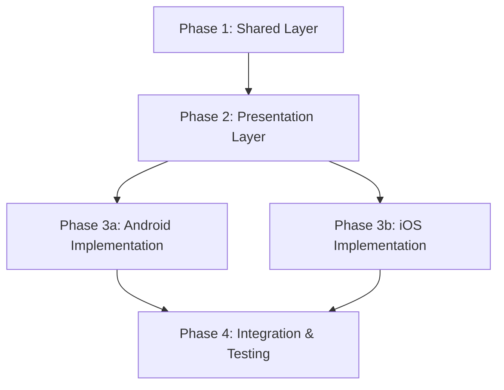

# YouTube再生時間取得機能 - タスク分割詳細

## Issue #11 概要

**機能要件:**
- 同期ボタン押下時に現在の再生位置を取得
- YouTube Data API v3から配信開始時間を取得
- 絶対的な日時を計算して返す
- データ永続化は不要（メモリ保持のみ）

**技術要件:**
- Kotlin Multiplatform (Android/iOS)
- 既存VideoPlayerView拡張
- expect/actualパターン活用
- YouTube Data API v3統合

---

## レイヤー別実装タスク

### Phase 1: Shared Layer (Domain Layer)

#### 1.1 Domain Models
**ファイル:** `shared/src/commonMain/kotlin/org/example/project/domain/model/`

**VideoSyncInfo.kt**
```kotlin
data class VideoSyncInfo(
    val videoId: String,
    val currentPosition: Double, // 秒単位
    val streamStartTime: Instant, // 配信開始時刻
    val syncedDateTime: Instant, // 絶対的な日時
    val isLive: Boolean
)
```

**YouTubeVideoDetails.kt**
```kotlin
data class YouTubeVideoDetails(
    val id: String,
    val liveStreamingDetails: LiveStreamingDetails?,
    val snippet: VideoSnippet
)

data class LiveStreamingDetails(
    val actualStartTime: String?, // ISO 8601 format
    val scheduledStartTime: String?
)

data class VideoSnippet(
    val title: String,
    val publishedAt: String
)
```

#### 1.2 Repository Interface
**ファイル:** `shared/src/commonMain/kotlin/org/example/project/domain/repository/VideoSyncRepository.kt`

```kotlin
interface VideoSyncRepository {
    suspend fun getVideoDetails(videoId: String): Result<YouTubeVideoDetails>
    suspend fun calculateSyncTime(videoId: String, currentPosition: Double): Result<VideoSyncInfo>
}
```

#### 1.3 Use Case
**ファイル:** `shared/src/commonMain/kotlin/org/example/project/domain/usecase/VideoSyncUseCase.kt`

```kotlin
class VideoSyncUseCase(
    private val repository: VideoSyncRepository
) {
    suspend fun syncVideoTime(videoId: String, currentPosition: Double): Result<VideoSyncInfo> {
        return repository.calculateSyncTime(videoId, currentPosition)
    }
}
```

#### 1.4 Data Layer Implementation
**ファイル:** `shared/src/commonMain/kotlin/org/example/project/data/`

**VideoSyncRepositoryImpl.kt**
```kotlin
class VideoSyncRepositoryImpl(
    private val apiService: YouTubeApiService
) : VideoSyncRepository {
    override suspend fun getVideoDetails(videoId: String): Result<YouTubeVideoDetails>
    override suspend fun calculateSyncTime(videoId: String, currentPosition: Double): Result<VideoSyncInfo>
}
```

**YouTubeApiService.kt**
```kotlin
class YouTubeApiService(
    private val httpClient: HttpClient
) {
    suspend fun getVideoDetails(videoId: String, apiKey: String): YouTubeVideoDetails
}
```

**ApiConstants.kt**
```kotlin
object ApiConstants {
    const val YOUTUBE_API_BASE_URL = "https://www.googleapis.com/youtube/v3"
    const val VIDEO_ENDPOINT = "/videos"
}
```

---

### Phase 2: ComposeApp Layer (Presentation Layer)

#### 2.1 Platform Provider Interface
**ファイル:** `composeApp/src/commonMain/kotlin/org/example/project/video/PlaybackPositionProvider.kt`

```kotlin
expect class PlaybackPositionProvider {
    suspend fun getCurrentPosition(videoId: String): Double
}
```

#### 2.2 UI State Extensions
**ファイル:** `composeApp/src/commonMain/kotlin/org/example/project/video/VideoUiState.kt` (拡張)

```kotlin
data class VideoUiState(
    val videoId: String = "",
    val serviceType: VideoServiceType = VideoServiceType.YOUTUBE,
    val syncDateTime: String = "",
    val isLoading: Boolean = false,
    val errorMessage: String? = null,
    // 新規フィールド
    val syncInfo: VideoSyncInfo? = null,
    val isSyncing: Boolean = false,
    val syncError: String? = null
)
```

#### 2.3 Intent Extensions
**ファイル:** `composeApp/src/commonMain/kotlin/org/example/project/video/VideoIntent.kt` (拡張)

```kotlin
sealed interface VideoIntent {
    data class LoadVideo(val videoId: String) : VideoIntent
    data object ClearError : VideoIntent
    data object RetryLoad : VideoIntent
    // 新規Intent
    data object SyncCurrentTime : VideoIntent
    data object ClearSyncError : VideoIntent
}

sealed interface VideoSideEffect {
    data class ShowError(val message: String) : VideoSideEffect
    data class ShowSuccess(val message: String) : VideoSideEffect
    // 新規SideEffect
    data class ShowSyncResult(val syncInfo: VideoSyncInfo) : VideoSideEffect
}
```

#### 2.4 Sync Controller
**ファイル:** `composeApp/src/commonMain/kotlin/org/example/project/video/VideoSyncController.kt`

```kotlin
class VideoSyncController(
    private val syncUseCase: VideoSyncUseCase,
    private val positionProvider: PlaybackPositionProvider
) {
    suspend fun syncCurrentTime(videoId: String): Result<VideoSyncInfo> {
        val currentPosition = positionProvider.getCurrentPosition(videoId)
        return syncUseCase.syncVideoTime(videoId, currentPosition)
    }
}
```

#### 2.5 ViewModel Extensions
**ファイル:** `composeApp/src/commonMain/kotlin/org/example/project/video/VideoViewModel.kt` (拡張)

```kotlin
// VideoViewModel クラスに追加
private val syncController: VideoSyncController = VideoSyncController(syncUseCase, positionProvider)

fun handleIntent(intent: VideoIntent) {
    when (intent) {
        // 既存処理
        is VideoIntent.LoadVideo -> loadVideo(intent.videoId)
        VideoIntent.ClearError -> clearError()
        VideoIntent.RetryLoad -> retryLoad()
        // 新規処理
        VideoIntent.SyncCurrentTime -> syncCurrentTime()
        VideoIntent.ClearSyncError -> clearSyncError()
    }
}

private fun syncCurrentTime() {
    val currentVideoId = _uiState.value.videoId
    if (currentVideoId.isBlank()) {
        handleSyncError("No video loaded")
        return
    }

    _uiState.value = _uiState.value.copy(isSyncing = true, syncError = null)

    viewModelScope.launch {
        syncController.syncCurrentTime(currentVideoId)
            .onSuccess { syncInfo ->
                _uiState.value = _uiState.value.copy(
                    isSyncing = false,
                    syncInfo = syncInfo
                )
                _sideEffect.emit(VideoSideEffect.ShowSyncResult(syncInfo))
            }
            .onFailure { error ->
                handleSyncError(error.message ?: "Sync failed")
            }
    }
}
```

---

### Phase 3: Platform-specific Implementation

#### 3.1 Android Implementation
**ファイル:** `composeApp/src/androidMain/kotlin/org/example/project/video/PlaybackPositionProvider.android.kt`

```kotlin
actual class PlaybackPositionProvider {
    private var youTubePlayer: YouTubePlayer? = null

    fun setPlayer(player: YouTubePlayer) {
        this.youTubePlayer = player
    }

    actual suspend fun getCurrentPosition(videoId: String): Double {
        return withContext(Dispatchers.Main) {
            suspendCoroutine<Double> { continuation ->
                youTubePlayer?.getCurrentTimeSeconds { currentTime ->
                    continuation.resume(currentTime.toDouble())
                } ?: continuation.resume(0.0)
            }
        }
    }
}
```

**ファイル:** `composeApp/src/androidMain/kotlin/org/example/project/video/VideoPlayerView.android.kt` (拡張)

```kotlin
// 既存ファイルに追加
@Composable
actual fun VideoPlayerView(
    videoId: String,
    modifier: Modifier,
    onError: (String) -> Unit,
    positionProvider: PlaybackPositionProvider? = null // 新規パラメータ
) {
    // 既存コード...

    AndroidView(
        modifier = modifier,
        factory = { context ->
            YouTubePlayerView(context).apply {
                addYouTubePlayerListener(object : AbstractYouTubePlayerListener() {
                    override fun onReady(youTubePlayer: YouTubePlayer) {
                        player = youTubePlayer
                        positionProvider?.setPlayer(youTubePlayer) // 追加
                        isLoading = false
                        youTubePlayer.loadVideo(videoId, 0f)
                    }
                    // 既存リスナー...
                })
            }
        },
        // 既存update処理...
    )
}
```

#### 3.2 iOS Implementation
**ファイル:** `composeApp/src/iosMain/kotlin/org/example/project/video/PlaybackPositionProvider.ios.kt`

```kotlin
actual class PlaybackPositionProvider {
    private var webView: WKWebView? = null

    fun setWebView(webView: WKWebView) {
        this.webView = webView
    }

    actual suspend fun getCurrentPosition(videoId: String): Double {
        return withContext(Dispatchers.Main) {
            suspendCoroutine<Double> { continuation ->
                webView?.evaluateJavaScript("player.getCurrentTime()") { result, error ->
                    if (error != null) {
                        continuation.resume(0.0)
                    } else {
                        val position = (result as? NSNumber)?.doubleValue ?: 0.0
                        continuation.resume(position)
                    }
                }
            }
        }
    }
}
```

**ファイル:** `composeApp/src/iosMain/kotlin/org/example/project/video/VideoPlayerView.ios.kt` (拡張)

```kotlin
// 既存HTMLに追加するJavaScript
val html = """
    <!DOCTYPE html>
    <html>
    <head>
        <!-- 既存head要素 -->
        <script>
            var player;
            function onYouTubeIframeAPIReady() {
                player = new YT.Player('youtube-player', {
                    height: '100%',
                    width: '100%',
                    videoId: '$videoId',
                    events: {
                        'onReady': onPlayerReady
                    }
                });
            }

            function onPlayerReady(event) {
                // プレイヤー準備完了
            }
        </script>
        <script src="https://www.youtube.com/iframe_api"></script>
    </head>
    <body>
        <div class="video-container">
            <div id="youtube-player"></div>
        </div>
    </body>
    </html>
""".trimIndent()
```

---

### Phase 4: UI Integration & Testing

#### 4.1 UI Component Extensions

**VideoContainer.kt** に同期ボタン追加:
```kotlin
@Composable
fun VideoContainer(
    // 既存パラメータ
    onSyncClick: () -> Unit // 新規パラメータ
) {
    Column {
        // 既存UI
        VideoPlayerView(...)

        // 新規: 同期ボタン
        Row {
            Button(
                onClick = onSyncClick,
                enabled = !uiState.isSyncing
            ) {
                if (uiState.isSyncing) {
                    CircularProgressIndicator(modifier = Modifier.size(16.dp))
                } else {
                    Text("同期")
                }
            }
        }

        // 同期結果表示
        uiState.syncInfo?.let { syncInfo ->
            SyncResultCard(syncInfo = syncInfo)
        }
    }
}
```

#### 4.2 Testing Tasks

**Unit Tests (shared/src/commonTest/kotlin/):**
- `VideoSyncUseCaseTest.kt`
- `VideoSyncRepositoryImplTest.kt`
- `YouTubeApiServiceTest.kt`
- `VideoSyncInfoTest.kt`

**Platform Tests:**
- `PlaybackPositionProviderTest.android.kt`
- `PlaybackPositionProviderTest.ios.kt`

**Integration Tests:**
- `VideoSyncIntegrationTest.kt`
- `EndToEndSyncTest.kt`

---

## 実装順序・依存関係



**実行コマンド例:**
```bash
# Phase 1: shared層実装
/task kotlin-backend-specialist --context=docs/context/11/ --layer=shared

# Phase 2: presentation層実装
/task compose-multiplatform-specialist --context=docs/context/11/ --layer=presentation

# Phase 3: platform実装 (並行可能)
/task compose-multiplatform-specialist --context=docs/context/11/ --platform=android
/task compose-multiplatform-specialist --context=docs/context/11/ --platform=ios

# Phase 4: 統合・テスト
/task integration-specialist --context=docs/context/11/
```

**Total Estimated Time:** 8-10 hours
**Critical Path:** Phase 1 → Phase 2 → Phase 3 → Phase 4 (sequential)
**Parallel Opportunities:** Phase 3 (Android/iOS同時実装可能)