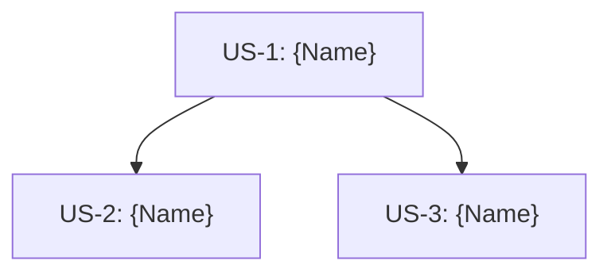

# Epic: {Epic Name}

> **作成日**: {YYYY-MM-DD}

---

## 1. Epic概要

### ビジョン
{このEpicで実現したい大きなゴール（1-2段落）}

### 背景・課題
{なぜこのEpicが必要か}

### ユーザー価値
- {価値1: ユーザーが得られる具体的なメリット}
- {価値2: ビジネスへの貢献}

---

## 2. 共通ドメイン

### Entity
- `{EntityName}` - `shared/src/commonMain/kotlin/org/example/project/domain/model/`

### Repository Interface
- `{RepositoryName}` - `shared/src/commonMain/kotlin/org/example/project/domain/repository/`

---

## 3. 開発進捗

```mermaid
---
config:
  kanban:
    ticketBaseUrl: ''
---
kanban
  backlog[Backlog]
    us1[US-1: {Name}]@{ priority: 'High' }
    us2[US-2: {Name}]
    us3[US-3: {Name}]
  spec[Spec]
  design[Design]
  dev[Dev]
  review[Review]
  done[Done]
```

**カラム = `/develop` ステップ対応**:

| カラム | `/develop` ステップ | 完了条件 |
|--------|---------------------|---------|
| Backlog | - | US.md 作成済み |
| Spec | Step 2 | SPECIFICATION.md 作成済み |
| Design | Step 3 | DESIGN.md + PROGRESS.md + Worktree |
| Dev | Step 4 | Shared + UI 実装 + 全テスト通過 |
| Review | Step 5 | PR作成済み |
| Done | - | PRマージ済み |

---

## 4. 依存関係図



**並行開発可能**: US-2とUS-3は並行して開発可能（US-1完了後）

---

## 5. 関連ドキュメント

### 参照ADR
- ADR-{Number}: {Title}
