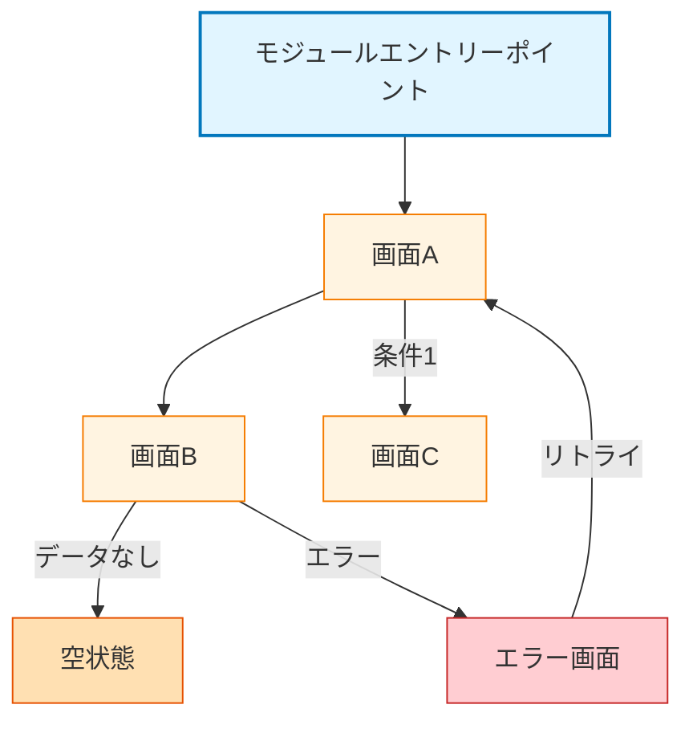

# {モジュール名} - 画面ナビゲーション

> **配置場所**: `docs/navigation/{module_name}-module.md`
> **目的**: {モジュール名}モジュール内の画面遷移
> **レベル**: モジュールレベルナビゲーション（Level 2）

---

## 目的

このドキュメントは、モジュールまたはドメイン領域内の画面遷移を可視化します。モジュール内にどの画面が存在し、それらがどのように接続され、どのような条件で遷移が発生するかを示します。モジュールは単一の機能ではなく、複数の関連する機能を包含します。

**モジュールの例**:
- **Videoモジュール**: 動画再生 + 動画同期 + サブストリーム選択
- **検索モジュール**: 配信者検索 + 検索結果 + ストリーム詳細
- **ユーザーモジュール**: プロフィール + 設定 + 認証（将来）

---

## Mermaid例

プレースホルダー（`{...}`）をモジュールの実際の内容に置き換えてください。

---

## ガイドライン

### 含めるべき内容

- **画面遷移のみ**: どの画面がどの画面に遷移するかを示す
- **条件**: 遷移が状態に依存する場合は条件を含める
  - 例: `SearchResults -->|結果なし| Empty`
  - 例: `APICall -->|エラー| ErrorScreen`
  - 例: `Login -->|認証済み| Home`
- **モジュールスコープ**: このモジュール内の複数の関連機能の画面を含める
- **画面内部の状態遷移は含めない**: 単一画面内の状態変化は含めない

### 含めるべきでない内容

- **ユーザーアクション**: 遷移に「ユーザーがタップ」「ユーザーが選択」を含めない
- **実装詳細**: クラス名、ViewModel参照、レイヤー情報を含めない
- **画面内部の振る舞い**: 詳細な振る舞いはscreen-transition.md（Level 3）へ

### 色分け

画面タイプごとに一貫した色を使用：

| 画面タイプ | 塗りつぶし色 | 枠線色 | 用途 |
|-------------|------------|--------------|-------|
| **エントリーポイント** | `#e1f5ff` | `#0277bd` | モジュールエントリー画面 |
| **メイン画面** | `#fff4e1` | `#f57c00` | 主要なモジュール画面 |
| **空状態** | `#ffe0b2` | `#e65100` | 空またはデータなし状態 |
| **エラー画面** | `#ffcdd2` | `#c62828` | エラー状態 |
| **モーダル/シート** | `#f3e5f5` | `#7b1fa2` | モーダル、ボトムシート（破線枠） |

---

## 関連ドキュメント

- **親**: [screen-navigation.md](../../../screen-navigation.md) - アプリ全体のナビゲーション索引（Level 1）
- **子**: `feature/{feature_name}/screen-transition.md` - 画面内部の振る舞い（Level 3）

---

**テンプレートバージョン**: 1.0
**最終更新**: 2025-12-30
**関連**: [screen-transition-template.md](./screen-transition-template.md), [requirements-template.md](./requirements-template.md)
