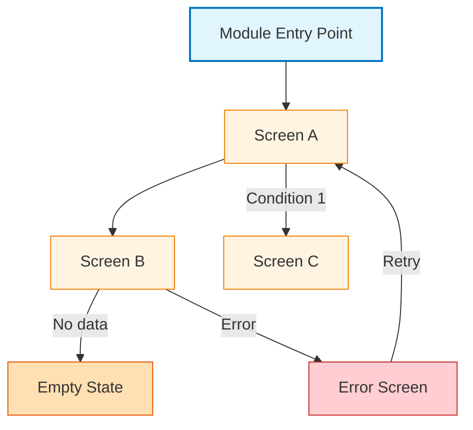

# {Module Name} - Screen Navigation

> **Location**: `docs/navigation/{module_name}-module.md`
> **Purpose**: Screen transitions within {module name} module
> **Level**: Module-level navigation (Level 2)

---

## Purpose

This document visualizes the screen transitions within a module or domain area. It shows which screens exist in the module, how they connect to each other, and under what conditions transitions occur. A module encompasses multiple related features, not just a single feature.

**Module Examples**:
- **Video Module**: Video Playback + Video Sync + Sub Stream Selection
- **Search Module**: Streamer Search + Search Results + Stream Detail
- **User Module**: Profile + Settings + Authentication (future)

---

## Mermaid Example

Replace placeholders (`{...}`) with your module's actual content.

---

## Guidelines

### What to Include

- **Screen transitions only**: Show which screen leads to which screen
- **Conditions**: Include conditions when transition depends on state
  - Example: `SearchResults -->|No results| Empty`
  - Example: `APICall -->|Error| ErrorScreen`
  - Example: `Login -->|Authenticated| Home`
- **Module scope**: Include screens from multiple related features in this module
- **NO screen-internal state transitions**: Do not include state changes within a single screen

### What NOT to Include

- **User actions**: Do not include "User taps", "User selects" on transitions
- **Implementation details**: No class names, ViewModel references, or layer information
- **Screen-internal behavior**: Detailed behavior goes to screen-transition.md (Level 3)

### Color Coding

Use consistent colors by screen type:

| Screen Type | Fill Color | Border Color | Usage |
|-------------|------------|--------------|-------|
| **Entry Point** | `#e1f5ff` | `#0277bd` | Module entry screen |
| **Main Screens** | `#fff4e1` | `#f57c00` | Primary module screens |
| **Empty State** | `#ffe0b2` | `#e65100` | Empty or no-data states |
| **Error Screen** | `#ffcdd2` | `#c62828` | Error states |
| **Modal/Sheet** | `#f3e5f5` | `#7b1fa2` | Modals, bottom sheets (dashed border) |

---

## Related Documents

- **Parent**: [screen-navigation.md](../../../screen-navigation.md) - App-wide navigation index (Level 1)
- **Child**: `feature/{feature_name}/screen-transition.md` - Screen-internal behavior (Level 3)

---

**Template Version**: 1.0
**Last Updated**: 2025-12-30
**Related**: [screen-transition-template.md](./screen-transition-template.md), [requirements-template.md](./requirements-template.md)
