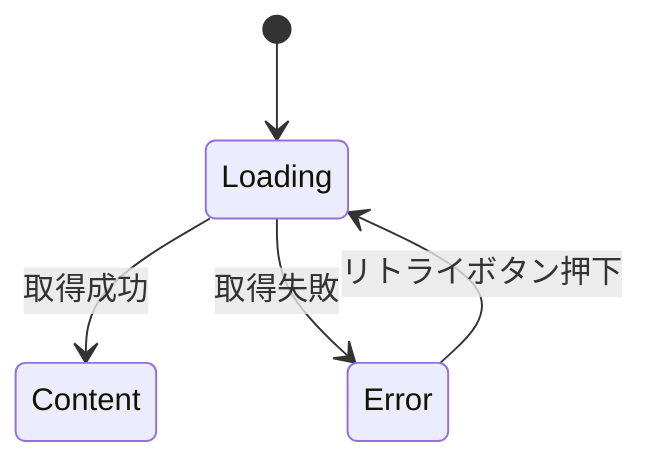

# 機能仕様: {Feature Name}

> **配置場所**: `composeApp/src/commonMain/kotlin/org/example/project/feature/{feature_name}/REQUIREMENTS.md`
> **作成フェーズ**: Phase 1（仕様・インターフェース定義）
> **目的**: AI実装のためのSSoT（Single Source of Truth）

---

## 1. ユーザーストーリー

ユーザー操作と期待する動作を箇条書きで記述します。

- {ユーザーが〇〇すると、△△が表示される}
- {例：ユーザーが画面を開くと、自動的に動画一覧を読み込む}
- {例：読み込み中はローディングを表示する}
- {例：失敗時は「再試行」ボタン付きのエラー画面を表示する}

---

## 2. ビジネスルール

機能の仕様とルールを明確に定義します。

- **{ルールカテゴリ1}**: {詳細}
  - {補足説明がある場合}
- **{ルールカテゴリ2}**: {詳細}

### 例
- **ソート**: 公開日時の新しい順
- **件数**: 一度の取得は20件まで
- **エラー処理**: ネットワークエラー時は「再試行」ボタンを表示

---

## 3. 画面状態遷移

Mermaid図で画面の状態遷移を表現します。



### 状態の説明（必要に応じて）
- **Loading**: データ取得中、ローディングインジケータを表示
- **Content**: データ表示、ユーザー操作可能
- **Error**: エラーメッセージと再試行ボタンを表示

---

## 4. Phase 2実装進捗

**Phase 1完了時に作成し、Phase 2実装中に随時更新します。**

**最終更新**: {YYYY-MM-DD}

### Shared Layer
- [ ] Domain Models実装
- [ ] Repository Interface実装
- [ ] UseCase実装
- [ ] Domain Tests実装
- [ ] Build成功（`./gradlew :shared:build`）

### ComposeApp Layer
- [ ] ViewModel実装（MVI pattern）
- [ ] UI Components実装（4層構造）
- [ ] ViewModel Tests実装
- [ ] DI設定（Koin）
- [ ] Build成功（`./gradlew :composeApp:build`）
- [ ] 全テスト成功（`./gradlew test`）
- [ ] Phase 3レビュー準備完了

**更新タイミング**:
- Phase 2開始時: このセクションを作成
- Phase 2実装中: 各タスク完了時にチェックボックスを更新
- Phase 3開始時: 全チェック完了を確認

---

## 補足

### API仕様（該当する場合）
```http
GET /api/v1/videos?sort=publishedAt&limit=20
```

### 参照
- **類似機能**: `feature/{existing_feature}/`
- **参照ADR**: ADR-002（MVIパターン）

---

**作成者**: {Name}
**作成日**: {YYYY-MM-DD}
**関連Issue**: #{Issue Number}
