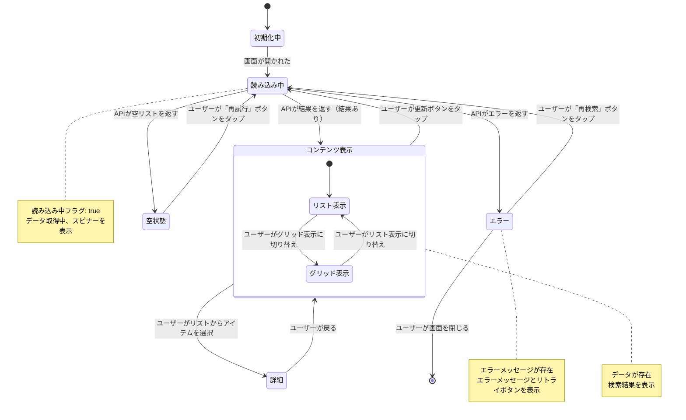

# 画面遷移図: {機能名}

> **配置場所**: `composeApp/src/commonMain/kotlin/org/example/project/feature/{feature_name}/screen-transition.md`
> **目的**: 画面状態ライフサイクル、ユーザーアクション、振る舞い遷移の視覚的表現
> **レベル**: 画面内部の振る舞い（Level 3）

---

## 目的

この図は、画面の**詳細な振る舞い**を可視化し、以下を示します：
- 画面の状態（読み込み中、コンテンツ表示、エラー、空状態）
- 状態変更をトリガーするユーザーアクション
- 状態遷移を決定する条件
- 複雑な振る舞いのためのネスト状態

これにより、実装時に機能の振る舞い要件を理解し、仕様とコード間の整合性を確保できます。

---

## Mermaid例

プレースホルダー（`{...}`）を機能の実際の内容に置き換えてください。



---

## ガイドライン

### ユーザーアクション（必須）

- **常にユーザーアクションを含める**: 遷移をトリガーするユーザーの行動を記述
  - 良い例: `ユーザーが「再検索」ボタンをタップ`
  - 悪い例: `データ取得成功`（ユーザーアクションなし、条件のみ）
- **コメントと整合性を持たせる**: コード内のコメントと同じ用語を使用
  - フォーマット: `ユーザーアクション説明`

### 条件（必須）

- **状態遷移条件**: 次の状態を決定するものを明確に記述
  - API結果: `APIが結果を返す（結果あり）`
  - エラー: `APIがエラーを返す`
  - 空: `APIが空リストを返す`
- **状態プロパティを含める**: 関連する状態プロパティを参照
  - 例: `（読み込み中フラグ = true）`、`（エラーメッセージが存在）`、`（データが空）`

### 状態

- **推奨状態数**: ほとんどの画面で5〜10状態
- **コア状態**: 読み込み中、コンテンツ表示、エラー、空状態を常に含める
- **ネスト状態**: 状態内のバリエーションに使用（例: リスト/グリッド表示モード）
- **すべての状態に出口を持たせる**: 最終状態`[*]`以外は行き止まり状態を避ける

### 注記

- **状態説明**: 各状態が何を表すかを説明する注記を追加
- **状態参照を含める**: 関連する状態プロパティを言及
  - 例: `読み込み中状態（読み込み中フラグ = true）`
  - 例: `エラー状態（エラーメッセージが存在）`

### 用語

コード内のコメントと同じ用語を使用：
- **状態プロパティ**: 実際のデータクラスプロパティを参照
- **ドメインモデル**: ドメイン層と同じ名前を使用（StreamInfo、SearchResult等）

### 含めるべきでない内容

- **実装詳細**: ViewModel、UseCase、Repositoryへの言及なし
- **レイヤー情報**: Presentation/Domain/Dataレイヤーのサブグラフなし
- **コード構造**: クラス名やメソッドシグネチャなし

---

## 機能タイプ別の例

### 検索機能
```mermaid
読み込み中 --> コンテンツ表示: APIが検索結果を返す（結果あり）
コンテンツ表示 --> 読み込み中: ユーザーが検索ボタンをタップ
空状態 --> 読み込み中: ユーザーが検索クエリを変更
```

### 動画再生機能
```mermaid
読み込み中 --> 再生中: 動画の読み込み成功（プレイヤー状態 = 準備完了）
再生中 --> 一時停止中: ユーザーが一時停止ボタンをタップ
一時停止中 --> 再生中: ユーザーが再生ボタンをタップ
```

### 認証機能
```mermaid
待機中 --> 認証中: ユーザーがログインボタンをタップ
認証中 --> 認証済み: ログイン成功（ユーザー情報が存在）
認証中 --> エラー: ログイン失敗（エラーが存在）
```

---

## 関連ドキュメント

- **親**: [モジュールナビゲーション](../../navigation/{module_name}-module.md) - モジュールレベル画面遷移（Level 2）
- **兄弟**: [REQUIREMENTS.md](./REQUIREMENTS.md) - 機能仕様

---

**テンプレートバージョン**: 3.0（振る舞い重視）
**最終更新**: 2025-12-30
**関連**: [module-navigation-template.md](./module-navigation-template.md), [requirements-template.md](./requirements-template.md)
