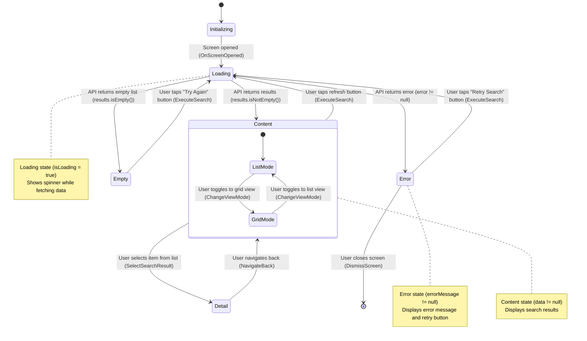

# Screen Transition Diagram: {Feature Name}

> **Location**: `composeApp/src/commonMain/kotlin/org/example/project/feature/{feature_name}/screen-transition.md`
> **Purpose**: Visual representation of screen state lifecycle, user actions, and behavioral transitions
> **Level**: Screen-internal behavior (Level 3)

---

## Purpose

This diagram visualizes the **detailed behavior** within a screen, showing:
- Screen states (Loading, Content, Error, Empty)
- User actions that trigger state changes (with Intent names)
- Conditions that determine state transitions
- Nested states for complex behaviors

This helps AI understand the feature's behavior requirements for Phase 2 implementation and ensures alignment between design and code through ubiquitous language.

---

## Mermaid Example

Replace placeholders (`{...}`) with your feature's actual content.



---

## Guidelines

### User Actions (REQUIRED)

- **Always include user actions**: Describe what the user does to trigger transitions
  - Good: `User taps "Retry Search" button (ExecuteSearch)`
  - Bad: `Data fetch success` (no user action, condition only)
- **Include Intent names**: Add Intent name in parentheses after action description
  - Format: `User action description (IntentName)`
  - Examples: `(ExecuteSearch)`, `(LoadVideo)`, `(SyncToAbsoluteTime)`

### Conditions (REQUIRED)

- **State transition conditions**: Clearly state what determines the next state
  - API result: `API returns results (results.isNotEmpty())`
  - Error: `API returns error (error != null)`
  - Empty: `API returns empty list (results.isEmpty())`
- **Include UiState properties**: Reference actual UiState properties when relevant
  - Examples: `(isLoading = true)`, `(errorMessage != null)`, `(data.isEmpty())`

### States

- **Recommended states**: 5-10 states for most screens
- **Core states**: Always include Loading, Content, Error, and Empty states
- **Nested states**: Use for variations within a state (e.g., List/Grid view modes)
- **All states must have exits**: Avoid dead-end states except final state `[*]`

### Notes

- **State descriptions**: Add notes to explain what each state represents
- **Include UiState references**: Mention relevant UiState properties
  - Example: `Loading state (isLoading = true)`
  - Example: `Error state (errorMessage != null)`

### Ubiquitous Language

Use the same terminology as in code:
- **Intent names**: Match the actual sealed interface Intent class
- **UiState properties**: Reference actual data class properties
- **Domain models**: Use same names as domain layer (StreamInfo, SearchResult, etc.)

### What NOT to Include

- **Implementation details**: No ViewModel, UseCase, Repository mentions
- **Layer information**: No Presentation/Domain/Data layer subgraphs
- **Code structure**: No class names or method signatures

---

## Examples by Feature Type

### Search Feature
```mermaid
Loading --> Content: API returns search results (results.isNotEmpty())
Content --> Loading: User taps search button (ExecuteSearch)
Empty --> Loading: User changes search query (UpdateInputText)
```

### Video Playback Feature
```mermaid
Loading --> Playing: Video loaded successfully (playerState = Ready)
Playing --> Paused: User taps pause button (PauseVideo)
Paused --> Playing: User taps play button (PlayVideo)
```

### Authentication Feature
```mermaid
Idle --> Authenticating: User taps login button (SubmitLogin)
Authenticating --> Authenticated: Login successful (user != null)
Authenticating --> Error: Login failed (error != null)
```

---

## Related Documents

- **Parent**: [Module Navigation](../../navigation/{module_name}-module.md) - Module-level screen transitions (Level 2)
- **Sibling**: [REQUIREMENTS.md](./REQUIREMENTS.md) - Feature specifications
- **Reference**: [VideoIntent.kt](../../feature/video_playback/VideoIntent.kt) - Example Intent definitions

---

**Template Version**: 3.0 (Behavior-focused)
**Last Updated**: 2025-12-30
**Related**: [module-navigation-template.md](./module-navigation-template.md), [requirements-template.md](./requirements-template.md)
