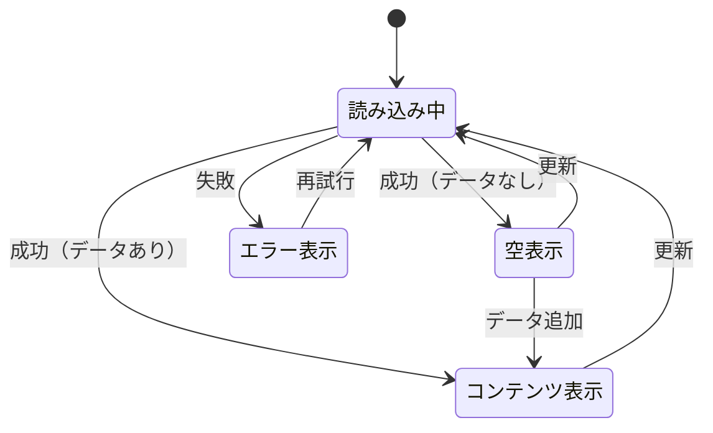

# 機能仕様: {Feature Name}

> 作成日: {YYYY-MM-DD}

---

## 1. ユーザーストーリー

- {ユーザーが〇〇すると、△△する}
- {例：ユーザーが画面を開くと、データが自動的に読み込まれる}
- {例：読み込み中はローディングを表示する}

---

## 2. ビジネスルール

| ドメイン | ルール | 条件/値 | 備考 |
|----------|--------|---------|------|
| {ドメイン名} | {ルール名} | {条件または値} | {備考} |
| 例: カレンダー | 表示範囲 | 過去7日〜当日 | - |
| 例: カレンダー | デフォルト | 今日 | - |
| 例: チャンネル | 最大数 | 10 | - |
| 例: バー表示 | 開始位置 | 選択日より前なら0:00から | - |
| 例: 同期状態 | WAITING判定 | 同期時刻がストリーム開始前 | - |

---

## 3. 状態遷移

