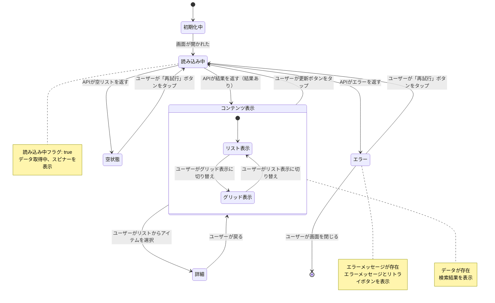

# 機能仕様: {Feature Name}

> **配置場所**: `composeApp/src/commonMain/kotlin/org/example/project/feature/{feature_name}/SPECIFICATION.md`
> **目的**: AI実装のためのSSoT（Single Source of Truth）
> **バージョン**: 4.0（統合仕様書）

---

## 1. ユーザーストーリー

ユーザー操作と期待する動作を箇条書きで記述します。

- {ユーザーが〇〇すると、△△が表示される}
- {例：ユーザーが画面を開くと、自動的に動画一覧を読み込む}
- {例：読み込み中はローディングを表示する}
- {例：失敗時は「再試行」ボタン付きのエラー画面を表示する}

---

## 2. ビジネスルール

機能の仕様とルールを明確に定義します。

- **{ルールカテゴリ1}**: {詳細}
  - {補足説明がある場合}
- **{ルールカテゴリ2}**: {詳細}

### 例
- **ソート**: 公開日時の新しい順
- **件数**: 一度の取得は20件まで
- **エラー処理**: ネットワークエラー時は「再試行」ボタンを表示

---

## 3. 画面内の状態遷移

画面の状態（Loading, Content, Error等）とユーザーアクションによる遷移を定義します。

### 状態遷移図

プレースホルダー（`{...}`）を機能の実際の内容に置き換えてください。



### ガイドライン

**状態の定義**:
- 推奨状態数: 5〜10状態
- コア状態: 読み込み中、コンテンツ表示、エラー、空状態を含める
- ネスト状態: 状態内のバリエーションに使用（例: リスト/グリッド表示モード）

**遷移の記述**:
- **ユーザーアクション**: 遷移をトリガーする操作を明記（例: `ユーザーが「再試行」ボタンをタップ`）
- **条件**: 次の状態を決定する条件を明確に（例: `APIが結果を返す（結果あり）`）

**注記の活用**:
- 各状態が何を表すかを説明
- 関連する状態プロパティを言及（例: `読み込み中フラグ = true`）

### 関連ドキュメント

- **App Navigation**: [/docs/screen-navigation.md](/docs/screen-navigation.md) - アプリ全体の画面遷移（Level 1）
- **Module Navigation**: [/docs/navigation/{module}-module.md](/docs/navigation/{module}-module.md) - モジュール単位の画面遷移（Level 2、該当する場合）

---

## 補足

### API仕様（該当する場合）
```http
GET /api/v1/videos?sort=publishedAt&limit=20
```

### 参照
- **類似機能**: `feature/{existing_feature}/`
- **参照ADR**: ADR-002（MVIパターン）

---

**作成者**: {Name}
**作成日**: {YYYY-MM-DD}
**関連Issue**: #{Issue Number}
