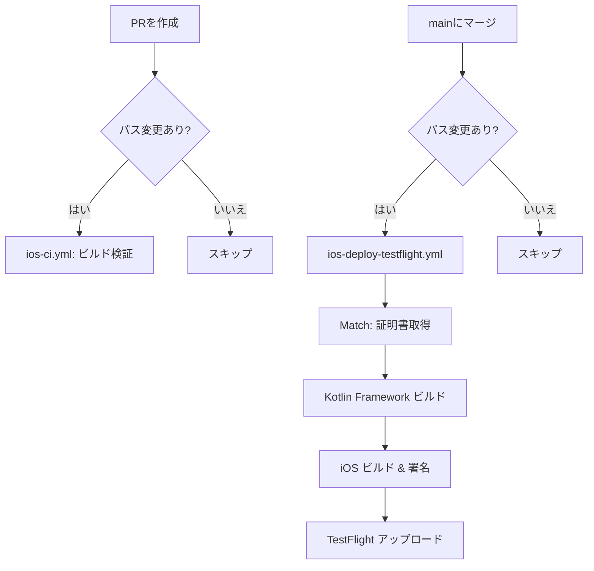

# GitHub Secrets 設定ガイド（iOS CI/CD）

## 概要

CollabStreamのiOS CI/CDパイプラインで必要なGitHub Secretsの一覧と設定手順。

## 必要なSecrets一覧

| Secret名 | 用途 | 取得元 |
|----------|------|--------|
| `MATCH_GIT_BASIC_AUTHORIZATION` | 証明書リポジトリへのアクセス | GitHub PAT |
| `MATCH_PASSWORD` | Match証明書の復号パスワード | Match初期化時に設定 |
| `APP_STORE_CONNECT_API_KEY_ID` | ASC API Key ID | App Store Connect |
| `APP_STORE_CONNECT_ISSUER_ID` | ASC Issuer ID | App Store Connect |
| `APP_STORE_CONNECT_API_KEY_CONTENT` | ASC API Key 内容 (Base64) | App Store Connect |
| `APPLE_TEAM_ID` | Apple Developer Team ID | Apple Developer Portal |

## 各Secretの取得・設定手順

### 1. MATCH_GIT_BASIC_AUTHORIZATION

証明書を保管するプライベートGitリポジトリへのアクセス用。

#### 取得手順

1. GitHubで Personal Access Token (Fine-grained) を作成
   - [Settings → Developer settings → Personal access tokens → Fine-grained tokens](https://github.com/settings/personal-access-tokens/new)
   - Repository access: 証明書リポジトリのみ選択
   - Permissions: Contents (Read and write)
2. Base64エンコード:

```bash
echo -n "your-github-username:ghp_xxxxxxxxxxxx" | base64
```

3. 出力された文字列を Secret に設定

### 2. MATCH_PASSWORD

Fastlane Match で証明書を暗号化するためのパスフレーズ。

#### 取得手順

1. `fastlane match` を初回実行した際に設定したパスフレーズ
2. まだ実行していない場合は、任意の強力なパスフレーズを決めておく

### 3. APP_STORE_CONNECT_API_KEY_ID

#### 取得手順

1. [App Store Connect - Users and Access - Integrations](https://appstoreconnect.apple.com/access/integrations/api) にアクセス
2. 作成済みのAPI Keyの「Key ID」列の値をコピー
   - 例: `XXXXXXXXXX`

### 4. APP_STORE_CONNECT_ISSUER_ID

#### 取得手順

1. 同じApp Store Connect API Keyページの上部に表示される「Issuer ID」をコピー
   - 例: `xxxxxxxx-xxxx-xxxx-xxxx-xxxxxxxxxxxx`

### 5. APP_STORE_CONNECT_API_KEY_CONTENT

#### 取得手順

1. API Key作成時にダウンロードした `.p8` ファイルを使用
2. Base64エンコード:

```bash
# macOS
base64 -i AuthKey_XXXXXXXXXX.p8

# Linux（改行なしで出力）
base64 -w 0 AuthKey_XXXXXXXXXX.p8
```

3. 出力された文字列を Secret に設定

### 6. APPLE_TEAM_ID

#### 取得手順

1. [Apple Developer - Membership](https://developer.apple.com/account#MembershipDetailsCard) にアクセス
2. 「Team ID」の値をコピー
   - 例: `XXXXXXXXXX`

## GitHub での設定方法

### リポジトリ Secrets の設定

1. GitHub リポジトリページ → **Settings** → **Secrets and variables** → **Actions**
2. **New repository secret** をクリック
3. 上記の各 Secret 名と値を入力して **Add secret**

### 設定確認

Secrets が正しく設定されているかは、GitHub Actions の実行ログで確認:
- `ios-deploy-testflight.yml` ワークフローを手動実行（Actions タブ → 「Run workflow」）
- ログで各ステップの成功/失敗を確認

## ワークフロー概要



## トラブルシューティング

### Match で認証エラー

- `MATCH_GIT_BASIC_AUTHORIZATION` の値を再確認
- Personal Access Token が期限切れでないか確認
- トークンに証明書リポジトリへのアクセス権限があるか確認

### App Store Connect API エラー

- API Keyが有効か確認（revoke されていないか）
- `APP_STORE_CONNECT_API_KEY_CONTENT` がBase64エンコードされているか確認
- Issuer IDが正しいか確認

### ビルド番号の重複エラー

- `github.run_number` は自動インクリメントされるため、通常は重複しない
- 手動でリセットされた場合は、App Store Connect で既存ビルドを確認
