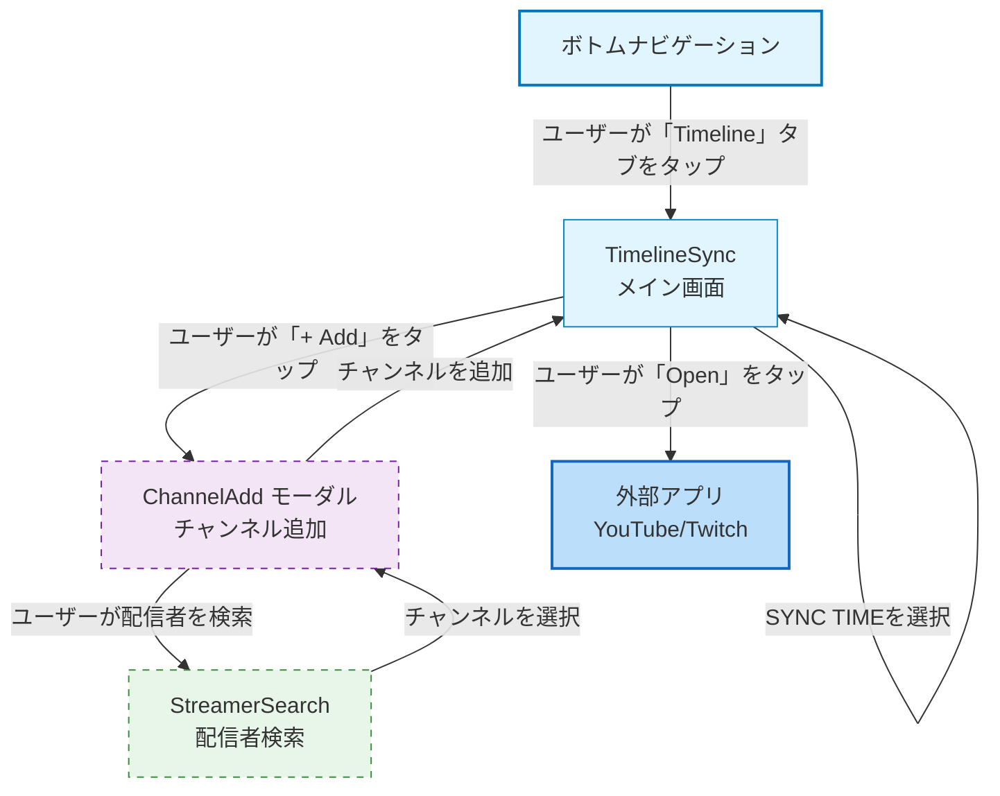

# Timelineモジュール - 画面ナビゲーション

> **配置場所**: `docs/navigation/timeline-module.md`
> **目的**: Timelineモジュール内の画面遷移
> **レベル**: モジュールレベルナビゲーション（Level 2）

---

## 目的

このドキュメントは、Timelineモジュール内の画面遷移を可視化します。Timelineモジュールは、複数チャンネルのタイムライン表示、チャンネル追加・管理、同期時刻計算、外部アプリ連携機能を包含し、ユーザーが画面間をどのように移動するか、どのような条件で遷移が発生するかを示します。

**モジュールスコープ**:
- **TimelineSync**: メイン画面（タイムライン表示）
- **ChannelAdd**: チャンネル追加モーダル（Story 2）
- **ExternalApp**: 外部アプリ遷移（Story 4）

**Epic**: Timeline Sync (EPIC-002)

---

## ナビゲーションフロー

---

## 画面説明

### TimelineSync（メイン画面）
- **目的**: 複数チャンネルのタイムラインを同期表示
- **タイプ**: 通常画面
- **機能**:
  - 週間カレンダーによる日付選択（Story 1）
  - チャンネルアバター行とタイムラインカードリスト（Story 1）
  - 同期時刻インジケーター表示（Story 1）
  - SYNC TIME選択（Story 3）
  - Open/Waitボタン（Story 4）
- **遷移**:
  - → ChannelAdd: ユーザーが「+ Add」をタップ（Story 2）
  - → ExternalApp: ユーザーが「Open」をタップ（Story 4）
  - 自己ループ: 日付選択、SYNC TIME変更

### ChannelAdd モーダル（Story 2）
- **目的**: タイムラインに表示するチャンネルを追加
- **タイプ**: ボトムシートモーダル
- **機能**:
  - 既存ChannelSearchUseCaseの再利用
  - チャンネル検索・選択
  - 複数チャンネル追加サポート
- **遷移**:
  - → StreamerSearch: 配信者検索画面へ
  - → TimelineSync: チャンネル追加完了

### StreamerSearch（配信者検索）
- **目的**: YouTube/Twitchの配信者を検索
- **タイプ**: 検索画面（Videoモジュールと共有）
- **機能**: 既存のStreamerSearch機能を再利用
- **遷移**:
  - → ChannelAdd: チャンネルを選択

### 外部アプリ（Story 4）
- **目的**: 計算された再生位置で公式アプリを開く
- **タイプ**: 外部遷移（DeepLink）
- **機能**:
  - YouTube: `youtube://watch?v={ID}&t={SECONDS}`
  - Twitch: `twitch://video/{ID}?t={SECONDS}s`
- **遷移**:
  - → 外部アプリ（戻りはユーザー操作）

---

## Story別の実装範囲

| Story | 画面/機能 | 説明 |
|-------|----------|------|
| **Story 1** | TimelineSync | タイムライン基本表示（カレンダー、カードリスト、インジケーター） |
| **Story 2** | ChannelAdd | チャンネル追加・管理モーダル |
| **Story 3** | TimelineSync | 同期時刻計算と表示（SYNC TIME選択） |
| **Story 4** | ExternalApp | 外部アプリ連携（DeepLink） |

---

## 特殊なナビゲーションパターン

### ボトムナビゲーション統合

TimelineSyncはボトムナビゲーションの「Timeline」タブからアクセスします：
- Home / **Timeline** / Channels / Settings

### 外部アプリ遷移（Story 4）

1. ユーザーがタイムラインカードの「Open」ボタンをタップ
2. SYNC TIMEに基づいて再生位置を計算
3. expect/actualパターンでDeepLinkを生成
4. プラットフォーム固有の方法で外部アプリを起動
5. 外部アプリ未インストール時はフォールバック（Webブラウザ）

### チャンネル追加フロー（Story 2）

1. ユーザーがアバター行の「+ Add」をタップ
2. ChannelAddモーダルが開く
3. 既存のStreamerSearch機能で配信者を検索
4. チャンネルを選択してタイムラインに追加
5. 追加完了後、モーダルを閉じる（または続けて追加）

---

## 色分け

| 画面タイプ | 塗りつぶし色 | 枠線色 | 用途 |
|-------------|------------|--------------|-------|
| **エントリーポイント** | `#e1f5ff` | `#0277bd` | ボトムナビゲーション |
| **メイン画面** | `#e1f5ff` | `#0288d1` | TimelineSync |
| **モーダル/シート** | `#f3e5f5` | `#7b1fa2` | ChannelAdd（破線枠） |
| **検索画面** | `#e8f5e9` | `#388e3c` | StreamerSearch（破線枠） |
| **外部遷移** | `#bbdefb` | `#1565c0` | ExternalApp |

---

## 関連ドキュメント

- **親**: [screen-navigation.md](../screen-navigation.md) - アプリ全体のナビゲーション索引（Level 1）
- **子**:
  - [timeline_sync/screen-transition.md](../../composeApp/src/commonMain/kotlin/org/example/project/feature/timeline_sync/screen-transition.md) - TimelineSync画面の振る舞い（Level 3）
- **関連モジュール**:
  - [video-module.md](./video-module.md) - StreamerSearch機能の共有元

---

**最終更新**: 2026-01-12
