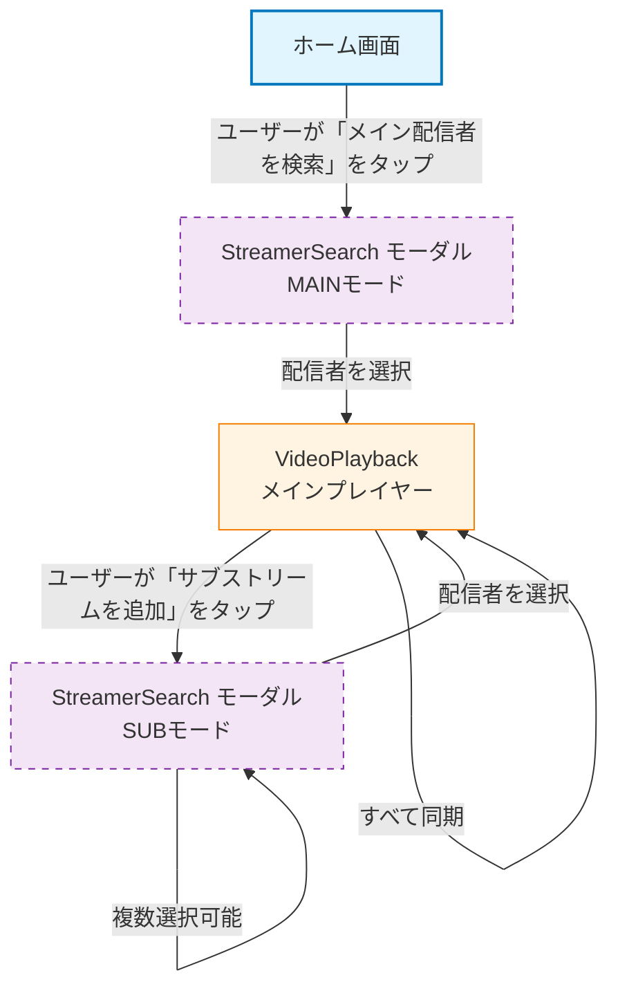

# Videoモジュール - 画面ナビゲーション

> **配置場所**: `docs/navigation/video-module.md`
> **目的**: Videoモジュール内の画面遷移
> **レベル**: モジュールレベルナビゲーション（Level 2）

---

## 目的

このドキュメントは、Videoモジュール内の画面遷移を可視化します。Videoモジュールは、動画検索、再生、同期機能を包含し、ユーザーが画面間をどのように移動するか、どのような条件で遷移が発生するかを示します。

**モジュールスコープ**:
- **Home**: エントリーポイント画面
- **StreamerSearch**: メイン/サブ配信者の検索（YouTube/Twitch）
- **VideoPlayback**: 同期機能付きマルチストリーム動画プレイヤー

---

## ナビゲーションフロー

---

## 画面説明

### ホーム画面（エントリーポイント）
- **目的**: アプリのエントリーポイント、メインナビゲーション
- **タイプ**: 通常画面
- **遷移**:
  - → StreamerSearch(MAIN): ユーザーが「メイン配信者を検索」をタップ

### StreamerSearch モーダル - MAINモード
- **目的**: メイン配信者の検索と選択
- **タイプ**: ボトムシートモーダル
- **機能**: YouTube/Twitch検索、日付フィルタリング、チャンネル検索
- **遷移**:
  - → VideoPlayback: 配信者を選択（単一選択）
  - バックスタック動作: VideoPlaybackへ遷移時にHomeRouteを置き換え

### VideoPlayback（メインプレイヤー）
- **目的**: 同期機能付きマルチストリーム動画再生
- **タイプ**: 通常画面
- **機能**: メインストリーム + 複数のサブストリーム、同期機能
- **遷移**:
  - → StreamerSearch(SUB): ユーザーが「サブストリームを追加」をタップ
  - → StreamerSearch(SUB): SavedStateHandle経由でサブストリーム選択を受信
  - 自己ループ: サブストリーム削除、メイン/サブ切り替え、すべて同期

### StreamerSearch モーダル - SUBモード
- **目的**: サブストリームの検索と追加
- **タイプ**: ボトムシートモーダル
- **機能**: 複数選択サポート、検索結果からメインストリームを除外
- **遷移**:
  - → VideoPlayback: SavedStateHandle経由でサブストリームを追加（モーダルは開いたまま）
  - 自己ループ: モーダルを閉じずに複数選択可能
  - ユーザーが閉じるボタンで手動でモーダルを閉じる

---

## 特殊なナビゲーションパターン

### SavedStateHandle連携

StreamerSearch(SUB)とVideoPlaybackはSavedStateHandleを介して双方向通信を行います：

**VideoPlayback → StreamerSearch(SUB)**:
- 既に追加済みのサブストリームIDのリスト
- メインストリームID（検索結果から除外するため）
- メインストリームの公開日（フィルタリング用）

**StreamerSearch(SUB) → VideoPlayback**:
- サブストリームデータ（ID、タイトル、サムネイルURL、チャンネル情報、サービス種別、公開日時、ライブ配信フラグ）
- または削除するサブストリームIDの通知

### 複数選択パターン

SUBモードでは：
1. ユーザーが配信者を検索して選択
2. StreamerSearchが結果をSavedStateHandleに書き込み
3. VideoPlaybackが受信してサブストリームを追加
4. モーダルは開いたまま次の選択が可能
5. ユーザーが完了したら手動でモーダルを閉じる

これにより、1回の検索セッションで複数のサブストリームを追加できます。

### バックスタック管理

- **MAINモード**: VideoPlaybackへ遷移時、バックスタックからHomeRouteを削除
- **SUBモード**: VideoPlayback上にモーダルが表示され、バックスタックは変更されない

---

## 色分け

| 画面タイプ | 塗りつぶし色 | 枠線色 | 用途 |
|-------------|------------|--------------|-------|
| **エントリーポイント** | `#e1f5ff` | `#0277bd` | ホーム画面 |
| **メイン画面** | `#fff4e1` | `#f57c00` | VideoPlayback |
| **モーダル/シート** | `#f3e5f5` | `#7b1fa2` | StreamerSearch（破線枠） |

---

## 関連ドキュメント

- **親**: [screen-navigation.md](../screen-navigation.md) - アプリ全体のナビゲーション索引（Level 1）
- **子**:
  - [home/screen-transition.md](../../composeApp/src/commonMain/kotlin/org/example/project/feature/home/screen-transition.md) - ホーム画面の振る舞い（Level 3）
  - [streamer_search/screen-transition.md](../../composeApp/src/commonMain/kotlin/org/example/project/feature/streamer_search/screen-transition.md) - StreamerSearch画面の振る舞い（Level 3）
  - [video_playback/screen-transition.md](../../composeApp/src/commonMain/kotlin/org/example/project/feature/video_playback/screen-transition.md) - VideoPlayback画面の振る舞い（Level 3）

---

**最終更新**: 2025-12-30
