# CollabStream - アプリ全体の画面ナビゲーション

> **目的**: CollabStreamのすべての画面とナビゲーションフローの概要
> **最終更新**: 2025-12-30
> **メンテナンス**: 新機能追加時のPhase 1で更新

---

## ナビゲーション概要

```mermaid
graph LR
    Start([アプリ起動])

    Start --> App[CollabStream アプリ]

    App --> VideoPlayback[動画再生画面]
    App --> StreamerSearch[配信者検索画面]

    %% 動画再生機能
    VideoPlayback --> VideoPlayer[動画プレイヤー]
    VideoPlayer --> VideoSync[動画同期モーダル]
    VideoPlayer --> SubStreamModal[サブストリーム選択]

    %% 検索機能
    StreamerSearch --> SearchModal[検索モーダル]
    SearchModal --> SearchResults[検索結果]
    SearchResults --> StreamDetail[ストリーム詳細]
    StreamDetail --> VideoPlayer

    %% 機能領域別のスタイリング
    style App fill:#e1f5ff,stroke:#0277bd,stroke-width:3px
    style VideoPlayback fill:#fff4e1,stroke:#f57c00,stroke-width:2px
    style StreamerSearch fill:#e8f5e9,stroke:#388e3c,stroke-width:2px

    style VideoPlayer fill:#fff4e1,stroke:#f57c00
    style VideoSync fill:#fff4e1,stroke:#f57c00
    style SubStreamModal fill:#fff4e1,stroke:#f57c00

    style SearchModal fill:#e8f5e9,stroke:#388e3c
    style SearchResults fill:#e8f5e9,stroke:#388e3c
    style StreamDetail fill:#e8f5e9,stroke:#388e3c

    classDef modal fill:#ffe0b2,stroke:#e65100,stroke-dasharray: 5 5
    class VideoSync,SubStreamModal,SearchModal modal
```

---

## 機能一覧

### 動画再生機能（オレンジ）

| 画面 | タイプ | 説明 | ドキュメント |
|--------|------|-------------|-----------------|
| **動画再生画面** | メイン | アクティブな動画再生を表示するメイン画面 | [REQUIREMENTS.md](../composeApp/src/commonMain/kotlin/org/example/project/feature/video_playback/REQUIREMENTS.md) |
| **動画プレイヤー** | コンポーネント | コントロールと状態管理を備えたコア動画プレイヤー | - |
| **動画同期モーダル** | モーダル | 視聴者間で動画再生時刻を同期するモーダル | - |
| **サブストリーム選択** | ボトムシート | 複数のストリームを選択・管理するボトムシート | - |

**モジュールナビゲーション（Level 2）**: [video-module.md](./navigation/video-module.md)
**振る舞い（Level 3）**: [screen-transition.md](../composeApp/src/commonMain/kotlin/org/example/project/feature/video_playback/screen-transition.md)

**主要機能**:
- YouTubeとTwitchの動画再生
- 絶対時刻同期（例: "2024-01-01 10:00:00から開始"）
- 複数のサブストリーム管理
- スクロールベースのアニメーションとプレイヤーコントロール

---

### 配信者検索機能（グリーン）

| 画面 | タイプ | 説明 | ドキュメント |
|--------|------|-------------|-----------------|
| **配信者検索画面** | メイン | プラットフォーム選択を備えたメイン検索インターフェース | [REQUIREMENTS.md](../composeApp/src/commonMain/kotlin/org/example/project/feature/streamer_search/REQUIREMENTS.md) |
| **検索モーダル** | モーダル | 検索入力、日付ピッカー、フィルターチップを備えたモーダル | - |
| **検索結果** | リスト | プラットフォーム固有データを含むフィルター済み検索結果 | - |
| **ストリーム詳細** | 詳細 | ストリームの詳細情報（TODO: 将来の機能） | - |

**モジュールナビゲーション（Level 2）**: [video-module.md](./navigation/video-module.md)
**振る舞い（Level 3）**: [screen-transition.md](../composeApp/src/commonMain/kotlin/org/example/project/feature/streamer_search/screen-transition.md)

**主要機能**:
- マルチプラットフォーム検索（YouTube、Twitch）
- 日付範囲フィルタリング
- Twitch結果のクライアント側日付フィルタリング
- プラットフォーム固有の検索条件

---

## 色分けリファレンス

| 機能領域 | 塗りつぶし色 | 枠線色 | 用途 |
|--------------|------------|--------------|----------|
| **アプリ/メイン** | ライトブルー（`#e1f5ff`） | ダークブルー（`#0277bd`） | メインアプリ画面、コアナビゲーション |
| **動画再生** | ライトオレンジ（`#fff4e1`） | ダークオレンジ（`#f57c00`） | 動画プレイヤー、同期、サブストリーム |
| **検索** | ライトグリーン（`#e8f5e9`） | ダークグリーン（`#388e3c`） | 配信者検索、結果、フィルター |
| **モーダル** | ライトアンバー（`#ffe0b2`） | ダークアンバー（`#e65100`、破線） | モーダルオーバーレイ、ボトムシート |

### 将来の機能用色（予約済み）

| 機能領域 | 塗りつぶし色 | 枠線色 | 予定用途 |
|--------------|------------|--------------|---------------|
| **ライブラリ** | ライトパープル（`#f3e5f5`） | ダークパープル（`#7b1fa2`） | 保存済みストリーム、履歴 |
| **設定** | ライトピンク（`#fce4ec`） | ダークピンク（`#c2185b`） | アプリ設定 |
| **ソーシャル** | ライトシアン（`#e0f7fa`） | ダークシアン（`#00838f`） | フレンド、チャット、コミュニティ |

---

## 関連ドキュメント

- **テンプレート**:
  - [module-navigation-template.md](./design-doc/template/module-navigation-template.md) - Level 2: モジュールレベルナビゲーション
  - [screen-transition-template.md](./design-doc/template/screen-transition-template.md) - Level 3: 画面内部の振る舞い
- **アーキテクチャ**: [docs/architecture/system-architecture.md](./architecture/system-architecture.md)
- **開発ワークフロー**: [docs/guides/development-workflow.md](./guides/development-workflow.md)
- **ADR**:
  - [ADR-001: Clean Architecture](./adr/001-clean-architecture-adoption.md)
  - [ADR-002: MVI Pattern](./adr/002-mvi-pattern-for-state-management.md)
  - [ADR-003: 4-Layer Component](./adr/003-four-layer-component-structure.md)

---

**ドキュメントバージョン**: 1.0
**管理者**: 開発チーム
**レビュースケジュール**: 各新機能のPhase 1で更新
