# CollabStream - App-wide Screen Navigation

> **Purpose**: High-level overview of all screens and navigation flows in CollabStream
> **Last Updated**: 2025-12-30
> **Maintenance**: Updated during Phase 1 when adding new features

---

## Navigation Overview

```mermaid
graph LR
    Start([App Launch])

    Start --> App[CollabStream App]

    App --> VideoPlayback[Video Playback Screen]
    App --> StreamerSearch[Streamer Search Screen]

    %% Video Playback Feature
    VideoPlayback --> VideoPlayer[Video Player]
    VideoPlayer --> VideoSync[Video Sync Modal]
    VideoPlayer --> SubStreamModal[Sub Stream Selection]

    %% Search Feature
    StreamerSearch --> SearchModal[Search Modal]
    SearchModal --> SearchResults[Search Results]
    SearchResults --> StreamDetail[Stream Detail]
    StreamDetail --> VideoPlayer

    %% Styling by feature area
    style App fill:#e1f5ff,stroke:#0277bd,stroke-width:3px
    style VideoPlayback fill:#fff4e1,stroke:#f57c00,stroke-width:2px
    style StreamerSearch fill:#e8f5e9,stroke:#388e3c,stroke-width:2px

    style VideoPlayer fill:#fff4e1,stroke:#f57c00
    style VideoSync fill:#fff4e1,stroke:#f57c00
    style SubStreamModal fill:#fff4e1,stroke:#f57c00

    style SearchModal fill:#e8f5e9,stroke:#388e3c
    style SearchResults fill:#e8f5e9,stroke:#388e3c
    style StreamDetail fill:#e8f5e9,stroke:#388e3c

    classDef modal fill:#ffe0b2,stroke:#e65100,stroke-dasharray: 5 5
    class VideoSync,SubStreamModal,SearchModal modal
```

---

## Feature List

### Video Playback Feature (Orange)

| Screen | Type | Description | Documentation |
|--------|------|-------------|---------------|
| **Video Playback Screen** | Main | Main screen showing active video playback | [REQUIREMENTS.md](../composeApp/src/commonMain/kotlin/org/example/project/feature/video_playback/REQUIREMENTS.md) |
| **Video Player** | Component | Core video player with controls and state management | - |
| **Video Sync Modal** | Modal | Modal for synchronizing video playback time across viewers | - |
| **Sub Stream Selection** | Bottom Sheet | Bottom sheet for selecting and managing multiple streams | - |

**Module Navigation (Level 2)**: TODO: [video-module.md](./navigation/video-module.md)
**Behavior (Level 3)**: TODO: [screen-transition.md](../composeApp/src/commonMain/kotlin/org/example/project/feature/video_playback/screen-transition.md)

**Key Features**:
- YouTube and Twitch video playback
- Absolute time synchronization (e.g., "Start at 2024-01-01 10:00:00")
- Multiple sub-stream management
- Scroll-based animation and player controls

---

### Streamer Search Feature (Green)

| Screen | Type | Description | Documentation |
|--------|------|-------------|---------------|
| **Streamer Search Screen** | Main | Main search interface with platform selection | [REQUIREMENTS.md](../composeApp/src/commonMain/kotlin/org/example/project/feature/streamer_search/REQUIREMENTS.md) |
| **Search Modal** | Modal | Modal with search input, date picker, and filter chips | - |
| **Search Results** | List | Filtered search results with platform-specific data | - |
| **Stream Detail** | Detail | Detailed information about a stream (TODO: Future feature) | - |

**Module Navigation (Level 2)**: TODO: [search-module.md](./navigation/search-module.md)
**Behavior (Level 3)**: TODO: [screen-transition.md](../composeApp/src/commonMain/kotlin/org/example/project/feature/streamer_search/screen-transition.md)

**Key Features**:
- Multi-platform search (YouTube, Twitch)
- Date range filtering
- Client-side date filtering for Twitch results
- Platform-specific search criteria

---

## Adding New Features

When adding a new feature with screens:

### 1. Update This Diagram

Add your feature area to the Navigation Overview diagram with consistent color coding (see Color Coding Reference below).

### 2. Create Feature Documentation (Phase 1)

Create the following documents in `feature/{feature_name}/`:
- **REQUIREMENTS.md** - Feature specifications
- **navigation.md** - Feature-level screen transitions (use [module-navigation-template.md](./design-doc/template/module-navigation-template.md))
- **screen-transition.md** - Screen-internal behavior (use [screen-transition-template.md](./design-doc/template/screen-transition-template.md))

### 3. Update Feature List Table

Add a new feature section with:
- Feature name and color scheme
- Screen list table with links to navigation.md
- Key features summary

---

## Color Coding Reference

| Feature Area | Fill Color | Border Color | Usage |
|--------------|------------|--------------|-------|
| **App/Main** | Light Blue (`#e1f5ff`) | Dark Blue (`#0277bd`) | Main app screens, core navigation |
| **Video Playback** | Light Orange (`#fff4e1`) | Dark Orange (`#f57c00`) | Video player, sync, sub-streams |
| **Search** | Light Green (`#e8f5e9`) | Dark Green (`#388e3c`) | Streamer search, results, filters |
| **Modals** | Light Amber (`#ffe0b2`) | Dark Amber (`#e65100`, dashed) | Modal overlays, bottom sheets |

### Future Feature Colors (Reserved)

| Feature Area | Fill Color | Border Color | Planned Use |
|--------------|------------|--------------|-------------|
| **Library** | Light Purple (`#f3e5f5`) | Dark Purple (`#7b1fa2`) | Saved streams, history |
| **Settings** | Light Pink (`#fce4ec`) | Dark Pink (`#c2185b`) | App configuration |
| **Social** | Light Cyan (`#e0f7fa`) | Dark Cyan (`#00838f`) | Friends, chat, community |

---

## Current Implementation Status

| Feature | Phase 1 (Spec) | Phase 2 (Implementation) | Phase 3 (Review) |
|---------|----------------|--------------------------|------------------|
| **Video Playback** | ✅ Complete | ✅ Complete | ✅ Complete |
| **Video Sync** | ✅ Complete | ✅ Complete | ✅ Complete |
| **Streamer Search** | ✅ Complete | ✅ Complete | ✅ Complete |
| **Sub Stream Selection** | ✅ Complete | ✅ Complete | ✅ Complete |

---

## Related Documentation

- **Templates**:
  - [module-navigation-template.md](./design-doc/template/module-navigation-template.md) - Level 2: Feature-level navigation
  - [screen-transition-template.md](./design-doc/template/screen-transition-template.md) - Level 3: Screen-internal behavior
- **Architecture**: [docs/architecture/system-architecture.md](./architecture/system-architecture.md)
- **Development Workflow**: [docs/guides/development-workflow.md](./guides/development-workflow.md)
- **ADRs**:
  - [ADR-001: Clean Architecture](./adr/001-clean-architecture-adoption.md)
  - [ADR-002: MVI Pattern](./adr/002-mvi-pattern-for-state-management.md)
  - [ADR-003: 4-Layer Component](./adr/003-four-layer-component-structure.md)

---

**Document Version**: 1.0
**Maintained By**: Development Team
**Review Schedule**: Updated in Phase 1 of each new feature
