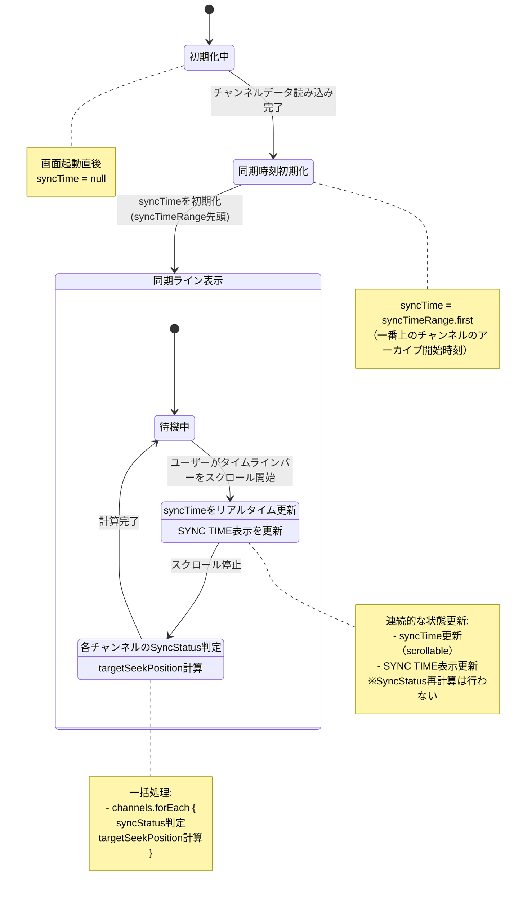
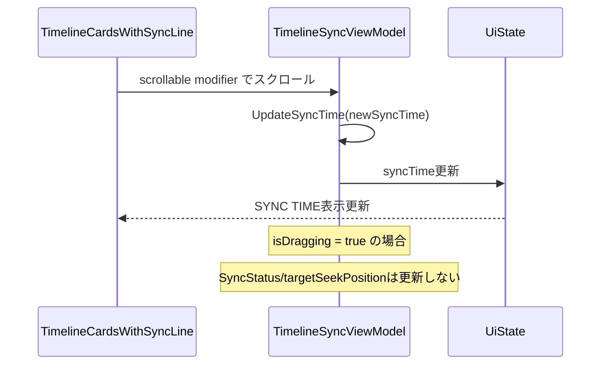
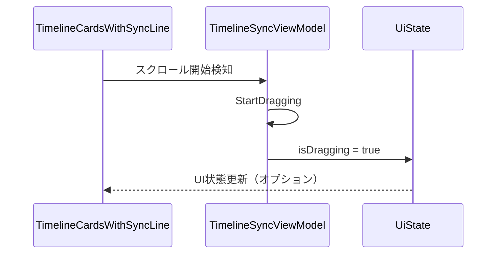
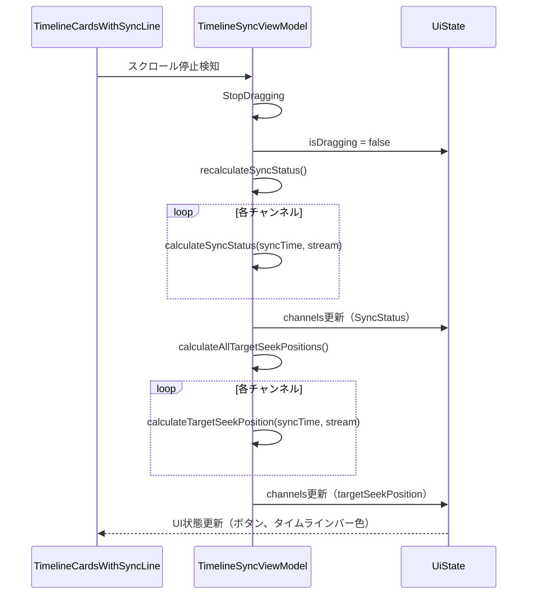
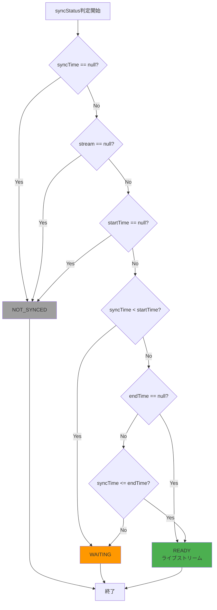
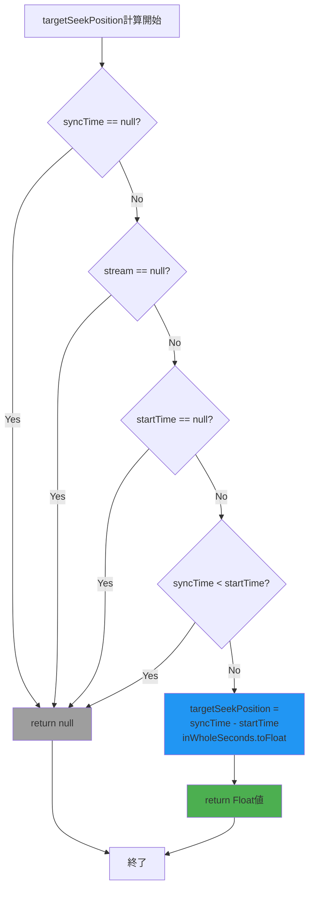

# Timeline Sync US-3: 同期時刻計算と表示 - 画面遷移

**Story Issue**: #53
**Epic**: #32 Timeline Sync - 利用規約対応のマルチストリーム同期機能
**Phase**: 1 (仕様定義)
**作成日**: 2026-01-17

---

## 1. 状態遷移図



---

## 2. 画面状態詳細

### 2.1 初期化中

**説明**: 画面起動直後、チャンネルデータを読み込み中の状態

**UiState**:
```kotlin
TimelineSyncUiState(
    syncTime = null,
    isDragging = false,
    channels = emptyList()
)
```

**UI表示**:
- ローディングインジケーター（オプション）
- タイムラインバーなし
- 同期ラインなし

**遷移条件**:
- チャンネルデータ読み込み完了 → 同期時刻初期化

---

### 2.2 同期時刻初期化

**説明**: syncTimeRangeを計算し、syncTimeを初期値に設定する状態

**処理内容**:
1. `syncTimeRange`を計算（全ストリームの最早開始〜最遅終了）
2. `syncTime = syncTimeRange.first`に設定

**UiState**:
```kotlin
TimelineSyncUiState(
    syncTime = Instant.parse("2025-01-01T10:00:00Z"), // syncTimeRange.first
    isDragging = false,
    channels = listOf(
        SyncChannel(
            channelId = "ch1",
            selectedStream = SelectedStreamInfo(...),
            syncStatus = SyncStatus.NOT_SYNCED,  // まだ計算前
            targetSeekPosition = null
        ),
        // ...
    )
)
```

**遷移条件**:
- 自動的に同期ライン表示（待機中）へ遷移

---

### 2.3 同期ライン表示 - 待機中

**説明**: スクロール待ちの通常状態

**UiState**:
```kotlin
TimelineSyncUiState(
    syncTime = Instant.parse("2025-01-01T10:00:00Z"),
    isDragging = false,
    channels = listOf(
        SyncChannel(
            channelId = "ch1",
            selectedStream = SelectedStreamInfo(
                startTime = Instant.parse("2025-01-01T10:00:00Z"),
                endTime = Instant.parse("2025-01-01T12:00:00Z")
            ),
            syncStatus = SyncStatus.READY,  // 計算済み
            targetSeekPosition = 0.0f       // syncTime == startTime
        ),
        SyncChannel(
            channelId = "ch2",
            selectedStream = SelectedStreamInfo(
                startTime = Instant.parse("2025-01-01T10:30:00Z"),
                endTime = Instant.parse("2025-01-01T12:30:00Z")
            ),
            syncStatus = SyncStatus.WAITING,  // syncTime < startTime
            targetSeekPosition = null
        )
    )
)
```

**UI表示**:
- 同期ライン（画面中央固定、青色）
- SYNC TIME表示: "10:00:00"
- ch1: Openボタン（活性）、通常色タイムラインバー
- ch2: Waitボタン（非活性）、グレーアウトタイムラインバー

**遷移条件**:
- ユーザーがタイムラインバーをスクロール開始 → スクロール中

---

### 2.4 同期ライン表示 - スクロール中

**説明**: ユーザーがタイムラインバーをスクロールしている状態

**処理内容**:
1. スクロールイベントを受け取る
2. `UpdateSyncTime(newSyncTime)`を発行
3. syncTimeのみ更新（SyncStatus/targetSeekPositionは更新しない）
4. SYNC TIME表示を更新

**UiState（例: 10:15:30にスクロール中）**:
```kotlin
TimelineSyncUiState(
    syncTime = Instant.parse("2025-01-01T10:15:30Z"),  // 更新中
    isDragging = true,  // スクロール中フラグ
    channels = listOf(
        SyncChannel(
            channelId = "ch1",
            selectedStream = SelectedStreamInfo(...),
            syncStatus = SyncStatus.READY,  // 古い値のまま
            targetSeekPosition = 0.0f       // 古い値のまま
        ),
        SyncChannel(
            channelId = "ch2",
            selectedStream = SelectedStreamInfo(...),
            syncStatus = SyncStatus.WAITING,  // 古い値のまま
            targetSeekPosition = null         // 古い値のまま
        )
    )
)
```

**UI表示**:
- 同期ライン: 画面中央固定
- SYNC TIME表示: "10:15:30"（リアルタイム更新）
- ch1/ch2のボタン表示: 変化なし（古い状態のまま）

**パフォーマンス最適化**:
- スクロール中はSyncStatus/targetSeekPositionを再計算しない
- syncTimeとSYNC TIME表示のみ更新

**遷移条件**:
- スクロール停止（タッチリリース） → 同期計算中

---

### 2.5 同期ライン表示 - 同期計算中

**説明**: スクロール停止後、全チャンネルのSyncStatus/targetSeekPositionを一括再計算する状態

**処理内容**:
1. `StopDragging`を発行
2. 各チャンネルのSyncStatusを判定:
   - `syncTime < stream.startTime` → WAITING
   - `stream.startTime <= syncTime <= stream.endTime` → READY
   - ストリーム未選択 → NOT_SYNCED
3. 各チャンネルのtargetSeekPositionを計算:
   - READY状態: `(syncTime - stream.startTime).inWholeSeconds.toFloat()`
   - WAITING/NOT_SYNCED: null
4. UiStateを更新

**UiState（例: 10:15:30で停止）**:
```kotlin
TimelineSyncUiState(
    syncTime = Instant.parse("2025-01-01T10:15:30Z"),
    isDragging = false,  // スクロール停止
    channels = listOf(
        SyncChannel(
            channelId = "ch1",
            selectedStream = SelectedStreamInfo(
                startTime = Instant.parse("2025-01-01T10:00:00Z"),
                endTime = Instant.parse("2025-01-01T12:00:00Z")
            ),
            syncStatus = SyncStatus.READY,  // 再計算済み
            targetSeekPosition = 930.0f     // (10:15:30 - 10:00:00) = 930秒
        ),
        SyncChannel(
            channelId = "ch2",
            selectedStream = SelectedStreamInfo(
                startTime = Instant.parse("2025-01-01T10:30:00Z"),
                endTime = Instant.parse("2025-01-01T12:30:00Z")
            ),
            syncStatus = SyncStatus.WAITING,  // 再計算済み（syncTime < startTime）
            targetSeekPosition = null
        ),
        SyncChannel(
            channelId = "ch3",
            selectedStream = null,
            syncStatus = SyncStatus.NOT_SYNCED,  // ストリーム未選択
            targetSeekPosition = null
        )
    )
)
```

**UI表示**:
- 同期ライン: 画面中央固定
- SYNC TIME表示: "10:15:30"
- ch1: Openボタン（活性）、通常色タイムラインバー、targetSeekPosition = 930.0f
- ch2: Waitボタン（非活性）、グレーアウトタイムラインバー
- ch3: ボタンなし、タイムラインバーなし

**計算ロジック**:
```kotlin
// ch1の例
targetSeekPosition = (10:15:30 - 10:00:00).inWholeSeconds.toFloat()
                   = 930.0f

// ch2の例
syncTime (10:15:30) < startTime (10:30:00)
→ syncStatus = WAITING, targetSeekPosition = null
```

**遷移条件**:
- 計算完了 → 待機中

---

## 3. Intent処理フロー

### 3.1 UpdateSyncTime

**トリガー**: タイムラインバーのスクロールイベント

**処理フロー**:


**疑似コード**:
```kotlin
fun updateSyncTime(newSyncTime: Instant) {
    _state.update { it.copy(syncTime = newSyncTime) }

    // スクロール停止時のみ状態再計算
    if (!_state.value.isDragging) {
        recalculateSyncStatus()
        calculateAllTargetSeekPositions()
    }
}
```

---

### 3.2 StartDragging

**トリガー**: スクロール開始

**処理フロー**:


**疑似コード**:
```kotlin
fun startDragging() {
    _state.update { it.copy(isDragging = true) }
}
```

---

### 3.3 StopDragging

**トリガー**: スクロール停止（タッチリリース）

**処理フロー**:


**疑似コード**:
```kotlin
fun stopDragging() {
    _state.update { it.copy(isDragging = false) }
    recalculateSyncStatus()
    calculateAllTargetSeekPositions()
}
```

---

## 4. SyncStatus判定フロー



**判定ロジック**:
```kotlin
fun calculateSyncStatus(syncTime: Instant?, stream: SelectedStreamInfo?): SyncStatus {
    if (syncTime == null || stream == null) return SyncStatus.NOT_SYNCED
    val startTime = stream.startTime ?: return SyncStatus.NOT_SYNCED
    val endTime = stream.endTime

    return when {
        syncTime < startTime -> SyncStatus.WAITING
        // ライブストリーム（endTime == null）または アーカイブ範囲内
        endTime == null || syncTime <= endTime -> SyncStatus.READY
        // アーカイブ終了後
        else -> SyncStatus.WAITING
    }
}
```

---

## 5. targetSeekPosition計算フロー



**計算ロジック**:
```kotlin
fun calculateTargetSeekPosition(syncTime: Instant?, stream: SelectedStreamInfo?): Float? {
    if (syncTime == null || stream == null) return null
    val startTime = stream.startTime ?: return null
    if (syncTime < startTime) return null

    return (syncTime - startTime).inWholeSeconds.toFloat()
}
```

**計算例**:
```kotlin
// 例1: READY状態
syncTime = Instant.parse("2025-01-01T10:15:30Z")
startTime = Instant.parse("2025-01-01T10:00:00Z")
→ targetSeekPosition = (930秒).toFloat() = 930.0f

// 例2: WAITING状態
syncTime = Instant.parse("2025-01-01T10:15:30Z")
startTime = Instant.parse("2025-01-01T10:30:00Z")
→ targetSeekPosition = null

// 例3: 境界値（開始時刻と同じ）
syncTime = Instant.parse("2025-01-01T10:00:00Z")
startTime = Instant.parse("2025-01-01T10:00:00Z")
→ targetSeekPosition = 0.0f
```

---

## 6. UI状態マッピング

### 6.1 SyncStatus → ボタン表示

| SyncStatus | ボタンラベル | アイコン | enabled | onClick動作 |
|-----------|------------|---------|---------|------------|
| NOT_SYNCED | なし | なし | - | - |
| WAITING | "Wait" | Lock | false | なし（非活性） |
| READY | "Open" | OpenInNew | true | 外部アプリ起動（Story 4） |

### 6.2 SyncStatus → タイムラインバー色

| SyncStatus | 色 | 説明 |
|-----------|---|------|
| NOT_SYNCED | Transparent | タイムラインバーなし |
| WAITING | onSurface.copy(alpha=0.38f) | グレーアウト |
| READY | primary | 通常色（青） |

### 6.3 SYNC TIME表示形式

- **形式**: HH:MM:SS（24時間表記）
- **例**: "10:15:30"
- **タイムゾーン**: ユーザーのローカルタイムゾーン
- **更新頻度**: スクロール中はリアルタイム、停止時は固定

---

## 7. エッジケースとエラーハンドリング

### 7.1 チャンネルが0件の場合

**状態**:
```kotlin
TimelineSyncUiState(
    syncTime = null,
    isDragging = false,
    channels = emptyList()
)
```

**UI表示**:
- 空状態メッセージ（例: "チャンネルを追加してください"）
- 同期ライン非表示

### 7.2 全チャンネルがWAITING状態の場合

**説明**: syncTimeが全ストリームの開始前（syncTimeRange.firstより前）

**UI表示**:
- 全チャンネルのWaitボタン（非活性）
- 全タイムラインバーがグレーアウト
- SYNC TIME表示は通常通り

### 7.3 syncTimeRangeが計算できない場合

**条件**: 全チャンネルのselectedStreamがnull

**状態**:
```kotlin
TimelineSyncUiState(
    syncTime = null,
    isDragging = false,
    channels = listOf(
        SyncChannel(selectedStream = null, ...),
        SyncChannel(selectedStream = null, ...)
    )
)
```

**UI表示**:
- 同期ライン非表示
- SYNC TIME表示なし
- 全チャンネルのNOT_SYNCED状態

---

## 8. パフォーマンス考慮事項

### 8.1 スクロール中の最適化

**問題**: スクロール中に全チャンネルのSyncStatus/targetSeekPositionを再計算するとUIが重くなる

**解決策**:
- スクロール中（isDragging = true）は syncTime のみ更新
- SyncStatus/targetSeekPosition は停止時に一括再計算

### 8.2 計算量

- **チャンネル数**: N
- **スクロール中の更新**: O(1)（syncTimeのみ）
- **停止時の再計算**: O(N)（全チャンネル）

### 8.3 StateFlow更新頻度

- **スクロール中**: 高頻度（フレームレート依存）
- **停止時**: 1回のみ（一括更新）

---

## 9. 参考資料

- **REQUIREMENTS.md**: `feature/timeline_sync/sync_time/REQUIREMENTS.md`
- **Story Issue**: #53
- **Epic**: #32 Timeline Sync
- **ADR**: `.claude/rules/architecture/004-manual-sync.md`
- **既存実装**: `composeApp/src/commonMain/kotlin/org/example/project/feature/timeline_sync/`
