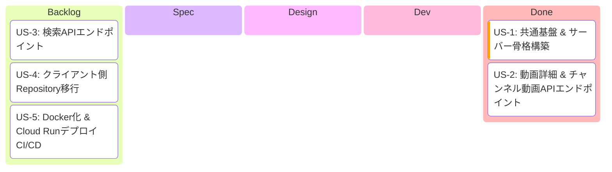
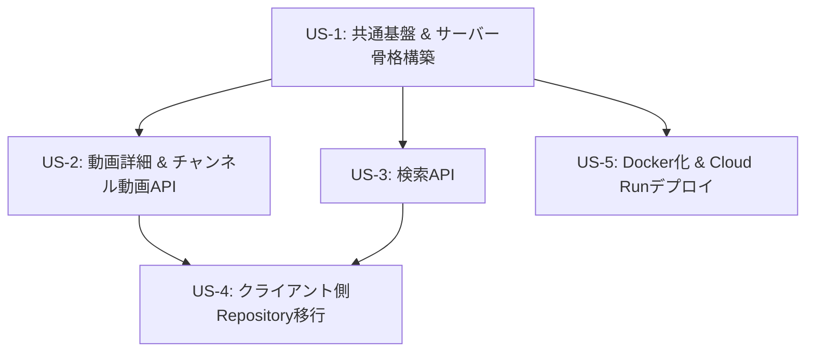

# Epic: APIプロキシサーバー移行

> **作成日**: 2026-02-11

---

## 1. Epic概要

### ビジョン
ADR-005 Phase 2として、YouTube API / Twitch APIへのアクセスをKtorバックエンド経由のプロキシ方式に移行する。APIキーをサーバー側で一元管理し、クライアントアプリからAPIキーを除去することで、セキュリティと運用性を向上させる。

### 背景・課題
1. **APIキー露出リスク**: 現在BuildKonfig経由でAPIキーがアプリに埋め込まれており、逆コンパイルで漏洩する可能性がある
2. **一元管理の欠如**: API呼び出しの使用量制限・ログ記録がクライアント側では困難
3. **ADR-005 Phase 2**: 段階的APIセキュリティ戦略において、プロキシサーバー移行がロードマップに定義済み

### ユーザー価値
- APIキーの安全な管理によるサービス安定稼働
- サーバー側でのレスポンス最適化（ドメインモデル形状のレスポンス）によるクライアント処理の簡素化
- 将来的な機能拡張（キャッシュ、レート制限等）の基盤構築

---

## 2. 開発進捗

**カラム = `/develop` ステップ対応**:

| カラム | `/develop` ステップ | 完了条件 |
|--------|---------------------|---------|
| Backlog | - | US.md 作成済み |
| Spec | Step 2 | SPECIFICATION.md 作成済み |
| Design | Step 3 | DESIGN.md + PROGRESS.md + Worktree |
| Dev | Step 4 | Shared + Server 実装 + 全テスト通過 |
| Done | Step 5 | PR作成済み |

---

## 3. 依存関係図

**並行開発可能**: US-2、US-3、US-5はUS-1完了後に並行して開発可能
**ボトルネック**: US-4はUS-2とUS-3の両方が完了するまで着手不可

---

## 4. 設計方針

### APIプロキシのみ（DB無し）
- サーバーはステートレスなAPIプロキシとして機能
- データベースは使用しない
- APIキーはサーバー側の環境変数で管理

### ドメインモデル形状のレスポンス
- サーバーは外部API（YouTube/Twitch）のレスポンスをドメインモデルに変換して返却
- クライアント側のマッピングロジックを削減

---

## 5. 関連ドキュメント

### 参照ADR
- ADR-001: Android Architecture採用
- ADR-005: 段階的APIセキュリティ戦略（Phase 2）
