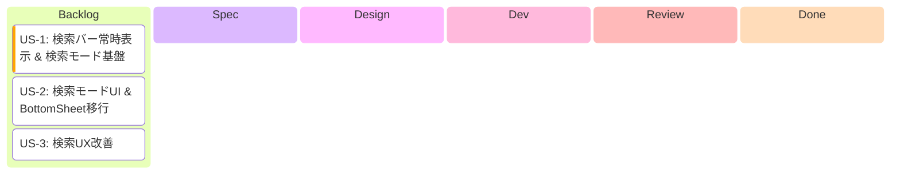
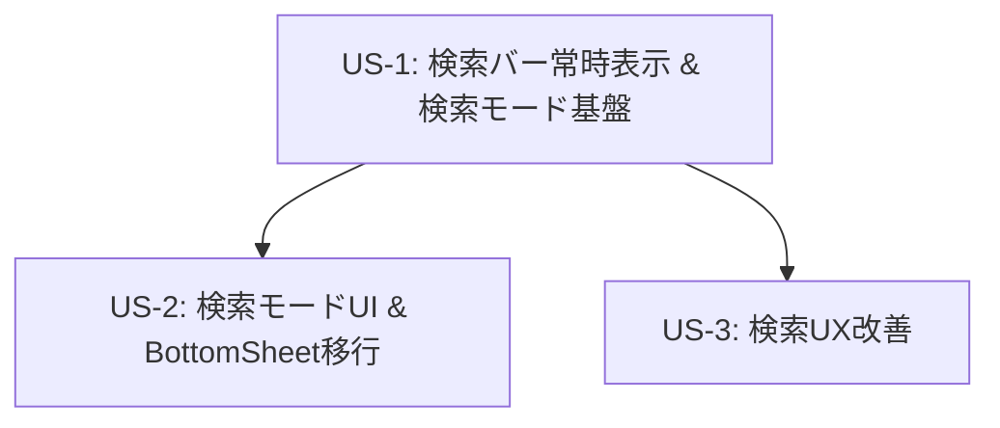

# Epic: アーカイブ画面 検索UX改善

> **作成日**: 2026-02-21

---

## 1. Epic概要

### ビジョン

アーカイブ画面（Timeline Sync）のチャンネル検索・追加体験を根本的に改善する。現在のBottomSheetベースの検索UIを廃止し、画面上部に常時表示される検索バーと、インラインの検索モードに置き換える。これにより、より直感的でスムーズなチャンネル管理体験を提供する。

### 背景・課題

1. **BottomSheetの操作性問題**: チャンネル追加のたびにBottomSheetを開閉する操作が煩雑
2. **フォーカス喪失問題**: 検索キーワード入力中にAPI応答で検索結果が更新されると、TextFieldのフォーカスが外れてしまう
3. **過度なAPI呼び出し**: 500msデバウンスでキー入力のたびにAPIが呼ばれ、不要なリクエストが発生している
4. **画面遷移の断絶**: BottomSheetの表示/非表示で画面コンテキストが断絶する

### ユーザー価値

- 検索バーが常時表示されることで、チャンネル追加への導線が明確になる
- 検索モードでのインライン表示により、コンテキスト切り替えのストレスが軽減される
- フォーカス問題の解消で、スムーズな検索入力体験が実現する
- API呼び出し最適化で、レスポンスが安定し通信コストが削減される

---

## 2. 開発進捗

**カラム = `/develop` ステップ対応**:

| カラム | `/develop` ステップ | 完了条件 |
|--------|---------------------|---------|
| Backlog | - | US.md 作成済み |
| Spec | Step 2 | SPECIFICATION.md 作成済み |
| Design | Step 3 | DESIGN.md + PROGRESS.md + Worktree |
| Dev | Step 4 | Shared + UI 実装 + 全テスト通過 |
| Review | Step 5 | PR作成済み |
| Done | - | PRマージ済み |

---

## 3. 依存関係図

**US-1を先に実装**: 検索バーと検索モードの状態管理基盤がUS-2、US-3の前提。
**US-2とUS-3は並行開発可能**: US-1完了後、独立して実装可能。

---

## 4. 共通ドメイン

### 新規Entity・Repository

**不要** - 既存のドメインモデルで対応可能。

### 既存利用モデル

| モデル | パス | 用途 |
|-------|------|------|
| `ChannelInfo` | `domain/model/ChannelInfo.kt` | 検索結果のチャンネル情報 |
| `ChannelSearchResponse` | `domain/model/ChannelSearchResponse.kt` | 検索APIレスポンス |
| `VideoServiceType` | `domain/model/VideoServiceType.kt` | プラットフォーム選択 |
| `VideoSearchRepository` | `domain/repository/VideoSearchRepository.kt` | 検索API呼び出し |

### 変更範囲

本Epicは主にUI層（composeApp）の変更:

| 層 | 変更内容 |
|---|---------|
| **UI層** | SearchBar新規作成、検索モードUI、BottomSheet廃止 |
| **ViewModel** | 検索モード状態管理、検索トリガー変更 |
| **Domain/Data** | 変更なし |

---

## 5. 関連ドキュメント

### 参照ADR

- ADR-002: MVI パターン採用
- ADR-003: 4層Component構造採用

### 関連SPECIFICATION

- `feature/timeline_sync/channel_add/SPECIFICATION.md`（更新対象）
- `feature/timeline_sync/SPECIFICATION.md`（参照）
