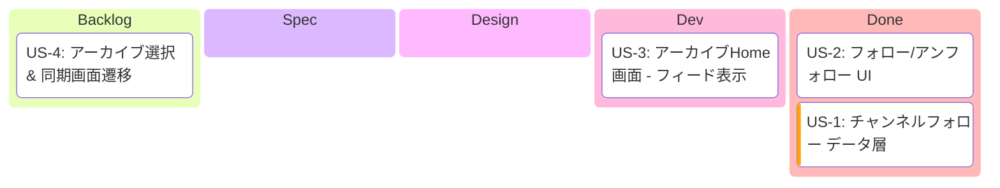
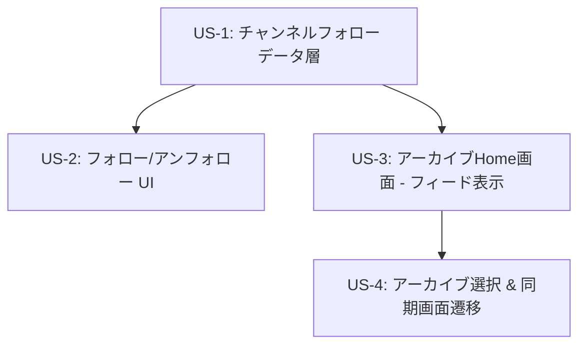

# Epic: チャンネルフォロー & アーカイブHome

> **作成日**: 2026-02-11

---

## 1. Epic概要

### ビジョン
ユーザーがよく見るチャンネルを「フォロー」し、起動時にフォロー中チャンネルのアーカイブ一覧から素早く同期セッションを開始できるHome画面を提供する。

### 背景・課題
1. **毎回の検索負荷**: 現在は`TimelineSyncRoute`がスタート画面で、毎回チャンネルを検索して追加する必要がある
2. **リピートユーザーのUX**: よく見るチャンネルをブックマーク的に保存する手段がない
3. **起動からの導線**: アプリ起動→同期開始までのステップが多い

### ユーザー価値
- フォロー済みチャンネルのアーカイブが一覧で見えるため、素早く同期セッションを開始できる
- 日付ベースでアーカイブを絞り込め、「あの日のコラボ」を探しやすい
- フォローはショートカットであり、フォロー外チャンネルもTimelineSync内の既存検索で追加可能

---

## 2. 開発進捗

**カラム = `/develop` ステップ対応**:

| カラム | `/develop` ステップ | 完了条件 |
|--------|---------------------|---------|
| Backlog | - | US.md 作成済み |
| Spec | Step 2 | SPECIFICATION.md 作成済み |
| Design | Step 3 | DESIGN.md + PROGRESS.md + Worktree |
| Dev | Step 4 | Shared + UI 実装 + 全テスト通過 |
| Done | Step 5 | PR作成済み |

---

## 3. 依存関係図

**並行開発可能**: US-2とUS-3はUS-1完了後に並行して開発可能
**ボトルネック**: US-4はUS-3の完了が必要

---

## 4. 設計方針

### ナビゲーション構造
- **BottomNav なし**、シンプルなスタックナビゲーション
- スタート画面を `TimelineSyncRoute` → `ArchiveHomeRoute` に変更
- TimelineSyncへのアクセスはHome画面のアーカイブ選択経由のみ

### フォローの位置づけ
- 毎回の検索を省くショートカット
- 同期はフォロー外チャンネルも追加可能（TimelineSync内の既存検索で）

### 既存コード再利用
- `WeekCalendar` コンポーネント → Home画面の日付セレクター
- `TimelineSyncRepository.getChannelVideos()` → アーカイブ取得
- `SyncChannel` → TimelineSyncへのプリセット変換
- Room KMP基盤（`AppDatabase`） → テーブル追加
- `ChannelAddBottomSheet` → フォローボタン追加

---

## 5. 関連ドキュメント

### 参照ADR
- ADR-001: Android Architecture採用
- ADR-002: MVI パターン採用
- ADR-003: 4層Component構造採用
