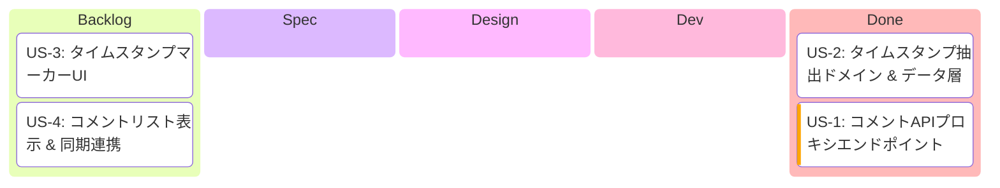
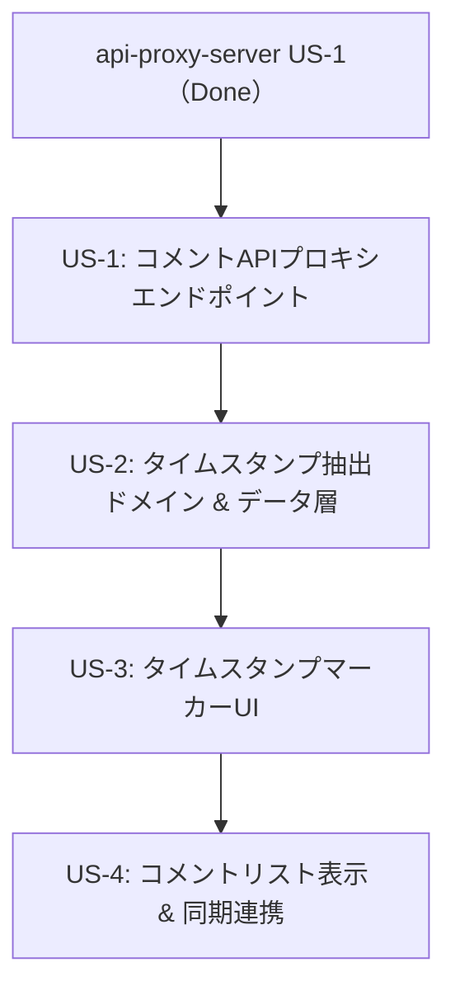

# Epic: コメントタイムスタンプ同期

> **作成日**: 2026-02-15

---

## 1. Epic概要

### ビジョン
YouTubeアーカイブ動画のコメントに含まれるタイムスタンプを自動抽出し、タイムライン画面上にマーカーとして表示。コメントで言及された注目シーンにワンタップで同期できる機能を実現する。

### 背景・課題
1. **注目シーンの発見困難**: 長時間のアーカイブ配信から注目シーンを見つけるのが困難
2. **コメント活用**: YouTubeコメントにはタイムスタンプ付きで注目シーンを紹介するものが多い
3. **同期連携**: 既存のタイムライン同期機能と組み合わせることで、コメント起点の同期が可能

### ユーザー価値
- コメントに含まれるタイムスタンプから注目シーンをすばやく発見できる
- タイムラインバー上のマーカーで視覚的にシーンの分布を把握できる
- コメントのタイムスタンプタップで同期時刻を即座に更新できる

### スコープ
- YouTube限定（Twitchは将来対応）
- 通常コメントのみ（ライブチャットリプレイは対象外）

---

## 2. 開発進捗

**カラム = `/develop` ステップ対応**:

| カラム | `/develop` ステップ | 完了条件 |
|--------|---------------------|---------|
| Backlog | - | US.md 作成済み |
| Spec | Step 2 | SPECIFICATION.md 作成済み |
| Design | Step 3 | DESIGN.md + PROGRESS.md + Worktree |
| Dev | Step 4 | Shared + UI 実装 + 全テスト通過 |
| Done | Step 5 | PR作成済み |

---

## 3. 依存関係図

**順次開発**: 全USが直列依存のため、順番に実装する

---

## 4. 技術的注意点

### YouTube API
- `commentThreads.list` API: videoIdでコメント取得可能、APIキーのみでOK（OAuth不要）
- クォータ: 1ユニット/リクエスト（日次10,000ユニット上限、非常に効率的）
- 最大100件/リクエスト、ページネーション対応
- `textFormat=plainText` でプレーンテキスト取得
- コメント無効化時は403 (`commentsDisabled`) エラー
- ライブチャットリプレイはAPI非対応

### タイムスタンプ抽出
- 対応フォーマット: `M:SS`, `MM:SS`, `H:MM:SS`, `HH:MM:SS`
- 秒が00-59の範囲検証
- `M:S`（秒1桁）パターンは除外
- 動画duration超過は除外

### アーキテクチャ準拠
- ADR-005 Phase 2: コメントAPIもサーバープロキシ経由
- ADR-002 MVI: 既存TimelineSyncUiState/Intentにコメント関連を追加
- ADR-003 4層Component: Route → Screen → Content → Component

---

## 5. 関連ドキュメント

### 参照ADR
- ADR-002: MVI パターン採用
- ADR-003: 4層Component構造採用
- ADR-005: 段階的APIセキュリティ戦略（Phase 2）

### 仕様書
- `composeApp/.../feature/timeline_sync/comment_timestamp/SPECIFICATION.md`（US-3, US-4向け）
