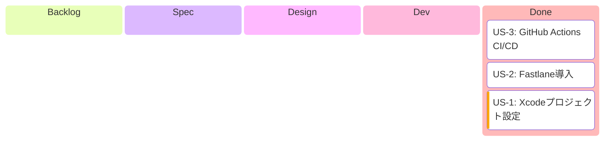

# Epic: iOS TestFlight配信基盤

## 概要

CollabStreamのiOSアプリをTestFlight経由で配信するためのCI/CD基盤を構築する。
最終目標は **mainマージでTestFlightに自動配信** されるパイプライン。

## 背景

- iOSアプリは動作するが、TestFlight配信の仕組みがない
- Apple Developer Program未登録のため、登録手続きと並行して設定可能な部分から構築
- Bundle IDがプレースホルダー (`org.example.project.CollabStream`)
- Fastlane未導入、iOS CI/CDなし

## ユーザーストーリー一覧

| US | 名前 | 依存 | 概要 |
|----|------|------|------|
| US-1 | Xcodeプロジェクト設定 | なし | Bundle ID・署名・バージョニングを本番用に設定 |
| US-2 | Fastlane導入 | US-1 | `fastlane beta` でビルド→TestFlightアップロード自動化 |
| US-3 | GitHub Actions CI/CD | US-2 | PRでビルド検証、mainマージでTestFlight自動配信 |

## 開発進捗

## 依存関係

## 設計判断

| 判断事項 | 採用方式 | 理由 |
|---------|---------|------|
| TEAM_ID管理 | `Config.local.xcconfig`（.gitignore） | 個人TEAM_IDをリポジトリに含めない |
| 証明書管理 | Fastlane Match（Git Storage） | チーム共有 & CI対応 |
| ASC認証 | App Store Connect API Key (.p8) | 2FA不要、Secrets管理しやすい |
| ビルド番号 | `github.run_number` | 単調増加保証、git commit不要 |
| macOSランナー | `macos-15` | Xcode 16.2対応 |

## 対象外

このEpicはインフラ/DevOpsタスクのため以下は対象外:
- SPECIFICATION.md（UIなし）
- ドメインモデル・Repository Interface
- UseCase / ViewModel
