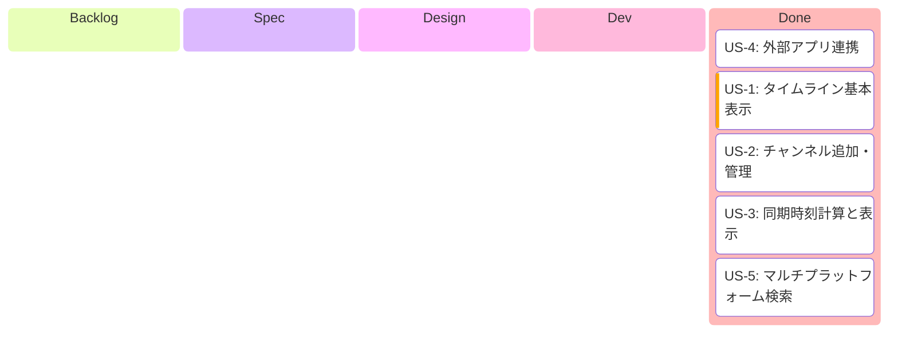
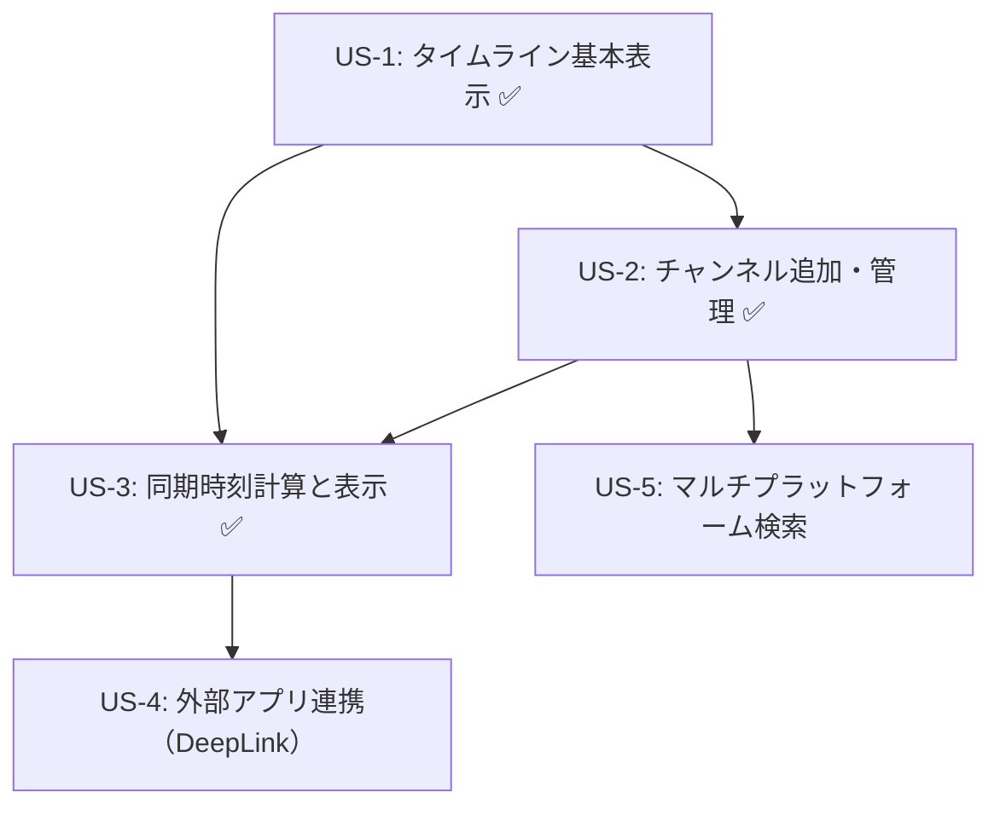

# Epic: Timeline Sync - 利用規約対応のマルチストリーム同期機能

> **作成日**: 2026-01-12
> **移行元**: GitHub Issue #32

---

## 1. Epic概要

### ビジョン
複数の配信プラットフォーム（YouTube、Twitch）の過去配信を、統一されたタイムライン上で同期表示し、ユーザーが指定した時刻に各プラットフォームの公式アプリを開くことで、利用規約に準拠したマルチストリーム視聴を実現する。

### 背景・課題
1. **利用規約対応**: WebView埋め込み再生は各プラットフォームの利用規約に抵触するリスクがある
2. **リリース版の要件**: 公開アプリでは正規の視聴方法（公式アプリ）を利用する必要がある
3. **既存機能の発展**: 現在のvideo_playback機能で培ったSync計算ロジックを再利用

### ユーザー価値
- 複数チャンネルの配信を同じ絶対時刻で開始できる
- タイムラインバーで各配信の開始・終了・現在位置を俯瞰できる
- ワンタップで各プラットフォームの公式アプリに指定時刻で遷移

---

## 2. 開発進捗

**カラム = `/develop` ステップ対応**:

| カラム | `/develop` ステップ | 完了条件 |
|--------|---------------------|---------|
| Backlog | - | US.md 作成済み |
| Spec | Step 2 | SPECIFICATION.md 作成済み |
| Design | Step 3 | DESIGN.md + PROGRESS.md + Worktree |
| Dev | Step 4 | Shared + UI 実装 + 全テスト通過 |
| Done | Step 5 | PR作成済み |

---

## 3. 依存関係図

**残タスク**: US-4（DeepLink実装）、US-5（マルチプラットフォーム検索実装）
**並行開発可能**: US-4とUS-5は独立して並行開発可能

---

## 4. 関連ドキュメント

### 参照ADR
- ADR-002: MVI パターン採用
- ADR-003: 4層Component構造採用
- ADR-004: 手動同期方式採用
