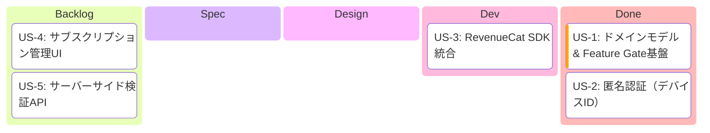
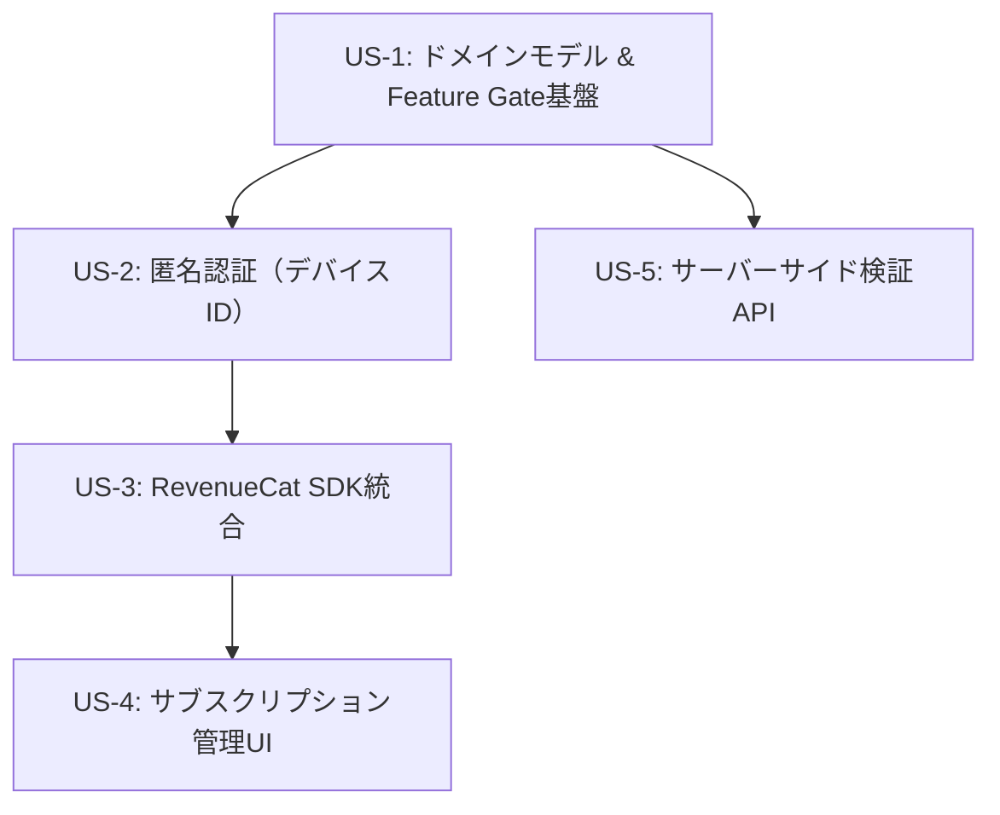

# Epic: サブスクリプション基盤

> **作成日**: 2026-02-15

---

## 1. Epic概要

### ビジョン
CollabStreamに収益化基盤を導入する。Free/Proの2段階プランによるサブスクリプション課金と、Feature Gate基盤を構築し、将来のPro限定機能追加を可能にする。

### 背景・課題
1. **収益化基盤の不在**: 現在のCollabStreamにはマネタイズの仕組みがない
2. **段階的な機能拡張**: Pro限定機能を後から柔軟に追加できる基盤が必要
3. **マルチプラットフォーム対応**: Android/iOS両方でのアプリ内課金に対応する必要がある

### ユーザー価値
- Proプランへのアップグレードにより将来的なプレミアム機能を利用可能
- 匿名認証（デバイスID）によるアカウント作成不要の手軽な体験

---

## 2. 開発進捗

**カラム = `/develop` ステップ対応**:

| カラム | `/develop` ステップ | 完了条件 |
|--------|---------------------|---------|
| Backlog | - | US.md 作成済み |
| Spec | Step 2 | SPECIFICATION.md 作成済み |
| Design | Step 3 | DESIGN.md + PROGRESS.md + Worktree |
| Dev | Step 4 | Shared + UI 実装 + 全テスト通過 |
| Done | Step 5 | PR作成済み |

---

## 3. 依存関係図

**並行開発可能**: US-2とUS-5はUS-1完了後に並行して開発可能
**ボトルネック**: US-4はUS-3の完了が必要

---

## 4. 設計方針

### 匿名認証（デバイスIDベース）
- UUID v4によるデバイス識別
- アカウント作成不要で手軽にサブスクリプション管理
- RevenueCat SDKのユーザー識別子として使用

### RevenueCat KMP SDK
- `com.revenuecat.purchases:purchases-kmp-core` を使用
- Android/iOS両対応のアプリ内課金処理
- サーバーサイド検証はRevenueCat REST APIで実現

### Feature Gate パターン
- `Feature` enumでPro限定機能を宣言的に管理
- `FeatureGate` インターフェースで利用可否を判定
- 新機能追加時はenumエントリの追加のみ

---

## 5. 関連ドキュメント

### 参照ADR
- ADR-001: Android Architecture採用
- ADR-002: MVI パターン採用
- ADR-003: 4層Component構造採用
