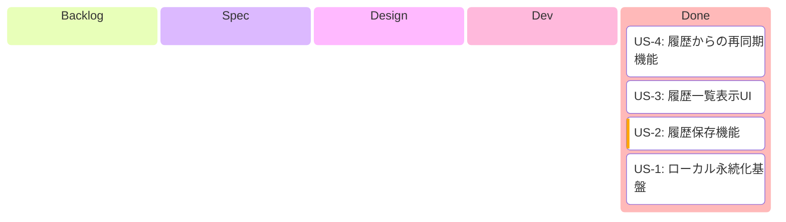
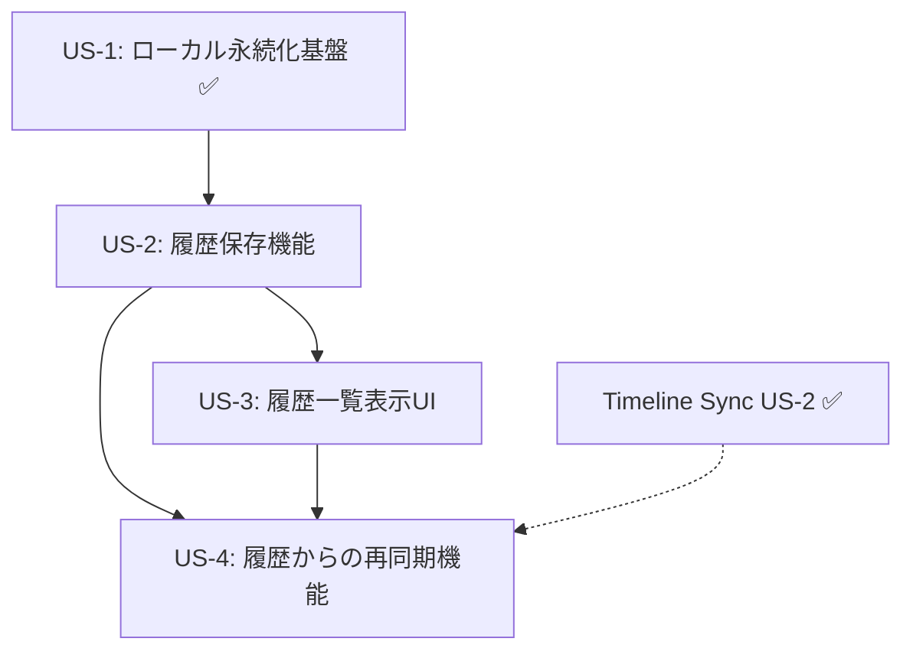

# Epic: 同期チャンネル履歴保存機能

> **作成日**: 2026-01-12
> **移行元**: GitHub Issue #35

---

## 1. Epic概要

### ビジョン
ユーザーが過去に同期したチャンネルの組み合わせを保存・呼び出しできるようにし、再度同じ配信者グループを同期する際の操作効率を向上させる。

### 背景・課題
1. **操作効率**: Timeline Sync機能で複数チャンネルを選択・同期する際、毎回チャンネルを検索・選択し直す手間がある
2. **ユーザー体験**: よく視聴する配信者グループの組み合わせを保存しておきたいニーズがある
3. **データ永続化**: 現在ローカル永続化機能がなく、アプリ再起動で設定が失われる

### ユーザー価値
- 頻繁に視聴する配信者の組み合わせをワンタップで復元できる
- チャンネル選択時間の大幅短縮
- ユーザー体験の向上とリテンション向上

---

## 2. 開発進捗

**カラム = `/develop` ステップ対応**:

| カラム | `/develop` ステップ | 完了条件 |
|--------|---------------------|---------|
| Backlog | - | US.md 作成済み |
| Spec | Step 2 | SPECIFICATION.md 作成済み |
| Design | Step 3 | DESIGN.md + PROGRESS.md + Worktree |
| Dev | Step 4 | Shared + UI 実装 + 全テスト通過 |
| Done | Step 5 | PR作成済み |

---

## 3. 依存関係図

**並行開発可能**: US-3はUS-2完了後に開始可能。US-4は全Storyと外部依存あり。
**外部依存**: US-4はTimeline Sync US-2（チャンネル管理機能）に依存 → 完了済み

---

## 4. 関連ドキュメント

### 参照ADR
- ADR-001: Android Architecture採用
