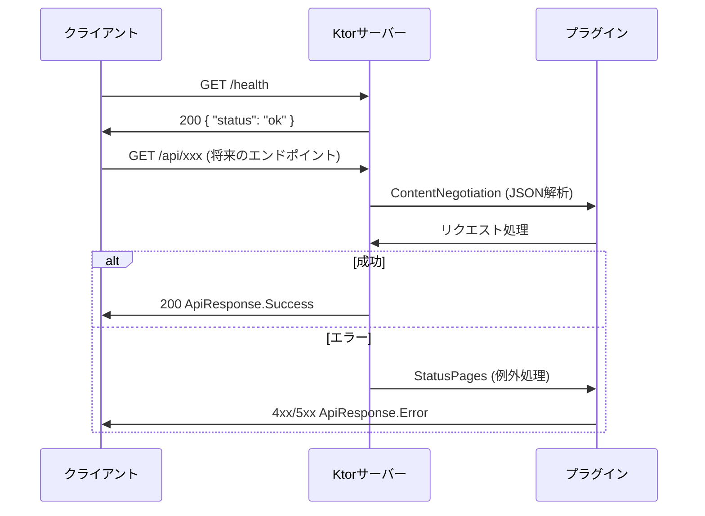

# 機能仕様: APIプロキシサーバー共通基盤

> 作成日: 2026-02-11

---

## 1. ユーザーストーリー

- 開発者がサーバーを起動すると、ContentNegotiation / StatusPages / CORS プラグインが自動設定される
- `GET /health` にアクセスすると、サーバーの稼働状態を示すJSONレスポンスが返る
- APIエンドポイントでエラーが発生すると、StatusPagesにより統一されたエラーレスポンスが返る
- APIレスポンスは共通DTO（`ApiResponse<T>`）で統一されたフォーマットを持つ
- サーバー起動時に環境変数からAPIキー（YouTube / Twitch）が読み込まれる

---

## 2. ビジネスルール

| ドメイン | ルール | 条件/値 | 備考 |
|----------|--------|---------|------|
| ヘルスチェック | レスポンス形式 | `{ "status": "ok" }` | ステータスコード200 |
| ContentNegotiation | JSON設定 | prettyPrint=false, isLenient=true | 本番向け |
| CORS | 許可オリジン | 全オリジン（開発段階） | 後続USで制限可能 |
| CORS | 許可メソッド | GET, POST, PUT, DELETE, OPTIONS | - |
| CORS | 許可ヘッダー | Content-Type, Authorization | - |
| StatusPages | 未処理例外 | 500 InternalServerError | `ApiResponse.Error` |
| StatusPages | IllegalArgumentException | 400 BadRequest | `ApiResponse.Error` |
| StatusPages | NotFoundException | 404 NotFound | `ApiResponse.Error` |
| APIキー | YouTube API Key | 環境変数 `YOUTUBE_API_KEY` | 未設定時は起動ログに警告 |
| APIキー | Twitch Client ID | 環境変数 `TWITCH_CLIENT_ID` | 未設定時は起動ログに警告 |
| APIキー | Twitch Client Secret | 環境変数 `TWITCH_CLIENT_SECRET` | 未設定時は起動ログに警告 |
| 共通DTO | 成功レスポンス | `ApiResponse.Success<T>(data: T)` | shared モジュール配置 |
| 共通DTO | エラーレスポンス | `ApiResponse.Error(message: String, code: Int)` | shared モジュール配置 |

---

## 3. リクエスト/レスポンスフロー

