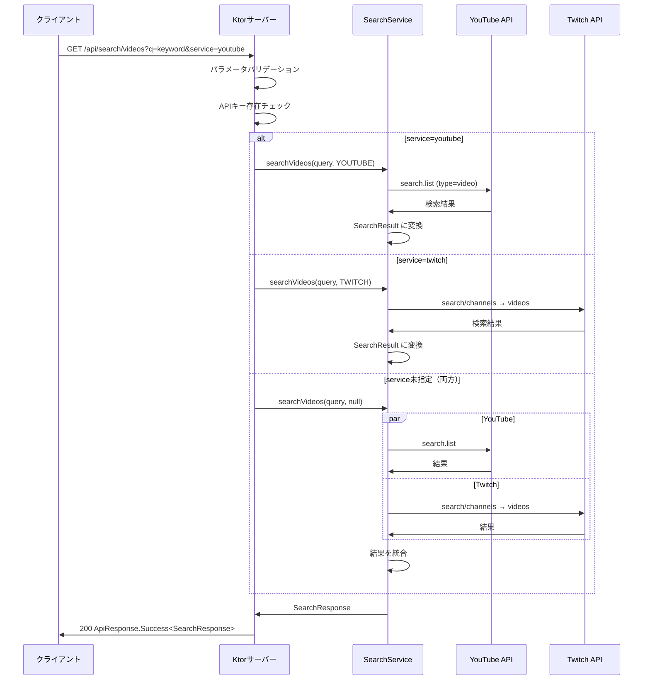
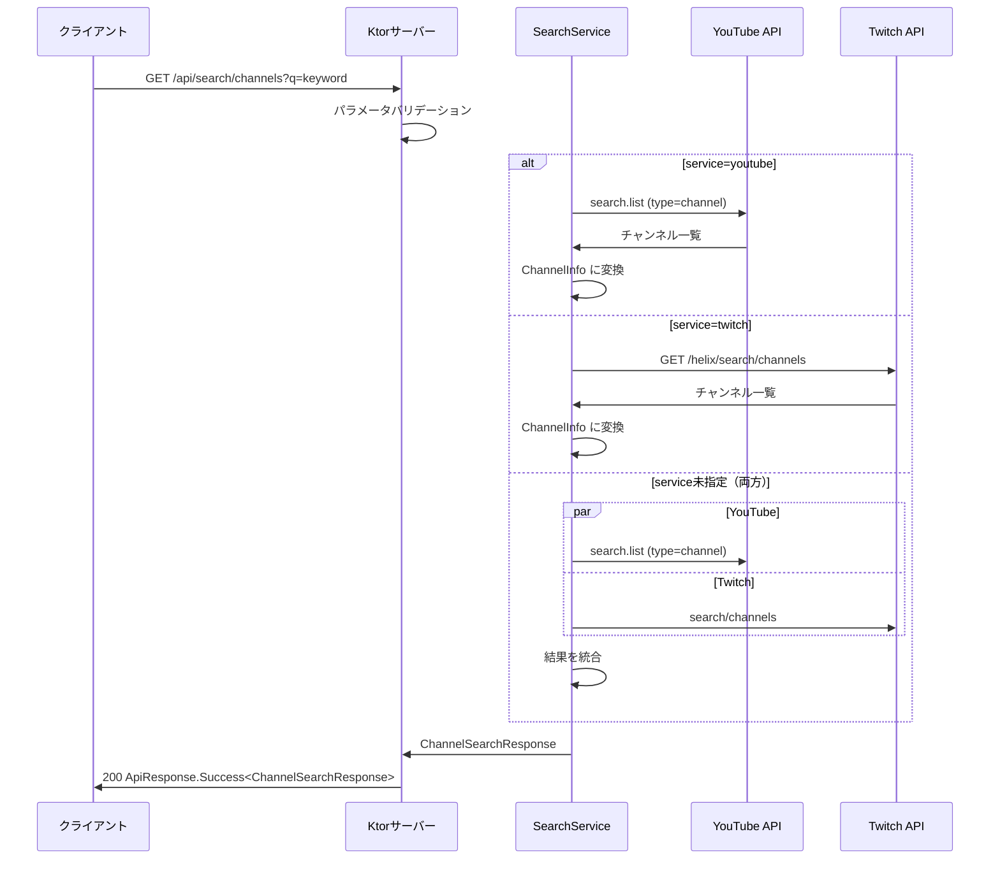

# 機能仕様: 検索APIエンドポイント

> 作成日: 2026-02-15

---

## 1. ユーザーストーリー

- クライアントが `GET /api/search/videos?q=keyword&service=youtube` を呼ぶと、YouTube動画の検索結果をドメインモデル形状で取得できる
- クライアントが `GET /api/search/videos?q=keyword&service=twitch` を呼ぶと、Twitch動画の検索結果をドメインモデル形状で取得できる
- クライアントが `GET /api/search/videos?q=keyword` を呼ぶと（service未指定）、YouTubeとTwitchの両方の検索結果を統合して取得できる
- クライアントが `GET /api/search/channels?q=keyword&service=youtube` を呼ぶと、YouTubeチャンネルの検索結果を取得できる
- クライアントが `GET /api/search/channels?q=keyword&service=twitch` を呼ぶと、Twitchチャンネルの検索結果を取得できる
- クライアントが `GET /api/search/channels?q=keyword` を呼ぶと（service未指定）、YouTubeとTwitchの両方のチャンネル検索結果を統合して取得できる
- ページネーションパラメータで次ページの結果を取得できる
- APIキーが未設定の場合、503 Service Unavailable が返される
- 外部APIがエラーを返した場合、適切なエラーレスポンス（`ApiResponse.Error`）が返される
- レスポンスは shared モジュールの `SearchResult` / `ChannelInfo` ドメインモデルと同じ形状である

---

## 2. ビジネスルール

| ドメイン | ルール | 条件/値 | 備考 |
|----------|--------|---------|------|
| エンドポイント | 動画検索 | `GET /api/search/videos` | q クエリパラメータ必須 |
| エンドポイント | チャンネル検索 | `GET /api/search/channels` | q クエリパラメータ必須 |
| パラメータ | q | 検索キーワード（必須） | 空文字は400エラー |
| パラメータ | service | `youtube`, `twitch`, または未指定（両方） | 大文字小文字不問 |
| パラメータ | maxResults | 整数（デフォルト: 25） | 動画検索のみ |
| パラメータ | pageToken | ページネーショントークン（任意） | YouTube用 |
| パラメータ | cursor | ページネーションカーソル（任意） | Twitch用 |
| パラメータ | eventType | `completed`, `live`, `upcoming`, `any`（デフォルト: `completed`） | 動画検索・YouTube向け |
| パラメータ | order | `viewCount`, `date`, `relevance`, `rating`（デフォルト: `viewCount`） | 動画検索のみ |
| YouTube | 動画検索API | `search.list` type=video | APIキー認証 |
| YouTube | チャンネル検索API | `search.list` type=channel | APIキー認証 |
| YouTube | 最大取得数 | maxResults パラメータで指定 | デフォルト25、最大50 |
| Twitch | 動画検索API | `search/channels` → チャンネルID → `videos` | 2段階取得 |
| Twitch | チャンネル検索API | `GET /helix/search/channels` | Client-ID + Bearer Token |
| Twitch | 最大取得数 | first パラメータ（最大100） | - |
| レスポンス | 動画検索成功 | `ApiResponse.Success<SearchResponse>` | 200 OK |
| レスポンス | チャンネル検索成功 | `ApiResponse.Success<ChannelSearchResponse>` | 200 OK |
| エラー | q未指定 | 400 Bad Request | `q query parameter is required` |
| エラー | q空文字 | 400 Bad Request | `Search query must not be empty` |
| エラー | service不正値 | 400 Bad Request | `Invalid service type` |
| エラー | APIキー未設定 | 503 Service Unavailable | 対象サービスのAPIキー未設定時 |
| エラー | 外部API障害 | 502 Bad Gateway | 外部APIからのエラーレスポンス |
| 統合検索 | service未指定時 | YouTube + Twitch を並行呼び出し | 片方のエラーは無視し、成功した結果のみ返す |

---

## 3. リクエスト/レスポンスフロー

### 3.1 動画検索

### 3.2 チャンネル検索

