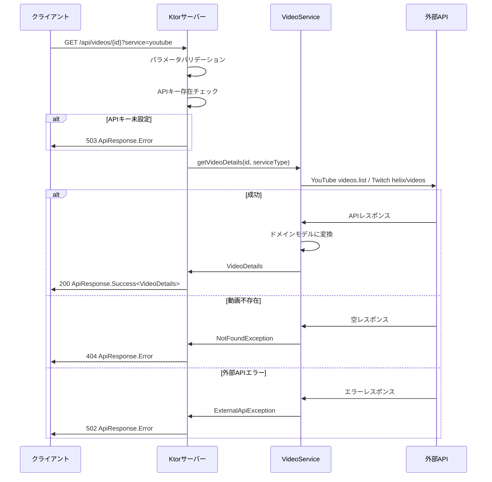
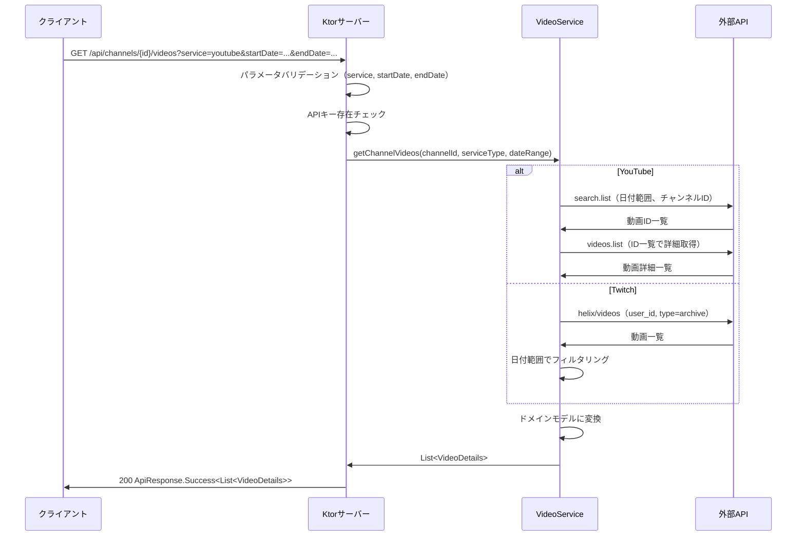

# 機能仕様: 動画詳細 & チャンネル動画APIエンドポイント

> 作成日: 2026-02-15

---

## 1. ユーザーストーリー

- クライアントが `GET /api/videos/{id}?service=youtube` を呼ぶと、YouTube動画の詳細をドメインモデル形状で取得できる
- クライアントが `GET /api/videos/{id}?service=twitch` を呼ぶと、Twitch動画の詳細をドメインモデル形状で取得できる
- クライアントが `GET /api/channels/{id}/videos?service=youtube&startDate=2026-01-01&endDate=2026-01-31` を呼ぶと、該当チャンネルの日付範囲内のYouTube動画一覧を取得できる
- クライアントが `GET /api/channels/{id}/videos?service=twitch&startDate=2026-01-01&endDate=2026-01-31` を呼ぶと、該当チャンネルの日付範囲内のTwitch動画一覧を取得できる
- APIキーが未設定の場合、503 Service Unavailable が返される
- 外部APIがエラーを返した場合、適切なエラーレスポンス（`ApiResponse.Error`）が返される
- レスポンスは shared モジュールの `VideoDetails` ドメインモデルと同じ形状である

---

## 2. ビジネスルール

| ドメイン | ルール | 条件/値 | 備考 |
|----------|--------|---------|------|
| エンドポイント | 動画詳細 | `GET /api/videos/{id}` | serviceクエリパラメータ必須 |
| エンドポイント | チャンネル動画一覧 | `GET /api/channels/{id}/videos` | service, startDate, endDate必須 |
| パラメータ | service | `youtube` または `twitch` | 大文字小文字不問 |
| パラメータ | startDate | ISO LocalDate形式 `YYYY-MM-DD` | チャンネル動画APIのみ |
| パラメータ | endDate | ISO LocalDate形式 `YYYY-MM-DD` | チャンネル動画APIのみ（inclusive） |
| YouTube | 動画詳細API | `videos.list` part=liveStreamingDetails,snippet | APIキー認証 |
| YouTube | チャンネル動画 | `search.list` → `videos.list` 2段階取得 | search: type=video, eventType=completed |
| YouTube | 日付フィルタ | publishedAfter/publishedBefore パラメータ | endDate+1日で inclusive 対応 |
| YouTube | 最大取得数 | 50件 | search.list の maxResults |
| Twitch | 動画詳細API | `GET /helix/videos?id={id}` | Client-ID + Bearer Token |
| Twitch | チャンネル動画 | `GET /helix/videos?user_id={id}&type=archive` | first=100 |
| Twitch | 日付フィルタ | クライアント（サーバー）側でフィルタリング | API制約によりパラメータなし |
| エラー | service未指定 | 400 Bad Request | `service query parameter is required` |
| エラー | service不正値 | 400 Bad Request | `Invalid service type` |
| エラー | 日付パラメータ未指定 | 400 Bad Request | チャンネル動画APIの場合 |
| エラー | APIキー未設定 | 503 Service Unavailable | 対象サービスのAPIキー未設定時 |
| エラー | 動画不存在 | 404 Not Found | 外部APIで動画が見つからない場合 |
| エラー | 外部API障害 | 502 Bad Gateway | 外部APIからのエラーレスポンス |
| レスポンス | 成功（動画詳細） | `ApiResponse.Success<VideoDetails>` | 200 OK |
| レスポンス | 成功（動画一覧） | `ApiResponse.Success<List<VideoDetails>>` | 200 OK |

---

## 3. リクエスト/レスポンスフロー

### 3.1 動画詳細取得

### 3.2 チャンネル動画一覧取得

